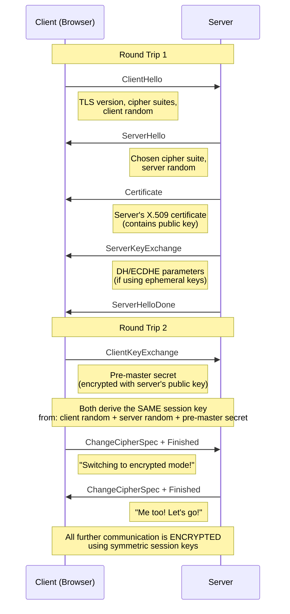
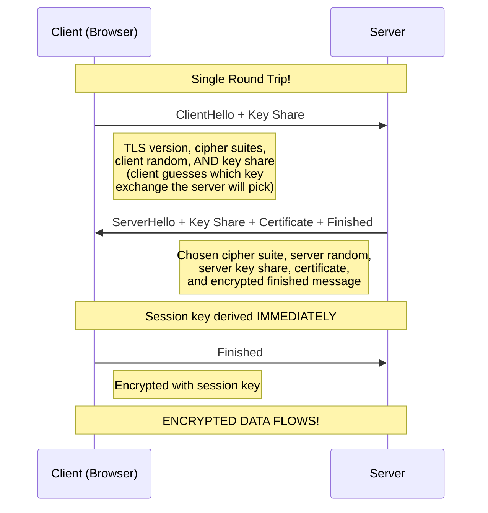
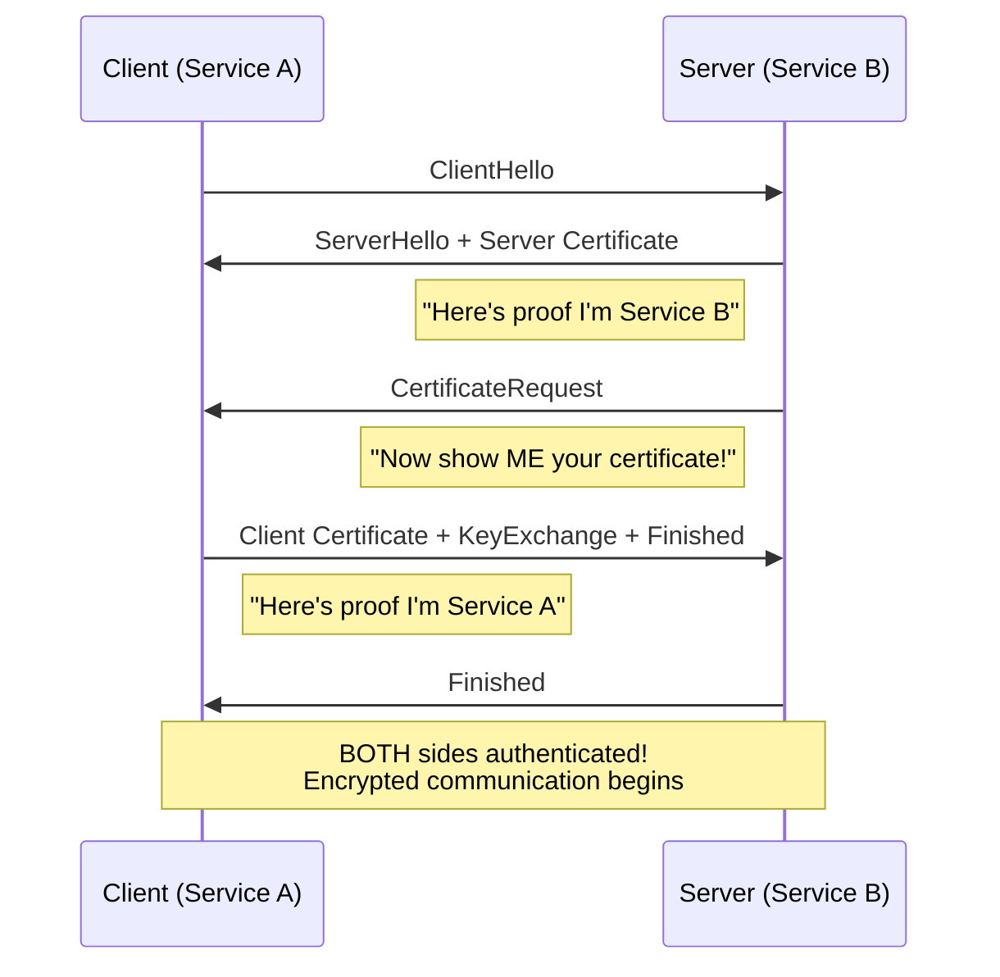

## TLS (Transport Layer Security)

```
Analogy: Sending a secret letter — first you and your friend agree on a secret code 
(handshake), then every letter you exchange is written in that code (encrypted session).
Nobody reading your mail can understand it!
```

Oh, this is one of the most **elegant** protocols on the internet! TLS is what puts the **S** in HTTPS. Every time you see that little lock icon in your browser — that's TLS working behind the scenes to keep your data safe. Let's break it down!

---

### Quick Summary

- **What it does:** TLS encrypts communication between a client and server so that no one in between can read or tamper with the data.
- **Primary use case:** Securing web traffic (HTTPS), email, APIs, database connections — basically anything over a network.
- **Key highlights:**
  - Confidentiality (encryption), Integrity (tamper detection), Authentication (certificates)
  - Successor to SSL (SSL is deprecated — we say "TLS" now!)
  - Current version: **TLS 1.3** (faster, simpler, more secure than TLS 1.2)

---

### The Big Picture — Where TLS Sits

TLS operates between the **Transport Layer (TCP)** and the **Application Layer (HTTP)**. It wraps your application data in an encrypted envelope!

```
┌─────────────────────────────┐
│     Application Layer       │  ← HTTP, gRPC, SMTP, etc.
├─────────────────────────────┤
│     TLS / SSL Layer         │  ← Encryption + Authentication happens HERE
├─────────────────────────────┤
│     Transport Layer (TCP)   │  ← Reliable delivery
├─────────────────────────────┤
│     Network Layer (IP)      │  ← Routing
└─────────────────────────────┘
```

---

### Core Concepts

#### 1. The Three Pillars of TLS

```
    ┌──────────────────┐   ┌──────────────────┐   ┌──────────────────┐
    │  CONFIDENTIALITY │   │    INTEGRITY      │   │  AUTHENTICATION  │
    │                  │   │                   │   │                  │
    │  Data is         │   │  Data hasn't      │   │  You're talking  │
    │  encrypted —     │   │  been modified    │   │  to who you      │
    │  only sender &   │   │  in transit       │   │  think you are   │
    │  receiver can    │   │  (MAC/HMAC)       │   │  (Certificates)  │
    │  read it         │   │                   │   │                  │
    └──────────────────┘   └──────────────────┘   └──────────────────┘
```

#### 2. Symmetric vs Asymmetric Encryption

This is SO important to understand because TLS uses **BOTH**!

```
  ASYMMETRIC (Slow but powerful)              SYMMETRIC (Fast!)
  ════════════════════════════                ═══════════════════
  
  Two keys: Public + Private                 One shared key
  
  ┌─────────┐    ┌─────────┐               ┌─────────┐
  │ Public  │    │ Private │               │ Shared  │
  │  Key    │    │  Key    │               │  Key    │
  │ (share  │    │ (NEVER  │               │ (both   │
  │  with   │    │  share) │               │ parties │
  │ anyone) │    │         │               │  have)  │
  └─────────┘    └─────────┘               └─────────┘
  
  Used during: HANDSHAKE                   Used during: DATA TRANSFER
  Examples: RSA, ECDHE                     Examples: AES-128, AES-256, ChaCha20
```

**Why both?** Asymmetric encryption is slow but lets strangers securely agree on a key. Symmetric encryption is fast but requires a shared secret. TLS uses asymmetric to exchange a symmetric key, then switches to symmetric for speed!

#### 3. Certificates and the Chain of Trust

This is how your browser knows it's *really* talking to google.com and not an impersonator!

```
  ┌──────────────────────────┐
  │     ROOT CA              │  ← Pre-installed in your OS/browser (e.g., DigiCert, Let's Encrypt)
  │  (Self-signed, trusted)  │     Your machine trusts ~100-150 of these
  └────────────┬─────────────┘
               │ signs
               ▼
  ┌──────────────────────────┐
  │   INTERMEDIATE CA        │  ← Signed by Root CA
  │  (Adds a layer of        │     Root CA stays offline for safety
  │   security)              │
  └────────────┬─────────────┘
               │ signs
               ▼
  ┌──────────────────────────┐
  │   SERVER CERTIFICATE     │  ← "Yes, this IS google.com"
  │  (Leaf certificate)      │     Contains: domain name, public key,
  │                          │     expiry date, issuer info
  └──────────────────────────┘
```

Your browser walks UP this chain: "I trust the Root CA, the Root CA trusts the Intermediate CA, the Intermediate CA signed this server cert — so I trust this server!"

---

### The TLS Handshake — The Star of the Show!

This is where the magic happens. Before any encrypted data flows, client and server perform a **handshake** to establish trust and agree on encryption keys.

#### TLS 1.2 Handshake (2 Round Trips)



#### TLS 1.3 Handshake (1 Round Trip — SO much faster!)



**Why is TLS 1.3 faster?** The client *proactively* sends its key share in the first message instead of waiting to be told which algorithm to use. This eliminates an entire round trip!

#### TLS 1.3 also supports 0-RTT (Zero Round Trip Time)

For **repeat connections**, the client can send encrypted data in the VERY FIRST message using a pre-shared key from a previous session. Incredible for performance, but has replay attack risks — so it's only used for idempotent requests (like GET).

```
  First visit:     1-RTT handshake  (still faster than TLS 1.2's 2-RTT!)
  Return visit:    0-RTT possible!  (data sent with the very first packet!)
  
  ┌──────────┐                          ┌──────────┐
  │  Client  │──── ClientHello ────────►│  Server  │
  │          │     + Early Data (0-RTT)  │          │
  │          │     + Key Share           │          │
  │          │◄─── ServerHello ─────────│          │
  │          │     + Finished            │          │
  │          │──── Finished ───────────►│          │
  └──────────┘                          └──────────┘
```

---

### What Changed from TLS 1.2 to 1.3?

| Feature                  | TLS 1.2              | TLS 1.3              |
|--------------------------|----------------------|----------------------|
| Handshake round trips    | 2 RTT                | 1 RTT (0-RTT resumption possible) |
| Cipher suites            | Many (some insecure) | Only 5 strong ones   |
| RSA key exchange         | Supported            | **Removed** (no forward secrecy) |
| Forward secrecy          | Optional (ECDHE)     | **Mandatory**        |
| Handshake encryption     | Partially plain      | Mostly encrypted     |
| Static RSA               | Allowed              | **Removed**          |
| CBC mode ciphers         | Allowed              | **Removed**          |
| 0-RTT resumption         | Not available        | Supported            |

**Forward secrecy** means even if someone steals the server's private key in the future, they CANNOT decrypt past recorded traffic. Each session generates unique ephemeral keys!

---

### Cipher Suite — What Gets Negotiated

A cipher suite is a set of algorithms that client and server agree on. Here's how to read one:

```
  TLS_AES_256_GCM_SHA384        (TLS 1.3 format — simplified!)
  │   │       │    │
  │   │       │    └── Hash algorithm (for key derivation)
  │   │       └─────── Mode (authenticated encryption)
  │   └─────────────── Bulk encryption algorithm + key size
  └─────────────────── Protocol

  TLS_ECDHE_RSA_WITH_AES_128_GCM_SHA256    (TLS 1.2 format)
  │   │      │        │       │    │
  │   │      │        │       │    └── MAC/Hash
  │   │      │        │       └─────── Mode
  │   │      │        └────────────── Encryption + key size
  │   │      └─────────────────────── Authentication
  │   └────────────────────────────── Key Exchange
  └────────────────────────────────── Protocol
```

TLS 1.3 cipher suites (only these 5!):
- `TLS_AES_256_GCM_SHA384`
- `TLS_AES_128_GCM_SHA256`
- `TLS_CHACHA20_POLY1305_SHA256`
- `TLS_AES_128_CCM_SHA256`
- `TLS_AES_128_CCM_8_SHA256`

---

### mTLS (Mutual TLS) — Both Sides Authenticate!

In standard TLS, only the **server** proves its identity. In **mTLS**, the **client also presents a certificate**. This is huge for service-to-service communication in microservices!



**Where is mTLS used?**
- Kubernetes service mesh (Istio, Linkerd)
- Zero-trust architectures
- API gateways authenticating internal services
- Database connections in cloud environments

---

### KeyStore vs TrustStore — Java's Two Vaults for TLS

OK this is the part that confuses EVERYONE at first, but once it clicks, you'll never forget it!

Java doesn't just "do TLS" — it needs to know two things:
1. **"Who am I?"** — that's the **KeyStore**
2. **"Who do I trust?"** — that's the **TrustStore**

They're both technically `java.security.KeyStore` objects (same class!), but they serve completely opposite purposes.

```
  ┌─────────────────────────────────────────────────────────────────────────┐
  │                        YOUR JAVA APPLICATION                           │
  │                                                                        │
  │   ┌──────────────────────┐          ┌──────────────────────────┐       │
  │   │      KEYSTORE        │          │       TRUSTSTORE         │       │
  │   │                      │          │                          │       │
  │   │  "Who am I?"         │          │  "Who do I trust?"       │       │
  │   │                      │          │                          │       │
  │   │  Contains:           │          │  Contains:               │       │
  │   │  ● MY private key    │          │  ● CA certificates       │       │
  │   │  ● MY certificate    │          │  ● Trusted server certs  │       │
  │   │  ● My cert chain     │          │  ● Root CAs              │       │
  │   │                      │          │                          │       │
  │   │  Used when:          │          │  Used when:              │       │
  │   │  ● I'm a server     │          │  ● Verifying a server    │       │
  │   │    proving my        │          │    I'm connecting to     │       │
  │   │    identity          │          │  ● Verifying a client    │       │
  │   │  ● mTLS (client      │          │    in mTLS               │       │
  │   │    sends its cert)   │          │                          │       │
  │   └──────────────────────┘          └──────────────────────────┘       │
  │           │                                    │                       │
  │           ▼                                    ▼                       │
  │     KeyManagerFactory                  TrustManagerFactory             │
  │           │                                    │                       │
  │           └──────────┐        ┌────────────────┘                       │
  │                      ▼        ▼                                        │
  │                   SSLContext.init(keyManagers, trustManagers, random)   │
  │                          │                                             │
  │                          ▼                                             │
  │                   SSLSocketFactory / SSLEngine                         │
  │                   (ready for TLS connections!)                         │
  └─────────────────────────────────────────────────────────────────────────┘
```

#### Why does Java need BOTH?

Think of it like a passport and a list of countries you trust:

```
  KEYSTORE = Your Passport                TRUSTSTORE = Your "Trusted Countries" List
  ═══════════════════════                  ═══════════════════════════════════════════
  
  ┌─────────────────────┐                 ┌─────────────────────────────────┐
  │  PASSPORT           │                 │  TRUSTED AUTHORITIES            │
  │                     │                 │                                 │
  │  Name: myserver.com │                 │  ✓ DigiCert Root CA             │
  │  Photo: [pub key]   │                 │  ✓ Let's Encrypt Root CA        │
  │  Secret: [priv key] │                 │  ✓ Amazon Root CA               │
  │  Issued by: CA      │                 │  ✓ My Company's Internal CA     │
  │                     │                 │  ✗ (Unknown CAs rejected!)      │
  └─────────────────────┘                 └─────────────────────────────────┘
  
  You SHOW this to others                 You CHECK others against this
```

#### Java's Default TrustStore — cacerts

Here's something exciting — Java ships with a **built-in TrustStore** called `cacerts`! It lives inside your JDK:

```
$JAVA_HOME/lib/security/cacerts       (Java 9+)
$JAVA_HOME/jre/lib/security/cacerts   (Java 8)

Default password: "changeit"   (yes, really!)
```

This file contains ~100+ root CA certificates (DigiCert, Let's Encrypt, Comodo, etc.). That's why `HttpsURLConnection` works out of the box for public websites — the server's cert chains up to a CA that's already in `cacerts`!

```
# List all trusted CAs in Java's default truststore
keytool -list -keystore $JAVA_HOME/lib/security/cacerts -storepass changeit

# Count them
keytool -list -keystore $JAVA_HOME/lib/security/cacerts -storepass changeit | grep -c "trustedCertEntry"
```

#### When Do You Need a Custom KeyStore or TrustStore?

| Scenario | KeyStore Needed? | TrustStore Needed? |
|----------|:---:|:---:|
| Client calling a public HTTPS API (google, stripe) | No | No (default `cacerts` works) |
| Server hosting HTTPS (Spring Boot, Tomcat) | **Yes** (server's own cert + private key) | No |
| Client connecting to server with self-signed cert | No | **Yes** (must add that cert) |
| Client connecting to internal CA-signed services | No | **Yes** (must add internal CA) |
| mTLS — client authenticating itself to server | **Yes** (client cert + private key) | **Yes** (server's CA) |
| mTLS — server verifying client certs | **Yes** (server cert) | **Yes** (client's CA) |

#### How keytool Ties Into This

`keytool` is Java's built-in CLI for managing KeyStores and TrustStores. When you run `keytool -genkeypair`, you're creating a **private key + self-signed certificate** inside a KeyStore. This is the starting point for any Java app that needs to prove its own identity over TLS.

```
# KEYSTORE operations — managing YOUR identity
# ─────────────────────────────────────────────

# Generate a new key pair (private key + self-signed cert)
keytool -genkeypair -alias myapp \
  -keyalg RSA -keysize 2048 \
  -validity 365 \
  -keystore keystore.jks \
  -storepass changeit \
  -dname "CN=myapp.example.com, O=MyCompany, L=City, ST=State, C=US"

# Generate a CSR (Certificate Signing Request) to send to a real CA
keytool -certreq -alias myapp \
  -keystore keystore.jks \
  -file myapp.csr

# Import the CA-signed certificate back into the keystore
keytool -importcert -alias myapp \
  -keystore keystore.jks \
  -file signed-cert.pem

# List contents of a keystore
keytool -list -v -keystore keystore.jks


# TRUSTSTORE operations — managing WHO YOU TRUST
# ───────────────────────────────────────────────

# Import a CA or server certificate into a truststore
keytool -importcert -alias partner-ca \
  -keystore truststore.jks \
  -file partner-ca-cert.pem

# Import a self-signed cert from a dev server you need to trust
keytool -importcert -alias dev-server \
  -keystore truststore.jks \
  -file dev-server.pem
```

#### Putting It All Together — Spring Boot Example

```yaml
# application.yml — telling Spring Boot where your stores are

# As a SERVER (clients connect to you over HTTPS):
server:
  ssl:
    key-store: classpath:keystore.p12        # YOUR cert + private key
    key-store-password: secret
    key-store-type: PKCS12
    enabled: true

# As a CLIENT calling another service with mTLS:
spring:
  ssl:
    bundle:
      jks:
        my-service:
          keystore:
            location: classpath:client-keystore.p12   # YOUR client cert
            password: secret
          truststore:
            location: classpath:truststore.jks         # THEIR CA cert
            password: secret
```

```java
// Programmatic SSLContext with BOTH stores — full mTLS setup
import javax.net.ssl.*;
import java.security.KeyStore;
import java.io.FileInputStream;

public class MtlsContextBuilder {

    public static SSLContext buildMtlsContext(
            String keyStorePath, String keyStorePass,
            String trustStorePath, String trustStorePass) throws Exception {

        // 1. Load KeyStore — "Here's who I am"
        KeyStore keyStore = KeyStore.getInstance("PKCS12");
        try (FileInputStream kis = new FileInputStream(keyStorePath)) {
            keyStore.load(kis, keyStorePass.toCharArray());
        }
        KeyManagerFactory kmf = KeyManagerFactory.getInstance(
            KeyManagerFactory.getDefaultAlgorithm());
        kmf.init(keyStore, keyStorePass.toCharArray());

        // 2. Load TrustStore — "Here's who I trust"
        KeyStore trustStore = KeyStore.getInstance("JKS");
        try (FileInputStream tis = new FileInputStream(trustStorePath)) {
            trustStore.load(tis, trustStorePass.toCharArray());
        }
        TrustManagerFactory tmf = TrustManagerFactory.getInstance(
            TrustManagerFactory.getDefaultAlgorithm());
        tmf.init(trustStore);

        // 3. Combine into SSLContext
        SSLContext ctx = SSLContext.getInstance("TLSv1.3");
        ctx.init(kmf.getKeyManagers(), tmf.getTrustManagers(), null);
        return ctx;
    }
}
```

#### Store File Formats

| Format | Extension | Description |
|--------|-----------|-------------|
| **JKS** | `.jks` | Java KeyStore (legacy, Java-only) |
| **PKCS12** | `.p12`, `.pfx` | Industry standard (recommended since Java 9) |
| **PEM** | `.pem`, `.crt` | Base64-encoded, common in Linux/OpenSSL world |
| **DER** | `.der`, `.cer` | Binary-encoded certificate |

Java 9+ defaults to PKCS12 format. If you see JKS in older projects, consider migrating:
```
# Convert JKS to PKCS12
keytool -importkeystore \
  -srckeystore keystore.jks -srcstoretype JKS \
  -destkeystore keystore.p12 -deststoretype PKCS12
```

---

### Usage Examples in Java

#### 1. Basic HTTPS Connection (TLS happens automatically!)

```java
import javax.net.ssl.HttpsURLConnection;
import java.net.URL;
import java.io.BufferedReader;
import java.io.InputStreamReader;

public class SimpleHttpsClient {
    public static void main(String[] args) throws Exception {
        URL url = new URL("https://api.example.com/data");
        HttpsURLConnection conn = (HttpsURLConnection) url.openConnection();

        // TLS handshake happens automatically here!
        System.out.println("Cipher Suite: " + conn.getCipherSuite());
        System.out.println("Server Cert: " + conn.getServerCertificates()[0]);

        BufferedReader reader = new BufferedReader(
            new InputStreamReader(conn.getInputStream()));
        String line;
        while ((line = reader.readLine()) != null) {
            System.out.println(line);
        }
        reader.close();
    }
}
```

#### 2. SSLSocket — Low-level TLS Connection

```java
import javax.net.ssl.SSLSocket;
import javax.net.ssl.SSLSocketFactory;
import javax.net.ssl.SSLSession;

public class TlsSocketExample {
    public static void main(String[] args) throws Exception {
        SSLSocketFactory factory = (SSLSocketFactory) SSLSocketFactory.getDefault();

        try (SSLSocket socket = (SSLSocket) factory.createSocket("www.google.com", 443)) {

            // Force TLS 1.3 only
            socket.setEnabledProtocols(new String[]{"TLSv1.3"});

            // Trigger handshake
            socket.startHandshake();

            SSLSession session = socket.getSession();
            System.out.println("Protocol : " + session.getProtocol());
            System.out.println("Cipher   : " + session.getCipherSuite());
            System.out.println("Peer Host: " + session.getPeerHost());
            System.out.println("Peer Cert: " + session.getPeerCertificates()[0].getType());
        }
    }
}
// Output:
// Protocol : TLSv1.3
// Cipher   : TLS_AES_256_GCM_SHA384
// Peer Host: www.google.com
// Peer Cert: X.509
```

#### 3. Custom TrustStore (when you have your own CA)

```java
import javax.net.ssl.*;
import java.security.KeyStore;
import java.io.FileInputStream;

public class CustomTrustStoreExample {
    public static SSLContext createSSLContext(String trustStorePath, String password)
            throws Exception {

        // Load custom trust store
        KeyStore trustStore = KeyStore.getInstance("JKS");
        try (FileInputStream fis = new FileInputStream(trustStorePath)) {
            trustStore.load(fis, password.toCharArray());
        }

        // Initialize TrustManagerFactory with our trust store
        TrustManagerFactory tmf = TrustManagerFactory.getInstance(
            TrustManagerFactory.getDefaultAlgorithm());
        tmf.init(trustStore);

        // Create SSL context with custom trust managers
        SSLContext sslContext = SSLContext.getInstance("TLSv1.3");
        sslContext.init(null, tmf.getTrustManagers(), null);

        return sslContext;
    }

    public static void main(String[] args) throws Exception {
        SSLContext ctx = createSSLContext("/path/to/truststore.jks", "changeit");
        SSLSocketFactory factory = ctx.getSocketFactory();

        try (SSLSocket socket = (SSLSocket) factory.createSocket("internal.mycompany.com", 443)) {
            socket.startHandshake();
            System.out.println("Connected with: " + socket.getSession().getCipherSuite());
        }
    }
}
```

---

### Key Points to Remember

- **TLS != SSL.** SSL is dead (SSL 3.0 deprecated in 2015). Always say TLS. When people say "SSL certificate," they mean a TLS certificate.
- **TLS 1.0 and 1.1 are deprecated** (RFC 8996, March 2021). Use **TLS 1.2 minimum**, prefer **TLS 1.3**.
- **Never disable certificate verification** in production (`TrustAllCerts` is a common security hole in Java apps).
- **Forward secrecy is critical** — TLS 1.3 enforces it; in TLS 1.2, make sure you're using ECDHE, not static RSA.
- **Certificate expiry** — Certs expire! Automate renewal with tools like Let's Encrypt + certbot.
- **SNI (Server Name Indication)** — Allows multiple TLS sites on one IP. The client sends the hostname in plaintext during ClientHello (TLS 1.3 introduced Encrypted Client Hello to fix this).
- **HSTS (HTTP Strict Transport Security)** — Header that tells browsers to ALWAYS use HTTPS for your domain. Prevents downgrade attacks.
- **Certificate pinning** — Hardcoding expected cert/public key in the app. Prevents MITM even if a CA is compromised. Used in mobile apps.

### Common Mistakes to Avoid

| Mistake | Why It's Bad |
|---------|-------------|
| Using `TrustAllCerts` or disabling hostname verification | Completely defeats TLS — MITM attacks become trivial |
| Allowing TLS 1.0/1.1 | Known vulnerabilities (BEAST, POODLE) |
| Using RSA key exchange (no ECDHE) | No forward secrecy — compromised key decrypts all past traffic |
| Self-signed certs in production without pinning | Users get warnings, phishing becomes easier |
| Not setting up HSTS | Allows SSL stripping / downgrade attacks |
| Hardcoding cipher suites | They become outdated; prefer server-side ordering |

---

### Quick Reference

```
# Check a server's TLS configuration from terminal
openssl s_client -connect example.com:443 -tls1_3

# View certificate details
openssl s_client -connect example.com:443 | openssl x509 -text -noout

# Generate a self-signed cert (for development)
keytool -genkeypair -alias myapp -keyalg RSA -keysize 2048 \
  -validity 365 -keystore keystore.jks -storepass changeit

# List Java's supported cipher suites
jrunscript -e "java.util.Arrays.asList(
  javax.net.ssl.SSLContext.getDefault()
    .getDefaultSSLParameters().getCipherSuites()
).forEach(function(s){print(s)})"

# Test TLS version support
nmap --script ssl-enum-ciphers -p 443 example.com
```

**Java System Properties for TLS:**

| Property | Description |
|----------|-------------|
| `javax.net.ssl.trustStore` | Path to trust store file |
| `javax.net.ssl.trustStorePassword` | Trust store password |
| `javax.net.ssl.keyStore` | Path to key store (for mTLS client cert) |
| `javax.net.ssl.keyStorePassword` | Key store password |
| `https.protocols` | Allowed TLS versions (e.g., `TLSv1.3`) |
| `jdk.tls.client.protocols` | Client-side TLS version control |

---

### Related Topics

- **Certificate Authorities & PKI** — How the trust hierarchy works at scale
- **HTTPS** — TLS applied to HTTP (port 443)
- **mTLS in Kubernetes** — Service mesh (Istio/Linkerd) auto-injects mTLS between pods
- **OAuth 2.0 / JWT** — Authentication on TOP of TLS (TLS handles transport security, OAuth handles authorization)
- **QUIC / HTTP/3** — Uses TLS 1.3 built directly into the transport protocol (merged with UDP)
- **Let's Encrypt** — Free, automated certificate authority

---
