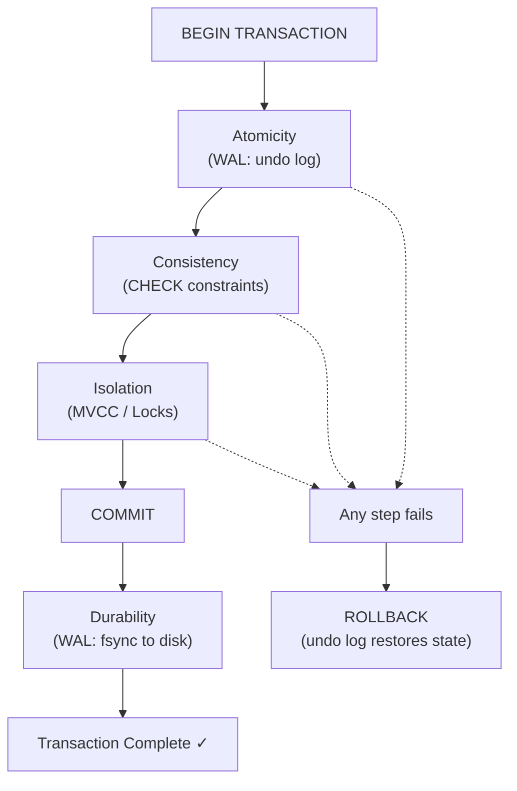

# Database ACID Properties

## Quick Summary

- **What:** Four guarantees (**A**tomicity, **C**onsistency, **I**solation, **D**urability) that make database transactions reliable
- **Primary use case:** Any operation where partial failure would corrupt data — money transfers, inventory, bookings
- **Key highlight:** Without ACID, a crashed server mid-transfer could make money vanish. With ACID, that's *impossible*.

---

## Analogy: The ATM Transaction

Think of ACID like the guarantees your ATM provides when you transfer money:

```
You: "Transfer $500 from Savings → Checking"

  ┌──────────────────────────────────────────────────────────────┐
  │                    WHAT COULD GO WRONG?                       │
  │                                                              │
  │  1. Power dies after deducting $500 but BEFORE adding it     │
  │     → Money vanishes! 💸                                     │
  │                                                              │
  │  2. Your balance goes negative (you only had $300)           │
  │     → Bank rules violated!                                   │
  │                                                              │
  │  3. Someone else transfers FROM your savings at the same time│
  │     → Both see $500, both deduct, you lose $1000!            │
  │                                                              │
  │  4. Transfer succeeds, server crashes, your $500 is gone     │
  │     → "Trust us, it went through" — but did it?              │
  └──────────────────────────────────────────────────────────────┘

  ACID prevents ALL of these:

  A — Atomicity:    Both sides happen, or NEITHER happens (no vanishing money)
  C — Consistency:  Balance can't go negative (rules always hold)
  I — Isolation:    Other transactions can't see your half-done transfer
  D — Durability:   Once confirmed, the transfer survives ANY crash
```

Once this clicks, you'll never forget it — ACID is the reason banks can use databases instead of filing cabinets!

---

## The Four Properties — Visual Overview

```
  ┌─────────────────────────────────────────────────────────────────────┐
  │                        A TRANSACTION                                │
  │                                                                     │
  │   BEGIN ──────────────────────────────────────────────── COMMIT     │
  │     │                                                      │        │
  │     │   ┌─── ATOMICITY ────────────────────────────┐      │        │
  │     │   │ All operations succeed, or ALL roll back │      │        │
  │     │   └──────────────────────────────────────────┘      │        │
  │     │                                                      │        │
  │     │   ┌─── CONSISTENCY ──────────────────────────┐      │        │
  │     │   │ DB starts valid → ends valid (rules hold)│      │        │
  │     │   └──────────────────────────────────────────┘      │        │
  │     │                                                      │        │
  │     │   ┌─── ISOLATION ────────────────────────────┐      │        │
  │     │   │ Other txns can't see my in-progress work │      │        │
  │     │   └──────────────────────────────────────────┘      │        │
  │     │                                                      │        │
  │     ▼   ┌─── DURABILITY ───────────────────────────┐      ▼        │
  │         │ Once COMMIT returns, data survives crash  │               │
  │         └──────────────────────────────────────────┘               │
  └─────────────────────────────────────────────────────────────────────┘
```

---

## Atomicity — "All or Nothing"

Think of it like sending a package: either the whole package arrives, or it gets returned to sender. You never get half a package.

```
  Transfer $100: Account A → Account B

  ✅ SUCCESS (both happen):               ❌ CRASH mid-way (both undo):
  ┌──────────┐    ┌──────────┐            ┌──────────┐    ┌──────────┐
  │ Acct A   │    │ Acct B   │            │ Acct A   │    │ Acct B   │
  │ $1000    │    │ $500     │            │ $1000    │    │ $500     │
  │  - $100  │    │  + $100  │            │  - $100  │    │          │
  │ ──────── │    │ ──────── │            │ ──────── │    │          │
  │ = $900 ✓ │    │ = $600 ✓ │            │ = $900   │    │ CRASH! ⚡│
  └──────────┘    └──────────┘            │ ROLLBACK │    │          │
                                          │ = $1000 ✓│    │ = $500 ✓ │
                                          └──────────┘    └──────────┘
                                          No money lost!
```

**How does the DB pull this off?** Write-Ahead Logging (WAL):

```
  1. BEFORE touching data, write your INTENT to a log on disk
  2. Then apply changes to actual data
  3. If crash → read the log → undo incomplete work

  ┌─────────────┐     ┌─────────────┐     ┌─────────────┐
  │  WAL Log    │     │  Buffer     │     │  Disk       │
  │  (on disk)  │────>│  (memory)   │────>│  (tables)   │
  │             │     │             │     │             │
  │ T1: A=1000  │     │ A = 900     │     │ A = 1000    │
  │     →900    │     │ B = 600     │     │ B = 500     │
  │ T1: B=500   │     │             │     │ (not yet    │
  │     →600    │     │             │     │  flushed)   │
  │ T1: COMMIT  │     │             │     │             │
  └─────────────┘     └─────────────┘     └─────────────┘
        ↑
  Crash recovery reads this log!
```

**Java example — Atomicity in action:**

```java
Connection conn = DriverManager.getConnection("jdbc:postgresql://localhost/bank");

try {
    conn.setAutoCommit(false);  // ← Start manual transaction

    PreparedStatement debit = conn.prepareStatement(
        "UPDATE accounts SET balance = balance - ? WHERE id = ?");
    debit.setBigDecimal(1, new BigDecimal("100.00"));
    debit.setInt(2, accountA);
    debit.executeUpdate();

    PreparedStatement credit = conn.prepareStatement(
        "UPDATE accounts SET balance = balance + ? WHERE id = ?");
    credit.setBigDecimal(1, new BigDecimal("100.00"));
    credit.setInt(2, accountB);
    credit.executeUpdate();

    conn.commit();  // ← Both succeed together, or...
    System.out.println("Transfer complete!");

} catch (SQLException e) {
    conn.rollback();  // ← ...both are undone together
    System.err.println("Transfer failed, rolled back: " + e.getMessage());
} finally {
    conn.setAutoCommit(true);
    conn.close();
}
```

> Deep dive: [Atomicity](./db-acid-atomicity.md) — undo/redo logs, savepoints, shadow paging

---

## Consistency — "Valid State to Valid State"

OK this is the one that confuses EVERYONE at first, because "consistency" means different things in different contexts. In ACID, it's simple: **the database's own rules are never broken**.

Think of it like a chess game — you can move pieces, but you can never end a turn in an illegal position (two kings on the same square, a pawn on row 0, etc.).

```
  CONSISTENCY = Your rules ALWAYS hold after a transaction

  Rules (constraints):
  ┌──────────────────────────────────────────────┐
  │  • balance >= 0          (CHECK constraint)  │
  │  • email is unique       (UNIQUE constraint) │
  │  • order.user_id exists  (FOREIGN KEY)       │
  │  • total = subtotal + tax (business rule)    │
  └──────────────────────────────────────────────┘

  Transaction: Withdraw $2000 from account with $500

  Before:  balance = $500 ✓ (valid state)
           ↓
  Attempt: balance = $500 - $2000 = -$1500
           ↓
  CHECK:   balance >= 0 ?  ❌ NO!
           ↓
  Result:  ROLLBACK → balance = $500 ✓ (still valid state)

  The DB NEVER lands in an invalid state!
```

**Two layers of consistency:**

```
  Layer 1: DATABASE constraints (enforced by the DB itself)
  ┌──────────────────────────────────────────────────────┐
  │  PRIMARY KEY    — uniqueness + not null               │
  │  FOREIGN KEY    — referential integrity               │
  │  CHECK          — column-level rules                  │
  │  UNIQUE         — no duplicates                       │
  │  NOT NULL       — required fields                     │
  └──────────────────────────────────────────────────────┘

  Layer 2: APPLICATION constraints (enforced by your code)
  ┌──────────────────────────────────────────────────────┐
  │  "User must be 18+ to create account"                │
  │  "Can't book a flight that already departed"         │
  │  "Discount can't exceed item price"                  │
  └──────────────────────────────────────────────────────┘

  Best practice: enforce at BOTH layers! DB constraints can't be
  bypassed by a rogue SQL query or a bug in your code.
```

**Java example — DB constraints catch violations you might miss:**

```java
String sql = "INSERT INTO products (name, price, stock) VALUES (?, ?, ?)";
try (PreparedStatement ps = conn.prepareStatement(sql)) {
    ps.setString(1, "Widget");
    ps.setBigDecimal(2, new BigDecimal("-10.00"));  // Oops, negative price!
    ps.setInt(3, 5);
    ps.executeUpdate();
} catch (SQLException e) {
    // DB CHECK constraint catches it:
    // "new row violates check constraint products_price_check"
    System.err.println("Consistency violation: " + e.getMessage());
}
```

> Deep dive: [Consistency](./db-acid-consistency.md) — entity/referential/domain integrity, triggers, stored procedures

---

## Isolation — "Transactions Don't Interfere"

This is where it gets really interesting! Imagine two cashiers at the same register counting cash simultaneously — without isolation, they'd lose track of the real total.

```
  WITHOUT ISOLATION (the "lost update" problem):

  Account balance: $1000

  Thread A (deposit $100):          Thread B (deposit $50):
  ─────────────────────             ─────────────────────
  1. READ balance → $1000           
                                    2. READ balance → $1000
  3. balance = 1000 + 100 = 1100    
                                    4. balance = 1000 + 50 = 1050
  5. WRITE balance = $1100          
                                    6. WRITE balance = $1050  ← OVERWRITES!

  Final: $1050 (Thread A's $100 deposit vanished! 😱)
  Expected: $1150
```

**Isolation levels — a spectrum from fast-and-loose to bulletproof:**

```
  ┌────────────────────┬──────────┬──────────────────┬──────────────┬─────────────┐
  │ Isolation Level    │ Dirty    │ Non-Repeatable   │ Phantom      │ Performance │
  │                    │ Read     │ Read             │ Read         │             │
  ├────────────────────┼──────────┼──────────────────┼──────────────┼─────────────┤
  │ READ UNCOMMITTED   │ ❌ Yes   │ ❌ Yes           │ ❌ Yes       │ ⚡ Fastest   │
  │ READ COMMITTED     │ ✅ No    │ ❌ Yes           │ ❌ Yes       │ 🏃 Fast     │
  │ REPEATABLE READ    │ ✅ No    │ ✅ No            │ ❌ Yes       │ 🚶 Medium   │
  │ SERIALIZABLE       │ ✅ No    │ ✅ No            │ ✅ No        │ 🐢 Slowest  │
  └────────────────────┴──────────┴──────────────────┴──────────────┴─────────────┘

  Most DBs default to READ COMMITTED (PostgreSQL) or REPEATABLE READ (MySQL)
```

**What are these problems? Visual breakdown:**

```
  DIRTY READ: You read someone's UNCOMMITTED work (that might get rolled back!)
  ┌────────────────────────────────────────────────────┐
  │ T1: UPDATE balance = 500     (uncommitted)        │
  │ T2: SELECT balance → 500     (reads dirty data!)  │
  │ T1: ROLLBACK                 (was never real!)    │
  │ T2: uses $500 for decisions  (WRONG!)             │
  └────────────────────────────────────────────────────┘

  NON-REPEATABLE READ: Same query, different results within YOUR transaction
  ┌────────────────────────────────────────────────────┐
  │ T1: SELECT balance → $1000                        │
  │ T2: UPDATE balance = $500; COMMIT;                │
  │ T1: SELECT balance → $500   (different!)          │
  └────────────────────────────────────────────────────┘

  PHANTOM READ: New rows appear/disappear between queries
  ┌────────────────────────────────────────────────────┐
  │ T1: SELECT COUNT(*) WHERE age > 21 → 5 rows      │
  │ T2: INSERT (age=25); COMMIT;                      │
  │ T1: SELECT COUNT(*) WHERE age > 21 → 6 rows      │
  │     (a "phantom" row appeared!)                    │
  └────────────────────────────────────────────────────┘
```

**How DBs implement isolation — two main strategies:**

```
  Strategy 1: LOCKING (pessimistic)         Strategy 2: MVCC (optimistic)
  ──────────────────────────                ──────────────────────────────
  "Lock the row so nobody                  "Keep multiple versions, each
   else can touch it"                       transaction sees its own snapshot"

  T1: LOCK row A                           T1: sees version @ timestamp 100
  T2: BLOCKED... waiting...                T2: sees version @ timestamp 150
  T1: UPDATE, COMMIT, UNLOCK               Both read without blocking!
  T2: now proceeds                         Conflict detected at COMMIT time

  ✅ Simple to reason about                ✅ Readers never block writers
  ❌ Contention under high load            ❌ More complex, uses more storage
                                           
  Used by: SQL Server (default)            Used by: PostgreSQL, MySQL InnoDB,
                                                    Oracle
```

**Java example — choosing isolation level for a financial transfer:**

```java
Connection conn = DriverManager.getConnection("jdbc:postgresql://localhost/bank");

// For critical financial operations: SERIALIZABLE
conn.setTransactionIsolation(Connection.TRANSACTION_SERIALIZABLE);
conn.setAutoCommit(false);

try {
    // Lock the row explicitly to prevent lost updates
    PreparedStatement check = conn.prepareStatement(
        "SELECT balance FROM accounts WHERE id = ? FOR UPDATE");
    check.setInt(1, fromAccountId);
    ResultSet rs = check.executeQuery();

    if (rs.next() && rs.getBigDecimal("balance").compareTo(amount) >= 0) {
        // Safe to proceed — row is locked, balance is sufficient
        PreparedStatement debit = conn.prepareStatement(
            "UPDATE accounts SET balance = balance - ? WHERE id = ?");
        debit.setBigDecimal(1, amount);
        debit.setInt(2, fromAccountId);
        debit.executeUpdate();

        PreparedStatement credit = conn.prepareStatement(
            "UPDATE accounts SET balance = balance + ? WHERE id = ?");
        credit.setBigDecimal(1, amount);
        credit.setInt(2, toAccountId);
        credit.executeUpdate();

        conn.commit();
    }
} catch (SQLException e) {
    conn.rollback();
    if ("40001".equals(e.getSQLState())) {
        // Serialization conflict — retry the transaction!
        System.out.println("Conflict detected, retrying...");
    }
}
```

> Deep dive: [Isolation](./db-acid-isolation.md) — all four levels in detail, MVCC, 2PL, deadlocks

---

## Durability — "Changes Are Permanent"

Think of COMMIT as clicking "Save" on a document — once the save completes, even pulling the plug won't lose your work.

```
  Timeline of a transaction:

  BEGIN ──── UPDATE ──── UPDATE ──── COMMIT ──── 💥 CRASH
                                       │
                                       ▼
                              ┌──────────────────┐
                              │ WAL on disk says: │
                              │ "T1 COMMITTED"    │
                              │ A = $900          │
                              │ B = $600          │
                              └──────────────────┘
                                       │
                              On restart, DB reads WAL
                                       │
                                       ▼
                              ┌──────────────────┐
                              │ Recovery:         │
                              │ REDO T1's changes │
                              │ A = $900 ✓        │
                              │ B = $600 ✓        │
                              │ Data restored!    │
                              └──────────────────┘


  BUT what if crash happens BEFORE commit?

  BEGIN ──── UPDATE ──── 💥 CRASH (no COMMIT in WAL)
                              │
                              ▼
                    ┌──────────────────┐
                    │ Recovery:         │
                    │ T1 not committed  │
                    │ UNDO T1's changes │
                    │ Data unchanged ✓  │
                    └──────────────────┘
```

**The durability stack — multiple layers of protection:**

```
  ┌─────────────────────────────────────────────────────┐
  │              APPLICATION                             │
  │              conn.commit()                           │
  └───────────────────┬─────────────────────────────────┘
                      ▼
  ┌─────────────────────────────────────────────────────┐
  │              DATABASE ENGINE                         │
  │              Write COMMIT record to WAL              │
  └───────────────────┬─────────────────────────────────┘
                      ▼
  ┌─────────────────────────────────────────────────────┐
  │              OS / FILESYSTEM                         │
  │              fsync() — force flush to disk           │
  └───────────────────┬─────────────────────────────────┘
                      ▼
  ┌─────────────────────────────────────────────────────┐
  │              HARDWARE                                │
  │              Bits written to SSD/HDD platters        │
  └───────────────────┬─────────────────────────────────┘
                      ▼
  ┌─────────────────────────────────────────────────────┐
  │              REPLICATION (distributed)               │
  │              Copied to 2+ servers in different DCs   │
  └─────────────────────────────────────────────────────┘

  Each layer adds more durability (and more latency).
  Most apps: WAL + fsync is enough.
  Banks: WAL + fsync + synchronous replication.
```

**Performance vs durability — you can tune this knob:**

```sql
-- PostgreSQL: full durability (default) — safest
SET synchronous_commit = on;

-- PostgreSQL: async commit — faster, but up to ~100ms of data loss on crash
SET synchronous_commit = off;

-- MySQL: the famous "flush on every commit" setting
SET innodb_flush_log_at_trx_commit = 1;  -- every commit (safest)
SET innodb_flush_log_at_trx_commit = 2;  -- every second (faster)
SET innodb_flush_log_at_trx_commit = 0;  -- OS decides (fastest, least safe)
```

> Deep dive: [Durability](./db-acid-durability.md) — WAL mechanics, fsync, ARIES recovery, replication strategies

---

## How They All Work Together

This is the part that really makes everything click — ACID isn't four independent ideas, they're deeply interconnected:



**Complete flow — a bank transfer through all four properties:**

```
  Transfer $100: Account A ($1000) → Account B ($500)

  ┌─ ATOMICITY ──────────────────────────────────────────────────┐
  │                                                              │
  │  1. WAL: log "T1: A.balance 1000 → 900"                     │
  │  2. WAL: log "T1: B.balance 500 → 600"                      │
  │  3. Apply changes in memory                                  │
  │                                                              │
  │  ┌─ CONSISTENCY ──────────────────────────────────────────┐  │
  │  │  4. CHECK: A.balance (900) >= 0? ✅                    │  │
  │  │  5. CHECK: B.balance (600) >= 0? ✅                    │  │
  │  │  6. FK: A and B exist? ✅                              │  │
  │  └────────────────────────────────────────────────────────┘  │
  │                                                              │
  │  ┌─ ISOLATION ────────────────────────────────────────────┐  │
  │  │  7. Other transactions see EITHER:                     │  │
  │  │     (A=$1000, B=$500) OR (A=$900, B=$600)              │  │
  │  │     NEVER (A=$900, B=$500) ← money vanished!           │  │
  │  └────────────────────────────────────────────────────────┘  │
  │                                                              │
  └──────────────────────────────────────────────────────────────┘

  ┌─ DURABILITY ─────────────────────────────────────────────────┐
  │  8. WAL: log "T1: COMMIT"                                   │
  │  9. fsync() — force WAL to disk                              │
  │  10. Return "success" to application                         │
  │                                                              │
  │  Even if server explodes right now → WAL has the truth       │
  └──────────────────────────────────────────────────────────────┘
```

---

## ACID vs BASE

Why doesn't every database just use ACID? Because in distributed systems, there's a fundamental trade-off:

```
  ACID (Strong Consistency)              BASE (Eventual Consistency)
  ═══════════════════════                ═══════════════════════════
  "I need the RIGHT answer"             "I need AN answer, RIGHT NOW"

  ┌────────────────────┐                ┌────────────────────┐
  │ PostgreSQL, MySQL  │                │ Cassandra, DynamoDB│
  │ Oracle, SQL Server │                │ MongoDB, Redis     │
  └────────────────────┘                └────────────────────┘

  ✅ Strong consistency                 ✅ High availability
  ✅ Immediate reads = truth            ✅ Scales horizontally  
  ❌ Harder to scale                    ❌ Reads may be stale
  ❌ Single point of failure            ❌ Weaker guarantees

  USE FOR:                              USE FOR:
  • Bank transfers                      • Social media feeds
  • Inventory / bookings                • Product catalogs
  • Healthcare records                  • Analytics / metrics
  • Anything with money                 • Shopping cart (can rebuild)
```

```
  BASE stands for:
  B — Basically Available  (system always responds, even if stale)
  A — 
  S — Soft state           (data may change without input — replicas syncing)
  E — Eventual consistency (all replicas converge... eventually)
```

### CAP Theorem Connection

```
  In distributed systems, pick 2 of 3:

       Consistency
          /\
         /  \
        /    \
       / ACID \
      /  (CP)  \
     /──────────\
    Availability ── Partition Tolerance
         \          /
          \  BASE  /
           \ (AP) /
            \    /
             \  /
              \/

  Network partitions WILL happen → you're really choosing C or A.
  
  ACID databases typically choose CP (Consistency + Partition tolerance)
  BASE databases typically choose AP (Availability + Partition tolerance)
```

---

## Java — Complete Transaction Template

Here's a reusable pattern for ACID-compliant transactions in Java:

```java
public class TransactionTemplate {

    /**
     * Execute a bank transfer with full ACID guarantees.
     * Demonstrates atomicity (try/rollback), consistency (balance check),
     * isolation (SERIALIZABLE + FOR UPDATE), durability (commit = done).
     */
    public static boolean transfer(DataSource ds, int from, int to, BigDecimal amount) {
        try (Connection conn = ds.getConnection()) {
            conn.setAutoCommit(false);
            conn.setTransactionIsolation(Connection.TRANSACTION_SERIALIZABLE);  // Isolation

            try {
                // Lock sender's row (Isolation — prevent concurrent modifications)
                BigDecimal balance;
                try (PreparedStatement ps = conn.prepareStatement(
                        "SELECT balance FROM accounts WHERE id = ? FOR UPDATE")) {
                    ps.setInt(1, from);
                    ResultSet rs = ps.executeQuery();
                    if (!rs.next()) throw new SQLException("Account not found: " + from);
                    balance = rs.getBigDecimal("balance");
                }

                // Consistency — enforce business rule
                if (balance.compareTo(amount) < 0) {
                    conn.rollback();
                    System.err.println("Insufficient funds: " + balance + " < " + amount);
                    return false;
                }

                // Atomicity — both updates succeed or both fail
                try (PreparedStatement debit = conn.prepareStatement(
                        "UPDATE accounts SET balance = balance - ? WHERE id = ?")) {
                    debit.setBigDecimal(1, amount);
                    debit.setInt(2, from);
                    debit.executeUpdate();
                }

                try (PreparedStatement credit = conn.prepareStatement(
                        "UPDATE accounts SET balance = balance + ? WHERE id = ?")) {
                    credit.setBigDecimal(1, amount);
                    credit.setInt(2, to);
                    credit.executeUpdate();
                }

                // Durability — once commit() returns, data is on disk
                conn.commit();
                return true;

            } catch (SQLException e) {
                conn.rollback();  // Atomicity — undo everything on failure
                throw e;
            }
        } catch (SQLException e) {
            System.err.println("Transaction failed: " + e.getMessage());
            return false;
        }
    }
}
```

---

## Key Points to Remember

**The essentials:**
- **Atomicity** is enforced by the **WAL** (undo/redo logs) — the DB logs intent before acting
- **Consistency** is a **shared responsibility** — DB enforces constraints, your app enforces business rules
- **Isolation** has **four levels** — pick the right one for your use case (READ COMMITTED for most OLTP)
- **Durability** depends on **fsync()** — without it, data can sit in OS buffers and get lost on crash

**Common mistakes:**
- Using `autoCommit=true` (the default in JDBC!) for multi-step operations — each statement is its own transaction
- Checking balance with `SELECT` then updating with `UPDATE` in two separate transactions — use `FOR UPDATE` to lock the row
- Assuming all databases are ACID — MongoDB before 4.0 wasn't, MyISAM isn't, Redis isn't
- Long-running transactions — they hold locks and block other users, keep them SHORT

**When you CAN relax ACID:**
- Analytics / reporting queries → `READ UNCOMMITTED` is fine (approximate data OK)
- High-volume logging / metrics → async commits for speed, accept tiny data-loss window
- Shopping carts / sessions → eventual consistency is acceptable (can rebuild from events)

---

## Quick Reference

```
┌────────────────────────────────────────────────────────────────┐
│                  ACID CHEAT SHEET                               │
├────────────────────────────────────────────────────────────────┤
│                                                                │
│  A — Atomicity     "All or nothing"     Mechanism: WAL         │
│  C — Consistency   "Rules always hold"  Mechanism: Constraints │
│  I — Isolation     "No interference"    Mechanism: MVCC/Locks  │
│  D — Durability    "Commit = permanent" Mechanism: WAL + fsync │
│                                                                │
├────────────────────────────────────────────────────────────────┤
│  ISOLATION LEVELS (least → most strict):                       │
│                                                                │
│  READ UNCOMMITTED  → dirty reads OK    (analytics)             │
│  READ COMMITTED    → no dirty reads    (most OLTP) ← default  │
│  REPEATABLE READ   → stable reads      (reports)              │
│  SERIALIZABLE      → fully sequential  (finance)              │
│                                                                │
├────────────────────────────────────────────────────────────────┤
│  JDBC:                                                         │
│  conn.setAutoCommit(false);                                    │
│  conn.setTransactionIsolation(Connection.TRANSACTION_*);       │
│  conn.commit();  /  conn.rollback();                           │
│                                                                │
│  SQL:                                                          │
│  BEGIN; ... COMMIT;  /  ROLLBACK;                              │
│  SET TRANSACTION ISOLATION LEVEL ...;                          │
│  SELECT ... FOR UPDATE;  (pessimistic locking)                 │
│                                                                │
├────────────────────────────────────────────────────────────────┤
│  REMEMBER:                                                     │
│  • ACID = single-node strong consistency                       │
│  • BASE = distributed eventual consistency                     │
│  • Pick isolation level per use case, not globally             │
│  • autoCommit=true is the JDBC default — watch out!            │
│  • WAL is the backbone of A and D                              │
└────────────────────────────────────────────────────────────────┘
```

---

## Detailed Documentation

For deep dives into each property with full examples and implementation details:

1. [**Atomicity**](./db-acid-atomicity.md) — Undo/redo logs, savepoints, shadow paging, crash recovery scenarios
2. [**Consistency**](./db-acid-consistency.md) — Constraint types, triggers, stored procedures, application vs DB-level enforcement
3. [**Isolation**](./db-acid-isolation.md) — All four levels, MVCC, 2PL, deadlocks, `SELECT FOR UPDATE`
4. [**Durability**](./db-acid-durability.md) — WAL mechanics, fsync, checkpoints, ARIES recovery, replication

---

## Related Topics

- [**Write-Ahead Logging (WAL)**](./db-wal.md) — The mechanism behind Atomicity and Durability
- [**Database Write Sequence**](./db-write-sequence.md) — How writes flow through the system
- [**Two-Phase Commit**](./db-two-phase-commit.md) — ACID across multiple databases
- [**Database Indexes**](./db-indexes.md) — How indexes interact with isolation (locks on index entries)
- [**Storage Engines**](./db-storage-engines.md) — InnoDB (ACID) vs MyISAM (no transactions)
