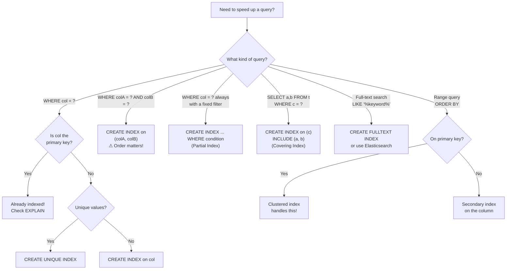

# Database Indexes

## Quick Summary

- **What:** Special data structures (usually B-Trees) that speed up data retrieval by avoiding full table scans
- **Primary use case:** Fast lookups, filtering, sorting, and joining on large tables
- **Key highlight:** Turns O(n) full table scans into O(log n) lookups — on a 10M row table, that's the difference between scanning 10,000,000 rows vs ~23 hops

---

## Analogy: The Library Card Catalog

Think of a database table as a **massive library** with millions of books stacked on shelves in no particular order.

```
WITHOUT an index (full table scan):
┌──────────────────────────────────────────────────┐
│  📚📚📚📚📚📚📚📚📚📚📚📚📚📚📚📚📚📚📚📚  │
│  You walk through EVERY shelf, checking EVERY    │
│  book until you find "Database Internals"        │
│  Time: O(n) — check all 10 million books         │
└──────────────────────────────────────────────────┘

WITH an index (card catalog):
┌──────────────┐     ┌──────────────┐
│ Card Catalog │     │   Shelves    │
│──────────────│     │──────────────│
│ A → Shelf 3  │────>│ Shelf 3,     │
│ B → Shelf 7  │     │ Position 42  │
│ C → Shelf 1  │     │ = YOUR BOOK! │
│ D → Shelf 12 │     └──────────────┘
│ ...          │
└──────────────┘
Time: O(log n) — just a few lookups!
```

The card catalog is sorted alphabetically, so you can **binary search** it. You don't touch the actual books until you know exactly where to go. That's exactly what a database index does!

---

## Core Concepts

### How an Index Works Internally

Most relational databases use a **B+ Tree** as the default index structure. Here's what happens under the hood:

```
                        ┌─────────────┐
                        │  [30 | 70]  │              Root Node
                        └──┬──────┬───┘
                   ┌───────┘      └────────┐
                   ▼                       ▼
            ┌────────────┐          ┌────────────┐
            │ [10 | 20]  │          │ [50 | 60]  │   Internal Nodes
            └─┬────┬──┬──┘          └─┬────┬──┬──┘
              ▼    ▼  ▼               ▼    ▼  ▼
           ┌────┐┌────┐┌────┐     ┌────┐┌────┐┌────┐
           │5,8 ││12  ││22  │     │35  ││55  ││65  │  Leaf Nodes
           │    ││15  ││25  │     │40  ││58  ││68  │  (sorted, linked)
           └──┬─┘└──┬─┘└──┬─┘     └──┬─┘└──┬─┘└──┬─┘
              │     │     │           │     │     │
              ▼     ▼     ▼           ▼     ▼     ▼
           [Row] [Row]  [Row]      [Row]  [Row] [Row]  Actual Table Data
                                                       (via row pointers)

     Leaf nodes are linked: ──► ──► ──► (great for range scans!)
```

**Why B+ Tree?** 
- All data pointers live in **leaf nodes** (internal nodes only store keys for navigation)
- Leaf nodes are **linked** left-to-right — this is why `ORDER BY` and range queries (`BETWEEN`) are so fast
- Tree stays **balanced** — every path from root to leaf is the same length
- A tree of height 3-4 can index **billions** of rows

### What Happens During a Query

```
  Query: SELECT * FROM users WHERE email = 'john@example.com'

  ┌──────────────────────────────────────────────────────────────────┐
  │                      WITHOUT INDEX                               │
  │                                                                  │
  │  Table: users (10M rows)                                         │
  │  ┌─────┬─────┬─────┬─────┬─────┬─────┬─ ─ ─ ─┬─────┐          │
  │  │Row 1│Row 2│Row 3│Row 4│Row 5│Row 6│  ...   │Row  │          │
  │  │     │     │  ✓  │     │     │     │        │ 10M │          │
  │  └─────┴─────┴─────┴─────┴─────┴─────┴─ ─ ─ ─┴─────┘          │
  │  Sequential scan: checks ALL 10M rows  → Disk I/O: ~50,000 pages│
  └──────────────────────────────────────────────────────────────────┘

  ┌──────────────────────────────────────────────────────────────────┐
  │                       WITH INDEX                                 │
  │                                                                  │
  │  B+ Tree Index on email:                                         │
  │       Root                                                       │
  │        │                                                         │
  │     compare → go right                                           │
  │        │                                                         │
  │     compare → go left                                            │
  │        │                                                         │
  │     Leaf: john@example.com → Row pointer → Row 3                 │
  │                                                                  │
  │  3 hops through the tree + 1 row fetch → Disk I/O: ~4 pages     │
  └──────────────────────────────────────────────────────────────────┘
```

---

## Types of Indexes (SQL)

### 1. Primary / Clustered Index

**The data IS the index.** The table rows are physically sorted on disk by this key.

```
  Clustered Index on id:

  Table stored on disk (physically ordered by id):
  ┌──────────┬──────────┬──────────┬──────────┬──────────┐
  │ id=1     │ id=2     │ id=3     │ id=4     │ id=5     │
  │ Alice    │ Bob      │ Charlie  │ Diana    │ Eve      │
  └──────────┴──────────┴──────────┴──────────┴──────────┘
       Page 1                 Page 2                Page 3

  Range query: WHERE id BETWEEN 2 AND 4
  → Only read Pages 1-2 (data is contiguous!) ✓
```

```sql
CREATE TABLE users (
    id INT PRIMARY KEY,       -- Clustered index created automatically
    name VARCHAR(100),
    email VARCHAR(255)
);
```

**When to use:**
- Every table gets exactly ONE (data can only be physically sorted one way)
- Choose columns used in range queries or `ORDER BY`
- Great for sequential data: timestamps, auto-increment IDs

**Java example — querying on clustered index (fast range scan):**

```java
// This is FAST — the DB reads contiguous disk pages
String sql = "SELECT * FROM orders WHERE order_date BETWEEN ? AND ?";
try (PreparedStatement ps = conn.prepareStatement(sql)) {
    ps.setDate(1, Date.valueOf("2024-01-01"));
    ps.setDate(2, Date.valueOf("2024-03-31"));
    ResultSet rs = ps.executeQuery();
    while (rs.next()) {
        System.out.println(rs.getString("order_id") + " - " + rs.getDate("order_date"));
    }
}
```

---

### 2. Secondary / Non-Clustered Index

A **separate structure** that holds (key → row pointer) mappings. Like having a separate card catalog that points to the real shelf location.

```
  Non-clustered index on email:

  Index Structure (sorted by email):         Table (sorted by id):
  ┌──────────────────┬─────────┐            ┌────┬─────────┬──────────────┐
  │ alice@mail.com   │ → Row 1 │───────────>│ 1  │ Alice   │alice@mail    │
  │ bob@mail.com     │ → Row 2 │───────────>│ 2  │ Bob     │bob@mail      │
  │ charlie@mail.com │ → Row 3 │───────────>│ 3  │ Charlie │charlie@mail  │
  │ diana@mail.com   │ → Row 4 │───────────>│ 4  │ Diana   │diana@mail    │
  └──────────────────┴─────────┘            └────┴─────────┴──────────────┘
       Separate structure!                     Physical table order
```

```sql
CREATE INDEX idx_users_email ON users(email);
```

**When to use:**
- Columns in `WHERE`, `JOIN`, or `ORDER BY` that aren't the primary key
- Can have **multiple** per table
- Example: Looking up users by email, orders by status

---

### 3. Unique Index

Enforces uniqueness + gives you fast lookups. Two birds, one stone.

```sql
CREATE UNIQUE INDEX idx_users_username ON users(username);
-- INSERT with duplicate username → ERROR!
```

**Java example — handling unique constraint violations:**

```java
String sql = "INSERT INTO users (username, email) VALUES (?, ?)";
try (PreparedStatement ps = conn.prepareStatement(sql)) {
    ps.setString(1, "john_doe");
    ps.setString(2, "john@example.com");
    ps.executeUpdate();
} catch (SQLIntegrityConstraintViolationException e) {
    // Unique index caught the duplicate!
    System.err.println("Username already taken: " + e.getMessage());
}
```

**When to use:**
- Business rules: no duplicate emails, usernames, SSNs
- Provides both data integrity AND fast lookups

---

### 4. Composite Index

Index on **multiple columns**. This is where it gets really interesting — column order matters A LOT!

```
  Composite index on (user_id, order_date):

  Index sorted by user_id FIRST, then order_date WITHIN each user:
  ┌─────────┬────────────┬─────────┐
  │ user_id │ order_date │ Row Ptr │
  ├─────────┼────────────┼─────────┤
  │    1    │ 2024-01-05 │ → Row 7 │
  │    1    │ 2024-02-10 │ → Row 3 │    ← user_id=1 dates are sorted!
  │    1    │ 2024-03-15 │ → Row 9 │
  │    2    │ 2024-01-20 │ → Row 1 │
  │    2    │ 2024-04-01 │ → Row 5 │    ← user_id=2 dates are sorted!
  │    3    │ 2024-02-28 │ → Row 4 │
  └─────────┴────────────┴─────────┘
```

```sql
CREATE INDEX idx_orders_user_date ON orders(user_id, order_date);
```

**The Left-Prefix Rule — once this clicks, you'll never forget it:**

```
  Index on (A, B, C):

  ✅ WHERE A = ?                    → Uses index (leftmost prefix)
  ✅ WHERE A = ? AND B = ?          → Uses index
  ✅ WHERE A = ? AND B = ? AND C = ?→ Uses index (full match)
  ✅ WHERE A = ? ORDER BY B         → Uses index for both!

  ❌ WHERE B = ?                    → CANNOT use index (skipped A!)
  ❌ WHERE C = ?                    → CANNOT use index
  ❌ WHERE B = ? AND C = ?          → CANNOT use index

  Think of it like a phone book sorted by (LastName, FirstName):
  - You CAN look up all "Smith" → just LastName ✓
  - You CAN look up "Smith, John" → both ✓
  - You CANNOT look up all "John" efficiently → need LastName first! ✗
```

**Java example — query that benefits from composite index:**

```java
// Both columns in the composite index (user_id, order_date) → efficient!
String sql = """
    SELECT order_id, total_amount 
    FROM orders 
    WHERE user_id = ? AND order_date >= ? 
    ORDER BY order_date DESC
    """;
try (PreparedStatement ps = conn.prepareStatement(sql)) {
    ps.setLong(1, 12345L);
    ps.setDate(2, Date.valueOf("2024-01-01"));
    ResultSet rs = ps.executeQuery();
    while (rs.next()) {
        System.out.printf("Order %d: $%.2f%n", rs.getInt("order_id"), rs.getBigDecimal("total_amount"));
    }
}
```

---

### 5. Partial / Filtered Index

Only indexes rows matching a condition. Smaller index = faster scans + less storage.

```
  Full index on email (10M entries):     Partial index WHERE status='active':
  ┌──────────────────────────┐           ┌──────────────────────────┐
  │ alice@... (active)       │           │ alice@... → Row 1        │
  │ bob@...   (deleted)      │           │ charlie@... → Row 3      │
  │ charlie@...(active)      │           │ eve@... → Row 5          │
  │ diana@... (suspended)    │           └──────────────────────────┘
  │ eve@...   (active)       │            Only 3 entries! (60% smaller)
  │ ...10M entries           │
  └──────────────────────────┘
```

```sql
CREATE INDEX idx_active_users ON users(email) WHERE status = 'active';
-- Only indexes active users — much smaller and faster
```

**When to use:**
- Queries always filter on a specific condition
- Large tables where only a small subset is queried (`is_deleted = false`, `payment_status = 'pending'`)
- Saves disk space significantly

---

### 6. Covering Index

This is the part that confuses EVERYONE at first, but it's actually simple: a covering index includes **all columns the query needs**, so the DB never touches the actual table!

```
  Regular index:                          Covering index:
  ┌────────┬─────────┐                   ┌────────┬────────────┬────────┐
  │ email  │ Row Ptr │                   │ email  │ name       │ status │
  └────┬───┴─────────┘                   └────────┴────────────┴────────┘
       │                                       ↑
       ▼                                  Query answered entirely
  ┌─────────────────┐                     from the index!
  │ Table: fetch    │                     No table access needed!
  │ name, status    │                     = "Index-Only Scan"
  └─────────────────┘
  2 steps: index + table                  1 step: index only (2x faster)
```

```sql
-- The query needs: email (filter), name, status (select)
CREATE INDEX idx_users_covering 
    ON users(email) 
    INCLUDE (name, status);

-- This query becomes an index-only scan:
SELECT name, status FROM users WHERE email = 'john@example.com';
```

**When to use:**
- Frequently run queries that always select the same columns
- Dashboard queries, API endpoints with fixed response shapes
- Trade-off: larger index, but avoids expensive table lookups

---

### 7. Full-Text Index

Specialized for searching **within** text content. Regular B-Tree indexes can't help with `LIKE '%keyword%'` — but full-text indexes can!

```
  How full-text indexing works (inverted index):

  Documents:
  Doc 1: "Redis is an in-memory database"
  Doc 2: "PostgreSQL is a relational database"
  Doc 3: "Redis supports in-memory caching"

  Inverted Index:
  ┌─────────────┬──────────────┐
  │  Term       │  Documents   │
  ├─────────────┼──────────────┤
  │ redis       │ Doc 1, Doc 3 │
  │ memory      │ Doc 1, Doc 3 │
  │ database    │ Doc 1, Doc 2 │
  │ postgresql  │ Doc 2        │
  │ relational  │ Doc 2        │
  │ caching     │ Doc 3        │
  └─────────────┴──────────────┘

  Search "redis memory" → Docs 1 & 3 (instant!)
```

```sql
CREATE FULLTEXT INDEX idx_articles_content ON articles(title, body);

-- Search usage:
SELECT * FROM articles 
WHERE MATCH(title, body) AGAINST ('database indexing' IN NATURAL LANGUAGE MODE);
```

**When to use:**
- Search functionality in articles, posts, comments
- Way better than `LIKE '%keyword%'` (which triggers full table scan!)
- For complex search needs, consider dedicated search engines (Elasticsearch, Solr)

---

## Dense vs Sparse Indexes

OK this is the part that trips people up, but the analogy makes it clear:

**Think of it like a textbook index vs chapter markers.**

```
  DENSE INDEX (textbook index)              SPARSE INDEX (chapter markers)
  ═══════════════════════════               ═══════════════════════════════
  Every row gets an entry:                  Only some rows get entries:

  ┌──────────┬─────────┐                   ┌──────────┬─────────┐
  │ Key: 1   │ → Row 1 │                   │ Key: 1   │ → Page1 │  (first key in page)
  │ Key: 2   │ → Row 2 │                   │ Key: 100 │ → Page2 │  (first key in page)
  │ Key: 3   │ → Row 3 │                   │ Key: 200 │ → Page3 │  (first key in page)
  │ Key: 4   │ → Row 4 │                   └──────────┴─────────┘
  │ Key: 5   │ → Row 5 │                   
  │ ...      │         │                   To find Key=150:
  │ Key: 10M │ → Row N │                   → Go to Page2 (key 100)
  └──────────┴─────────┘                   → Scan within page until 150
                                           
  Index size: LARGE                        Index size: SMALL
  Lookup: O(log n) exact                   Lookup: O(log n) + page scan
  Works for: any table                     Works for: sorted/clustered tables only!
```

Why does this matter? Because it affects **storage, write speed, and when each strategy works:**

|                  | **Dense Index**                         | **Sparse Index**                        |
|------------------|-----------------------------------------|-----------------------------------------|
| **Entries**      | One per row                             | One per disk page/block                 |
| **Size**         | Large                                   | Much smaller                            |
| **Point lookup** | Fast (exact pointer)                    | Slower (find block, then scan)          |
| **Range scan**   | Good                                    | Good (once you find the start)          |
| **Write cost**   | Higher (update index on every write)    | Lower (only update on page splits)      |
| **Requirement**  | Works on any table                      | Data must be sorted (clustered)         |

### PostgreSQL: Dense by Default

```sql
-- Dense index (default in Postgres — B-tree indexes every matching row)
CREATE INDEX idx_users_email ON users(email);

-- Partial index ≈ "sparse-like" behavior on a subset
CREATE INDEX idx_active_users ON users(email) WHERE status = 'active';
```

- PostgreSQL indexes (B-tree, Hash, GIN, GiST) are all **dense**
- True sparse indexes are more common in NoSQL / LSM-tree systems (Cassandra, RocksDB)
- Use **partial indexes** to get some of the storage benefits of sparsity

---

## EXPLAIN: How to Check if Your Index is Working

This is the most important practical skill — you can create all the indexes you want, but if the query planner isn't using them, they're just wasting space!

```sql
EXPLAIN ANALYZE SELECT * FROM users WHERE email = 'john@example.com';
```

```
  What to look for in the output:

  ✅ GOOD (index is being used):
  ┌─────────────────────────────────────────────────────────┐
  │ Index Scan using idx_users_email on users                │
  │   Index Cond: (email = 'john@example.com')               │
  │   Rows: 1   Time: 0.05ms                                │
  └─────────────────────────────────────────────────────────┘

  ❌ BAD (index is NOT being used):
  ┌─────────────────────────────────────────────────────────┐
  │ Seq Scan on users                                        │
  │   Filter: (email = 'john@example.com')                   │
  │   Rows Removed by Filter: 9,999,999   Time: 2500ms      │
  └─────────────────────────────────────────────────────────┘
```

**Java example — using EXPLAIN programmatically:**

```java
public static void explainQuery(Connection conn, String query) throws SQLException {
    String explainSql = "EXPLAIN ANALYZE " + query;
    try (Statement stmt = conn.createStatement();
         ResultSet rs = stmt.executeQuery(explainSql)) {
        System.out.println("=== Query Plan ===");
        while (rs.next()) {
            String plan = rs.getString(1);
            System.out.println(plan);
            // Watch for these keywords:
            if (plan.contains("Seq Scan")) {
                System.out.println("⚠ WARNING: Sequential scan detected — consider adding an index!");
            }
            if (plan.contains("Index Scan") || plan.contains("Index Only Scan")) {
                System.out.println("✓ Index is being used efficiently");
            }
        }
    }
}
```

---

## Mermaid: Index Decision Flowchart



---

## Key Points to Remember

**Gotchas that will bite you:**
- **Functions kill indexes:** `WHERE UPPER(email) = 'JOHN@...'` won't use the index on `email`. Use a functional index or fix the query
- **Implicit type casting:** `WHERE phone = 1234567` when `phone` is VARCHAR — the DB casts every row, skipping the index
- **`OR` splits index usage:** `WHERE a = 1 OR b = 2` may not use indexes on either. Consider `UNION` instead
- **`LIKE` with leading wildcard:** `WHERE name LIKE '%john'` → full scan. `LIKE 'john%'` → uses index
- **`NOT IN` / `!=`:** These usually force a full scan. Rewrite with `EXISTS` or `LEFT JOIN ... IS NULL`

**When NOT to index:**
- Small tables (< 1000 rows) — full scan is faster than index overhead
- Columns with low cardinality (e.g., boolean `is_active` with only 2 values) — index doesn't narrow much
- Tables with heavy writes and rare reads — index maintenance slows writes
- Columns rarely used in WHERE/JOIN/ORDER BY

**Performance rules of thumb:**
- Each index adds **~10-15% overhead** to write operations
- A table with 10+ indexes is a red flag — audit them
- Unused indexes waste space and slow writes — check `pg_stat_user_indexes` periodically
- Composite index on `(A, B)` already handles queries on just `A` — don't create a separate index on `A`

---

## Quick Reference

```
┌─────────────────────────────────────────────────────────────────┐
│                    INDEX CHEAT SHEET                             │
├─────────────────────────────────────────────────────────────────┤
│                                                                 │
│  CREATE INDEX idx ON t(col);           -- Basic secondary index │
│  CREATE UNIQUE INDEX idx ON t(col);    -- Unique constraint     │
│  CREATE INDEX idx ON t(a, b, c);       -- Composite index       │
│  CREATE INDEX idx ON t(a) INCLUDE(b);  -- Covering index        │
│  CREATE INDEX idx ON t(a) WHERE x='y'; -- Partial index         │
│  DROP INDEX idx;                       -- Remove index          │
│                                                                 │
│  EXPLAIN ANALYZE SELECT ...;           -- Check if index used   │
│                                                                 │
│  -- Postgres: check unused indexes                              │
│  SELECT indexrelname, idx_scan                                  │
│  FROM pg_stat_user_indexes                                      │
│  WHERE idx_scan = 0;                                            │
│                                                                 │
├─────────────────────────────────────────────────────────────────┤
│  REMEMBER:                                                      │
│  • Clustered = 1 per table (physical order)                     │
│  • Non-clustered = many per table (separate structure)          │
│  • Composite index order matters! (A,B) ≠ (B,A)                │
│  • EXPLAIN is your best friend                                  │
│  • More indexes ≠ better — each one costs write performance     │
└─────────────────────────────────────────────────────────────────┘
```

---

## Related Topics

- **[B+ Trees](../data-structures/b-+-tree.md)** — The data structure behind most indexes
- **[Storage Engines](db-storage-engines.md)** — How indexes fit into the bigger picture
- **[LSM Trees](../data-structures/b-+-tree.md)** — Alternative to B+ Trees used in NoSQL (Cassandra, RocksDB)
- **[ACID Properties](db-acid.md)** — How indexes help with isolation and consistency
- **[WAL](db-wal.md)** — Index changes are also logged in the write-ahead log
