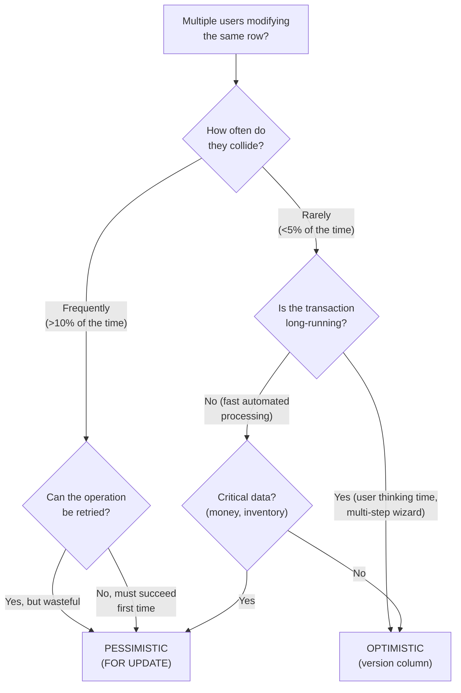

# Pessimistic vs Optimistic Locking

## Quick Summary

- **What:** Two strategies for handling concurrent access to the same data — lock upfront (pessimistic) vs detect conflicts at save time (optimistic)
- **Primary use case:** Any system where multiple users/threads can modify the same row simultaneously — bookings, inventory, banking
- **Key insight:** Pessimistic = "I *expect* collisions, so I'll lock first." Optimistic = "Collisions are *rare*, so I'll check at the end."

---

## Analogy: The Fitting Room vs The Shopping Cart

```
  PESSIMISTIC LOCKING = Fitting Room                OPTIMISTIC LOCKING = Shopping Cart
  ══════════════════════════════                     ═════════════════════════════════

  ┌──────────────┐                                  ┌──────────────┐
  │  👔 Shirt    │                                  │  👔 Shirt    │
  │  (only 1     │                                  │  (only 1     │
  │   left!)     │                                  │   left!)     │
  └──────┬───────┘                                  └──────┬───────┘
         │                                                 │
    You take it INTO                                  You put it in
    the fitting room                                  your cart and
    and LOCK the door                                 keep shopping
         │                                                 │
  ┌──────▼───────┐                                  ┌──────▼───────┐
  │  🔒 LOCKED   │ Nobody else can                  │  🛒 In Cart  │ Others can ALSO
  │  You try it  │ even touch it                    │  Not reserved │ add it to THEIR cart
  │  on safely   │ while you decide                 │  yet...       │
  └──────┬───────┘                                  └──────┬───────┘
         │                                                 │
    You decide:                                       At CHECKOUT:
    Buy or return                                     "Is it still available?"
         │                                                 │
  ┌──────▼───────┐                                  ┌──────▼───────┐
  │  ✅ Buy it   │                                  │ ✅ Yes → Buy │
  │  🔓 Unlock   │                                  │ ❌ No → Sorry│
  │  room        │                                  │    sold out! │
  └──────────────┘                                  └──────────────┘

  GUARANTEES you get it                              FASTER (no waiting in line)
  but others WAIT                                    but you might LOSE it
```

---

## Core Concepts

### Pessimistic Locking

**"Lock first, ask questions later."**

The database physically locks the row when you read it. No other transaction can modify (or sometimes even read) that row until you release the lock.

```
  Timeline — Pessimistic Lock (SELECT ... FOR UPDATE):

  T1 (Book seat 12A):                    T2 (Also wants seat 12A):
  ─────────────────                      ─────────────────────────
  BEGIN;
  SELECT * FROM seats
    WHERE id = '12A'
    FOR UPDATE;             ──── 🔒 Row locked!
  │                                      BEGIN;
  │ (checking, processing...)            SELECT * FROM seats
  │                                        WHERE id = '12A'
  │                                        FOR UPDATE;
  │                                      │
  │                                      ⏳ BLOCKED... waiting...
  │                                      │  (can't even READ the row)
  UPDATE seats SET                       │
    status = 'booked',                   │
    passenger = 'Alice'                  │
    WHERE id = '12A';                    │
  COMMIT;                   ──── 🔓 Lock released!
                                         │
                                         ▼ Now T2 proceeds
                                         SELECT returns: status='booked'
                                         "Seat already taken!"
                                         ROLLBACK;
```

### Optimistic Locking

**"Hope for the best, verify at the end."**

No physical locks. Instead, you read a **version number** (or timestamp) with the data. When you write, you check that the version hasn't changed since your read.

```
  Timeline — Optimistic Lock (version column):

  T1 (Book seat 12A):                    T2 (Also wants seat 12A):
  ─────────────────                      ─────────────────────────
  BEGIN;                                 BEGIN;
  SELECT * FROM seats                    SELECT * FROM seats
    WHERE id = '12A';                      WHERE id = '12A';
  → status='available', version=1        → status='available', version=1
  │                                      │
  │ (both read freely,                   │ (no blocking!)
  │  no locks held)                      │
  │                                      │
  UPDATE seats SET                       │
    status = 'booked',                   │
    passenger = 'Alice',                 │
    version = 2                          │
    WHERE id = '12A'                     │
    AND version = 1;                     │
  → 1 row updated ✅                    │
  COMMIT;                                │
                                         │
                                         UPDATE seats SET
                                           status = 'booked',
                                           passenger = 'Bob',
                                           version = 2
                                           WHERE id = '12A'
                                           AND version = 1;
                                         → 0 rows updated ❌
                                           (version is now 2, not 1!)
                                         "Conflict! Seat was modified."
                                         ROLLBACK; (or retry)
```

---

## When to Use Which?

This is the decision that matters most. Get this wrong and your system either grinds to a halt (too much locking) or silently loses updates (too little).

```
  ┌──────────────────────┬────────────────────────┬────────────────────────┐
  │                      │  PESSIMISTIC            │  OPTIMISTIC            │
  ├──────────────────────┼────────────────────────┼────────────────────────┤
  │ Collision frequency  │ HIGH (many users        │ LOW (rare that two     │
  │                      │ competing for same row) │ users touch same row)  │
  ├──────────────────────┼────────────────────────┼────────────────────────┤
  │ Cost of conflict     │ Acceptable to WAIT      │ Acceptable to RETRY    │
  ├──────────────────────┼────────────────────────┼────────────────────────┤
  │ Transaction duration │ SHORT (seconds)         │ Can be LONG            │
  │                      │ (long locks = danger)   │ (no locks held)        │
  ├──────────────────────┼────────────────────────┼────────────────────────┤
  │ Throughput           │ Lower (blocking)        │ Higher (no blocking)   │
  ├──────────────────────┼────────────────────────┼────────────────────────┤
  │ Correctness          │ GUARANTEED              │ Guaranteed if you      │
  │                      │ (lock prevents conflict)│ handle retries!        │
  ├──────────────────────┼────────────────────────┼────────────────────────┤
  │ Deadlock risk        │ YES                     │ NO (no locks held)     │
  └──────────────────────┴────────────────────────┴────────────────────────┘

  Rule of thumb:
  • High contention + short txns → PESSIMISTIC  (flights, flash sales, tickets)
  • Low contention + long txns  → OPTIMISTIC   (wikis, config edits, CMS)
```



---

## Scenario 1: Flight Check-In (IRCTC / Airlines)

**The problem:** 120 passengers on one flight all checking in at the same time. Each selects a seat — same seats can be selected by multiple passengers simultaneously.

Why this is a **pessimistic locking** problem: contention is extremely high (120 people, ~30 window seats), and a failed check-in is a terrible user experience.

### Approach A: `FOR UPDATE` (Default — Wait)

```sql
-- Passenger picks seat 12A
BEGIN;
    SELECT * FROM seats
        WHERE flight_id = 'AI-302' AND seat_number = '12A'
        FOR UPDATE;  -- 🔒 Lock the row

    -- Check if available
    -- If yes, assign it
    UPDATE seats SET
        status = 'checked_in',
        passenger_id = 42
        WHERE flight_id = 'AI-302' AND seat_number = '12A';
COMMIT;  -- 🔓 Release lock
```

```
  What happens with 5 passengers all wanting seat 12A:

  Passenger 1: SELECT FOR UPDATE → 🔒 got lock → UPDATE → COMMIT 🔓
  Passenger 2: SELECT FOR UPDATE → ⏳ wait... → 🔒 got lock → "already booked!" → ROLLBACK
  Passenger 3: SELECT FOR UPDATE → ⏳ wait... wait... → 🔒 → "already booked!" → ROLLBACK
  Passenger 4: SELECT FOR UPDATE → ⏳ wait... wait... wait... → 🔒 → "already booked!"
  Passenger 5: SELECT FOR UPDATE → ⏳ wait... wait... wait... wait...

  Problem: Passengers 2-5 all WAIT even though there's nothing to gain.
  They queue up, one by one, only to be told "sorry, taken."
```

**Java implementation:**

```java
public boolean checkIn(Connection conn, String flightId, String seatNumber, int passengerId)
        throws SQLException {
    conn.setAutoCommit(false);

    try {
        // Lock the seat row — other transactions WAIT here
        String lockSql = """
            SELECT status FROM seats
            WHERE flight_id = ? AND seat_number = ?
            FOR UPDATE
            """;
        try (PreparedStatement ps = conn.prepareStatement(lockSql)) {
            ps.setString(1, flightId);
            ps.setString(2, seatNumber);
            ResultSet rs = ps.executeQuery();

            if (!rs.next() || !"available".equals(rs.getString("status"))) {
                conn.rollback();
                return false;  // Seat doesn't exist or already taken
            }
        }

        // We hold the lock — safe to update
        String updateSql = """
            UPDATE seats SET status = 'checked_in', passenger_id = ?
            WHERE flight_id = ? AND seat_number = ?
            """;
        try (PreparedStatement ps = conn.prepareStatement(updateSql)) {
            ps.setInt(1, passengerId);
            ps.setString(2, flightId);
            ps.setString(3, seatNumber);
            ps.executeUpdate();
        }

        conn.commit();
        return true;

    } catch (SQLException e) {
        conn.rollback();
        throw e;
    }
}
```

### Approach B: `FOR UPDATE NOWAIT` (Fail Fast)

This is where it gets really interesting! Instead of making everyone wait, **fail immediately** if the row is locked:

```sql
BEGIN;
    SELECT * FROM seats
        WHERE flight_id = 'AI-302' AND seat_number = '12A'
        FOR UPDATE NOWAIT;  -- 🔒 Lock OR fail immediately
    -- ...
COMMIT;
```

```
  Passenger 1: SELECT FOR UPDATE NOWAIT → 🔒 got lock → UPDATE → COMMIT
  Passenger 2: SELECT FOR UPDATE NOWAIT → ❌ ERROR! (row locked) → show "try another seat"
  Passenger 3: SELECT FOR UPDATE NOWAIT → ❌ ERROR! (row locked) → show "try another seat"

  No waiting! Users get instant feedback.
  Perfect for real-time UIs where you want to show "seat unavailable" immediately.
```

**Java — NOWAIT with error handling:**

```java
public boolean checkInNoWait(Connection conn, String flightId, String seatNumber,
                             int passengerId) throws SQLException {
    conn.setAutoCommit(false);

    try {
        String sql = """
            SELECT status FROM seats
            WHERE flight_id = ? AND seat_number = ?
            FOR UPDATE NOWAIT
            """;
        try (PreparedStatement ps = conn.prepareStatement(sql)) {
            ps.setString(1, flightId);
            ps.setString(2, seatNumber);
            ResultSet rs = ps.executeQuery();

            if (!rs.next() || !"available".equals(rs.getString("status"))) {
                conn.rollback();
                return false;
            }
        }

        // Got the lock — proceed with booking
        String update = """
            UPDATE seats SET status = 'checked_in', passenger_id = ?
            WHERE flight_id = ? AND seat_number = ?
            """;
        try (PreparedStatement ps = conn.prepareStatement(update)) {
            ps.setInt(1, passengerId);
            ps.setString(2, flightId);
            ps.setString(3, seatNumber);
            ps.executeUpdate();
        }

        conn.commit();
        return true;

    } catch (SQLException e) {
        conn.rollback();
        // PostgreSQL error code 55P03 = "could not obtain lock"
        if ("55P03".equals(e.getSQLState())) {
            System.out.println("Seat is being booked by someone else, try another!");
            return false;
        }
        throw e;
    }
}
```

### Approach C: `FOR UPDATE SKIP LOCKED` (Queue Processing)

Once this clicks, you'll never forget it — this is the secret sauce behind BookMyShow and IRCTC-style seat assignment.

Instead of "give me seat 12A specifically," the user says "give me ANY available seat." The DB skips over locked rows and grabs the next free one:

```sql
BEGIN;
    SELECT * FROM seats
        WHERE flight_id = 'AI-302' AND status = 'available'
        ORDER BY seat_number
        LIMIT 1
        FOR UPDATE SKIP LOCKED;  -- 🔒 Skip already-locked rows!

    -- Whatever row comes back is YOURS — nobody else has it
    UPDATE seats SET
        status = 'checked_in',
        passenger_id = 42
        WHERE flight_id = 'AI-302' AND seat_number = ?;  -- use the returned seat
COMMIT;
```

```
  5 passengers request "any available seat" simultaneously:

  Seat Pool: [1A🟢, 1B🟢, 1C🟢, 2A🟢, 2B🟢, ...]

  Passenger 1: SKIP LOCKED → gets 1A → 🔒 locks 1A
  Passenger 2: SKIP LOCKED → skips 1A(locked) → gets 1B → 🔒 locks 1B
  Passenger 3: SKIP LOCKED → skips 1A,1B → gets 1C → 🔒 locks 1C
  Passenger 4: SKIP LOCKED → skips 1A,1B,1C → gets 2A → 🔒 locks 2A
  Passenger 5: SKIP LOCKED → skips 1A-2A → gets 2B → 🔒 locks 2B

  ZERO contention! Everyone gets a seat instantly!
  No waiting, no errors, no retries.
```

**Java — SKIP LOCKED for auto-assignment:**

```java
public String assignAnySeat(Connection conn, String flightId, int passengerId)
        throws SQLException {
    conn.setAutoCommit(false);

    try {
        // Grab the first unlocked available seat
        String sql = """
            SELECT seat_number FROM seats
            WHERE flight_id = ? AND status = 'available'
            ORDER BY seat_number
            LIMIT 1
            FOR UPDATE SKIP LOCKED
            """;
        String seatNumber;
        try (PreparedStatement ps = conn.prepareStatement(sql)) {
            ps.setString(1, flightId);
            ResultSet rs = ps.executeQuery();
            if (!rs.next()) {
                conn.rollback();
                return null;  // No seats available (all booked or locked)
            }
            seatNumber = rs.getString("seat_number");
        }

        // This seat is ours — assign it
        String update = """
            UPDATE seats SET status = 'checked_in', passenger_id = ?
            WHERE flight_id = ? AND seat_number = ?
            """;
        try (PreparedStatement ps = conn.prepareStatement(update)) {
            ps.setInt(1, passengerId);
            ps.setString(2, flightId);
            ps.setString(3, seatNumber);
            ps.executeUpdate();
        }

        conn.commit();
        return seatNumber;  // "You've been assigned seat 2B!"

    } catch (SQLException e) {
        conn.rollback();
        throw e;
    }
}
```

### Comparison of All Three Strategies

```
  ┌──────────────────────────────────────────────────────────────────┐
  │              120 Passengers → 1 Flight → Check-In               │
  ├──────────────┬───────────────────┬───────────────────────────────┤
  │   FOR UPDATE │ FOR UPDATE NOWAIT │ FOR UPDATE SKIP LOCKED        │
  ├──────────────┼───────────────────┼───────────────────────────────┤
  │ "I want 12A" │ "I want 12A"      │ "Give me any seat"            │
  │              │                   │                               │
  │ 1 gets it    │ 1 gets it         │ Everyone gets a different     │
  │ 119 WAIT in  │ 119 get instant   │ seat — ZERO collisions!       │
  │ line for it  │ ERROR             │                               │
  │              │                   │                               │
  │ ⏳ Slow       │ ⚡ Fast fail       │ ⚡ Fast success                │
  │ 😤 Frustrating│ 😐 "Try another"  │ 😊 "Here's your seat!"        │
  ├──────────────┼───────────────────┼───────────────────────────────┤
  │ Use when:    │ Use when:         │ Use when:                     │
  │ User MUST    │ Real-time UI,     │ Auto-assignment OK,           │
  │ have that    │ fail-fast, show   │ job queues, ticket pools,     │
  │ specific row │ live availability │ flash sales                   │
  └──────────────┴───────────────────┴───────────────────────────────┘
```

---

## Scenario 2: BookMyShow / Flash Sale (High Contention Inventory)

**The problem:** 50,000 users trying to buy 500 tickets the moment a sale goes live. This is the highest-contention scenario possible.

```
  50,000 requests → 500 tickets → 10 seconds

  ┌─────────────────────────────────────────────────────────────────────┐
  │                     THE THUNDERING HERD                             │
  │                                                                     │
  │    50,000 users                                                     │
  │    ┌──┐┌──┐┌──┐┌──┐┌──┐┌──┐                                       │
  │    │U1││U2││U3││U4││U5││..│ ──────→ 500 tickets                    │
  │    └──┘└──┘└──┘└──┘└──┘└──┘          ┌──┬──┬──┬──┬──┐              │
  │    All at the SAME instant!          │T1│T2│T3│..│Tn│              │
  │                                      └──┴──┴──┴──┴──┘              │
  └─────────────────────────────────────────────────────────────────────┘
```

### Why Optimistic Locking FAILS Here

```
  With optimistic locking (version column):

  Ticket row: {id: 1, status: 'available', version: 1}

  User 1: READ (version=1) → UPDATE WHERE version=1 → ✅ 1 row updated
  User 2: READ (version=1) → UPDATE WHERE version=1 → ❌ 0 rows (version now 2)
  User 3: READ (version=1) → UPDATE WHERE version=1 → ❌ 0 rows
  ...
  User 100: READ (version=1) → UPDATE WHERE version=1 → ❌ 0 rows

  All 100 users who read version=1 simultaneously:
  → 1 succeeds, 99 FAIL and must RETRY
  → On retry, they ALL read version=2, ALL try again
  → 1 succeeds, 98 fail
  → Retry storm! 🔥 DB gets hammered with retries

  This is called the "retry stampede" — optimistic locking
  degrades into something WORSE than pessimistic under high contention.
```

### The Right Approach: `SKIP LOCKED` Ticket Pool

```sql
-- Schema: each ticket is a row
CREATE TABLE tickets (
    ticket_id SERIAL PRIMARY KEY,
    event_id INT NOT NULL,
    status VARCHAR(20) DEFAULT 'available',  -- available, reserved, sold
    user_id INT,
    reserved_at TIMESTAMP,
    version INT DEFAULT 1
);

-- 500 ticket rows pre-created for the event
INSERT INTO tickets (event_id)
    SELECT 101 FROM generate_series(1, 500);
```

```sql
-- Each user's request: "Give me a ticket — any ticket"
BEGIN;
    SELECT ticket_id FROM tickets
        WHERE event_id = 101 AND status = 'available'
        LIMIT 1
        FOR UPDATE SKIP LOCKED;

    -- If a row is returned, it's OURS
    UPDATE tickets SET
        status = 'reserved',
        user_id = ?,
        reserved_at = NOW()
        WHERE ticket_id = ?;
COMMIT;
```

```
  50,000 users, 500 tickets, SKIP LOCKED:

  User 1    → grabs ticket #1   (skips nothing)
  User 2    → grabs ticket #2   (skips #1 — locked)
  User 3    → grabs ticket #3   (skips #1,#2)
  ...
  User 500  → grabs ticket #500 (skips #1-#499)
  User 501  → SELECT returns empty → "Sold out!"
  ...
  User 50000 → "Sold out!"

  Total locks held concurrently: ≤ 500 (one per ticket)
  Total contention: ZERO (every user gets a different row)
  Total wait time: ZERO (nobody blocks)
```

**Java — Flash sale ticket service:**

```java
public class FlashSaleService {

    /**
     * Attempt to reserve a ticket for a user.
     * Uses SKIP LOCKED to avoid contention under extreme load.
     *
     * @return ticket ID if successful, -1 if sold out
     */
    public int reserveTicket(DataSource ds, int eventId, int userId) {
        String selectSql = """
            SELECT ticket_id FROM tickets
            WHERE event_id = ? AND status = 'available'
            LIMIT 1
            FOR UPDATE SKIP LOCKED
            """;

        String updateSql = """
            UPDATE tickets
            SET status = 'reserved', user_id = ?, reserved_at = NOW()
            WHERE ticket_id = ?
            """;

        try (Connection conn = ds.getConnection()) {
            conn.setAutoCommit(false);

            try {
                int ticketId;
                try (PreparedStatement ps = conn.prepareStatement(selectSql)) {
                    ps.setInt(1, eventId);
                    ResultSet rs = ps.executeQuery();
                    if (!rs.next()) {
                        conn.rollback();
                        return -1;  // Sold out!
                    }
                    ticketId = rs.getInt("ticket_id");
                }

                try (PreparedStatement ps = conn.prepareStatement(updateSql)) {
                    ps.setInt(1, userId);
                    ps.setInt(2, ticketId);
                    ps.executeUpdate();
                }

                conn.commit();
                return ticketId;

            } catch (SQLException e) {
                conn.rollback();
                throw new RuntimeException("Reservation failed", e);
            }
        } catch (SQLException e) {
            throw new RuntimeException("Connection failed", e);
        }
    }
}
```

---

## Scenario 3: Wiki / CMS Article Editing (Low Contention)

**The problem:** Multiple editors might edit the same wiki article, but it happens rarely. Locking the article while someone edits (could be 30 minutes!) would block everyone else.

Why this is an **optimistic locking** problem: edits are long (human thinking time), and collisions are rare.

```
  Article: "System Design Notes"  (version = 5)

  Editor A (starts editing at 2:00 PM):   Editor B (starts editing at 2:05 PM):
  ──────────────────────────────────────  ──────────────────────────────────────
  SELECT content, version                 SELECT content, version
    FROM articles WHERE id = 42;            FROM articles WHERE id = 42;
  → content="...", version=5              → content="...", version=5
  │                                       │
  │ (edits for 20 minutes,               │ (edits for 10 minutes,
  │  no locks held!)                      │  no locks held!)
  │                                       │
  │                                       UPDATE articles SET
  │                                         content = 'B edits...',
  │                                         version = 6
  │                                         WHERE id = 42 AND version = 5;
  │                                       → 1 row updated ✅
  │                                       COMMIT;
  │
  UPDATE articles SET
    content = 'A edits...',
    version = 6
    WHERE id = 42 AND version = 5;
  → 0 rows updated ❌ (version is now 6!)
  
  "Someone else edited this article while you were working.
   Here's a diff of their changes — merge or overwrite?"
```

**Schema for optimistic locking:**

```sql
CREATE TABLE articles (
    id SERIAL PRIMARY KEY,
    title VARCHAR(255) NOT NULL,
    content TEXT,
    version INT NOT NULL DEFAULT 1,       -- ← The version column!
    updated_by INT,
    updated_at TIMESTAMP DEFAULT NOW()
);
```

**Java — Optimistic locking with version check:**

```java
public class ArticleService {

    public static class OptimisticLockException extends Exception {
        public OptimisticLockException(String message) { super(message); }
    }

    /**
     * Save article edits with optimistic locking.
     * Throws OptimisticLockException if someone else edited since we read it.
     */
    public void saveArticle(Connection conn, int articleId, String newContent,
                            int expectedVersion, int editorId)
            throws SQLException, OptimisticLockException {

        String sql = """
            UPDATE articles
            SET content = ?,
                version = version + 1,
                updated_by = ?,
                updated_at = NOW()
            WHERE id = ? AND version = ?
            """;

        try (PreparedStatement ps = conn.prepareStatement(sql)) {
            ps.setString(1, newContent);
            ps.setInt(2, editorId);
            ps.setInt(3, articleId);
            ps.setInt(4, expectedVersion);

            int rowsUpdated = ps.executeUpdate();

            if (rowsUpdated == 0) {
                // Version mismatch — someone else modified the article!
                throw new OptimisticLockException(
                    "Article was modified by another user. " +
                    "Expected version " + expectedVersion +
                    " but it has been updated. Please refresh and merge your changes."
                );
            }
        }
    }
}

// Usage:
// 1. User loads article → gets version=5
// 2. User edits for 20 minutes (no locks held, no DB connection needed!)
// 3. User clicks "Save"
// 4. saveArticle(conn, 42, newContent, 5, userId)
//    → Success: version becomes 6
//    → Failure: someone else already made it version 6
```

### Alternative: Timestamp-Based Optimistic Locking

Instead of a version counter, use `updated_at`:

```sql
-- Read
SELECT content, updated_at FROM articles WHERE id = 42;
-- → content="...", updated_at='2024-03-15 14:00:00'

-- Write (check timestamp hasn't changed)
UPDATE articles SET
    content = 'new content',
    updated_at = NOW()
    WHERE id = 42 AND updated_at = '2024-03-15 14:00:00';

-- 0 rows updated? → Someone else modified it!
```

```
  Version counter vs Timestamp:

  ┌─────────────────┬────────────────────────────────────────┐
  │ Version (INT)   │ Timestamp (DATETIME)                   │
  ├─────────────────┼────────────────────────────────────────┤
  │ ✅ Always unique │ ❌ Clock skew in distributed systems   │
  │ ✅ Simple, fast  │ ❌ Millisecond collisions possible     │
  │ ✅ No clock deps │ ✅ Tells you WHEN it was modified      │
  │ ❌ No time info  │ ✅ No extra column if updated_at exists│
  └─────────────────┴────────────────────────────────────────┘

  Verdict: prefer version counter for correctness.
  Use timestamp only if you already have updated_at and collisions
  within the same millisecond are impossible (single-node, low traffic).
```

---

## Scenario 4: E-Commerce Inventory Decrement

**The problem:** 200 users add the same product to cart and checkout. Stock = 50 units. How do we prevent overselling?

### Pessimistic Approach (Guaranteed, But Slow)

```java
public boolean purchaseItem(Connection conn, int productId, int quantity, int userId)
        throws SQLException {
    conn.setAutoCommit(false);

    try {
        // Lock the product row
        int stock;
        try (PreparedStatement ps = conn.prepareStatement(
                "SELECT stock FROM products WHERE id = ? FOR UPDATE")) {
            ps.setInt(1, productId);
            ResultSet rs = ps.executeQuery();
            if (!rs.next()) { conn.rollback(); return false; }
            stock = rs.getInt("stock");
        }

        if (stock < quantity) {
            conn.rollback();
            return false;  // Not enough stock
        }

        // Decrement stock — we hold the lock, so this is safe
        try (PreparedStatement ps = conn.prepareStatement(
                "UPDATE products SET stock = stock - ? WHERE id = ?")) {
            ps.setInt(1, quantity);
            ps.setInt(2, productId);
            ps.executeUpdate();
        }

        // Create order
        try (PreparedStatement ps = conn.prepareStatement(
                "INSERT INTO orders (product_id, user_id, quantity) VALUES (?, ?, ?)")) {
            ps.setInt(1, productId);
            ps.setInt(2, userId);
            ps.setInt(3, quantity);
            ps.executeUpdate();
        }

        conn.commit();
        return true;
    } catch (SQLException e) {
        conn.rollback();
        throw e;
    }
}
```

### Optimistic Approach (Faster, But Needs Retries)

```java
public boolean purchaseItemOptimistic(Connection conn, int productId, int quantity,
                                      int userId) throws SQLException {
    int maxRetries = 3;

    for (int attempt = 0; attempt < maxRetries; attempt++) {
        conn.setAutoCommit(false);

        try {
            // Read current stock AND version (no lock!)
            int stock, version;
            try (PreparedStatement ps = conn.prepareStatement(
                    "SELECT stock, version FROM products WHERE id = ?")) {
                ps.setInt(1, productId);
                ResultSet rs = ps.executeQuery();
                if (!rs.next()) { conn.rollback(); return false; }
                stock = rs.getInt("stock");
                version = rs.getInt("version");
            }

            if (stock < quantity) {
                conn.rollback();
                return false;  // Not enough stock
            }

            // Attempt update — only succeeds if version unchanged
            try (PreparedStatement ps = conn.prepareStatement("""
                    UPDATE products SET stock = stock - ?, version = version + 1
                    WHERE id = ? AND version = ?
                    """)) {
                ps.setInt(1, quantity);
                ps.setInt(2, productId);
                ps.setInt(3, version);
                int rows = ps.executeUpdate();

                if (rows == 0) {
                    conn.rollback();
                    // Version changed — someone else bought stock, RETRY
                    System.out.println("Conflict on attempt " + (attempt + 1) + ", retrying...");
                    continue;
                }
            }

            // Create order
            try (PreparedStatement ps = conn.prepareStatement(
                    "INSERT INTO orders (product_id, user_id, quantity) VALUES (?, ?, ?)")) {
                ps.setInt(1, productId);
                ps.setInt(2, userId);
                ps.setInt(3, quantity);
                ps.executeUpdate();
            }

            conn.commit();
            return true;

        } catch (SQLException e) {
            conn.rollback();
            throw e;
        }
    }

    return false;  // Exhausted retries
}
```

### The Elegant Middle Ground: Atomic UPDATE with WHERE

This is the approach most production systems actually use — no explicit locking, no version column, just a smart `UPDATE`:

```sql
-- Single atomic statement — no race condition possible!
UPDATE products
SET stock = stock - 1
WHERE id = 42 AND stock >= 1;

-- Check rows affected:
-- 1 row → success (stock was decremented)
-- 0 rows → failed (stock was already 0)
```

```java
public boolean purchaseItemAtomic(Connection conn, int productId, int quantity, int userId)
        throws SQLException {
    conn.setAutoCommit(false);

    try {
        // Single atomic check-and-decrement — no lock, no version, no retry
        try (PreparedStatement ps = conn.prepareStatement(
                "UPDATE products SET stock = stock - ? WHERE id = ? AND stock >= ?")) {
            ps.setInt(1, quantity);
            ps.setInt(2, productId);
            ps.setInt(3, quantity);
            int rows = ps.executeUpdate();

            if (rows == 0) {
                conn.rollback();
                return false;  // Out of stock
            }
        }

        try (PreparedStatement ps = conn.prepareStatement(
                "INSERT INTO orders (product_id, user_id, quantity) VALUES (?, ?, ?)")) {
            ps.setInt(1, productId);
            ps.setInt(2, userId);
            ps.setInt(3, quantity);
            ps.executeUpdate();
        }

        conn.commit();
        return true;

    } catch (SQLException e) {
        conn.rollback();
        throw e;
    }
}
```

Why does this work? Because a single `UPDATE` statement is **atomic at the DB level** — the WHERE check and the SET happen as one indivisible operation. The DB handles the row-level lock internally for just the duration of that single statement.

---

## Shared Locks vs Exclusive Locks

Under the hood, pessimistic locking uses two types of locks:

```
  SHARED LOCK (S-Lock / Read Lock):
  ═════════════════════════════════
  "I'm reading this — nobody can WRITE, but others CAN also read."

  ┌─────────────────────────────────────────────────────────┐
  │  T1: SELECT ... FOR SHARE     → 🔒 S-lock on row       │
  │  T2: SELECT ... FOR SHARE     → 🔒 S-lock on row ✅    │
  │  T3: UPDATE ...               → ❌ BLOCKED (S-lock)     │
  │                                                         │
  │  Multiple readers, zero writers.                        │
  └─────────────────────────────────────────────────────────┘


  EXCLUSIVE LOCK (X-Lock / Write Lock):
  ═════════════════════════════════════
  "I'm writing this — nobody can read OR write."

  ┌─────────────────────────────────────────────────────────┐
  │  T1: SELECT ... FOR UPDATE    → 🔒 X-lock on row       │
  │  T2: SELECT ... FOR SHARE     → ❌ BLOCKED              │
  │  T3: SELECT ... FOR UPDATE    → ❌ BLOCKED              │
  │  T4: UPDATE ...               → ❌ BLOCKED              │
  │                                                         │
  │  One writer, zero readers (strict isolation).           │
  └─────────────────────────────────────────────────────────┘


  Compatibility Matrix:
  ┌─────────────┬──────────────┬──────────────┐
  │  Requesting │  S-Lock Held │  X-Lock Held │
  ├─────────────┼──────────────┼──────────────┤
  │  S-Lock     │  ✅ Granted   │  ❌ Blocked   │
  │  X-Lock     │  ❌ Blocked   │  ❌ Blocked   │
  └─────────────┴──────────────┴──────────────┘
```

---

## Deadlocks

Pessimistic locking introduces the risk of **deadlocks** — two transactions each waiting for the other's lock:

```
  T1: LOCK row A → wants row B
  T2: LOCK row B → wants row A

  ┌──────┐         ┌──────┐
  │  T1  │ ──wants──▶ Row B │
  │      │         │ 🔒 T2 │
  │ 🔒   │◀──wants── │      │
  │ Row A│         │  T2  │
  └──────┘         └──────┘
      ↑                 │
      └─── DEADLOCK! ───┘
      Both wait forever.
```

**How databases handle it:**
1. **Deadlock detection** — DB builds a "wait-for" graph, detects cycles
2. **Victim selection** — DB kills one transaction (the "victim"), rolls it back
3. **Retry** — Your application retries the killed transaction

**Prevention — always lock in the same order:**

```java
// BAD: T1 locks A then B, T2 locks B then A → deadlock possible!
// GOOD: Both transactions lock in alphabetical order (A before B)

public void transfer(Connection conn, int fromId, int toId, BigDecimal amount)
        throws SQLException {
    conn.setAutoCommit(false);

    // Always lock the LOWER id first — consistent ordering prevents deadlocks!
    int firstLock = Math.min(fromId, toId);
    int secondLock = Math.max(fromId, toId);

    try {
        try (PreparedStatement ps = conn.prepareStatement(
                "SELECT balance FROM accounts WHERE id = ? FOR UPDATE")) {
            ps.setInt(1, firstLock);
            ps.executeQuery();
        }

        try (PreparedStatement ps = conn.prepareStatement(
                "SELECT balance FROM accounts WHERE id = ? FOR UPDATE")) {
            ps.setInt(1, secondLock);
            ps.executeQuery();
        }

        // Now both rows are locked in consistent order — no deadlock possible
        // ... perform the transfer ...
        conn.commit();

    } catch (SQLException e) {
        conn.rollback();
        throw e;
    }
}
```

---

## Lock Manager — How the DB Tracks Locks

```
  Every database has a Lock Manager that maintains a lock table:

  ┌─────────────────────────────────────────────────────────────┐
  │                    LOCK TABLE (in memory)                    │
  ├──────────────┬───────────┬───────────┬─────────────────────┤
  │  Resource    │ Lock Type │ Held By   │ Wait Queue          │
  ├──────────────┼───────────┼───────────┼─────────────────────┤
  │ seats:12A    │ X-Lock    │ T1        │ T2 → T3 → T5       │
  │ seats:14B    │ S-Lock    │ T4, T6    │ T7 (wants X-Lock)  │
  │ accounts:101 │ X-Lock    │ T8        │ (empty)             │
  │ products:42  │ (none)    │ —         │ —                   │
  └──────────────┴───────────┴───────────┴─────────────────────┘

  When T1 releases seats:12A:
  1. Lock manager removes T1's lock
  2. Grants lock to T2 (front of queue)
  3. T2's SELECT ... FOR UPDATE returns
  4. T3 and T5 continue waiting

  Lock granularity (from coarse → fine):
  ┌─────────────────────────────────────────────────┐
  │  TABLE lock  → locks entire table (rare, slow)  │
  │  PAGE lock   → locks a disk page (~8KB of rows) │
  │  ROW lock    → locks a single row (most common) │
  └─────────────────────────────────────────────────┘

  Finer granularity = more concurrency, but more memory for lock table.
  Most OLTP systems use ROW-level locks.
```

---

## Key Points to Remember

**Pessimistic locking:**
- Use `SELECT ... FOR UPDATE` for exclusive lock, `FOR SHARE` for shared lock
- `NOWAIT` = fail immediately if locked (real-time UIs)
- `SKIP LOCKED` = skip locked rows, grab next available (queues, pools, flash sales)
- **Watch out:** long-held locks block everyone and risk deadlocks — keep transactions SHORT
- Lock ordering prevents deadlocks (always lock lower ID first)

**Optimistic locking:**
- Add a `version INT` column and check it in your `WHERE` clause on UPDATE
- No physical locks → no blocking → no deadlocks
- **Watch out:** under high contention, retry storms can be worse than pessimistic
- Always have a max retry limit with exponential backoff

**The atomic UPDATE trick:**
- `UPDATE ... SET stock = stock - 1 WHERE stock >= 1` — no version, no lock, no retry
- Works when the condition can be expressed in SQL (simple decrements, status transitions)
- The DB's own row-level lock handles concurrency for the duration of the single statement

**How to choose:**
- Flash sale (50K users, 500 items) → `SKIP LOCKED`
- Seat picker (specific seat) → `FOR UPDATE NOWAIT`
- Wiki editing (long edits, rare conflicts) → optimistic with version
- Counter decrement → atomic `UPDATE ... WHERE`

---

## Quick Reference

```
┌──────────────────────────────────────────────────────────────────────┐
│                  LOCKING CHEAT SHEET                                  │
├──────────────────────────────────────────────────────────────────────┤
│                                                                      │
│  PESSIMISTIC (lock on read):                                         │
│  SELECT ... FOR UPDATE;                 -- exclusive (read+write)    │
│  SELECT ... FOR SHARE;                  -- shared (read only)        │
│  SELECT ... FOR UPDATE NOWAIT;          -- fail if locked            │
│  SELECT ... FOR UPDATE SKIP LOCKED;     -- skip locked rows          │
│                                                                      │
│  OPTIMISTIC (check on write):                                        │
│  UPDATE t SET col=?, version=version+1                               │
│    WHERE id=? AND version=?;            -- 0 rows = conflict!        │
│                                                                      │
│  ATOMIC CONDITIONAL UPDATE:                                          │
│  UPDATE t SET stock=stock-1                                          │
│    WHERE id=? AND stock >= 1;           -- 0 rows = out of stock     │
│                                                                      │
├──────────────────────────────────────────────────────────────────────┤
│  JDBC:                                                               │
│  conn.setAutoCommit(false);                                          │
│  ps = conn.prepareStatement("SELECT ... FOR UPDATE");                │
│  rs.getInt("version");  // for optimistic                            │
│  ps.executeUpdate();    // check return value for 0 rows!            │
│  conn.commit();  /  conn.rollback();                                 │
│                                                                      │
├──────────────────────────────────────────────────────────────────────┤
│  ERROR CODES (PostgreSQL):                                           │
│  55P03 — could not obtain lock (NOWAIT)                              │
│  40001 — serialization failure                                       │
│  40P01 — deadlock detected                                           │
│                                                                      │
├──────────────────────────────────────────────────────────────────────┤
│  REMEMBER:                                                           │
│  • High contention → pessimistic (SKIP LOCKED if possible)           │
│  • Low contention → optimistic (version column)                      │
│  • Deadlock prevention: always lock rows in consistent order         │
│  • Keep pessimistic transactions SHORT                               │
│  • Always check rows-affected on optimistic updates                  │
└──────────────────────────────────────────────────────────────────────┘
```

---

## Related Topics

- [**ACID: Isolation**](./db-acid-isolation.md) — Isolation levels, MVCC, Two-Phase Locking
- [**ACID Properties**](./db-acid.md) — How locking supports atomicity and isolation
- [**WAL**](./db-wal.md) — How lock state is recovered after crashes
- [**Distributed Locks**](../week3/locks.md) — Remote locking with Redis, ZooKeeper
- [**Two-Phase Commit**](./db-two-phase-commit.md) — Locking across multiple databases
