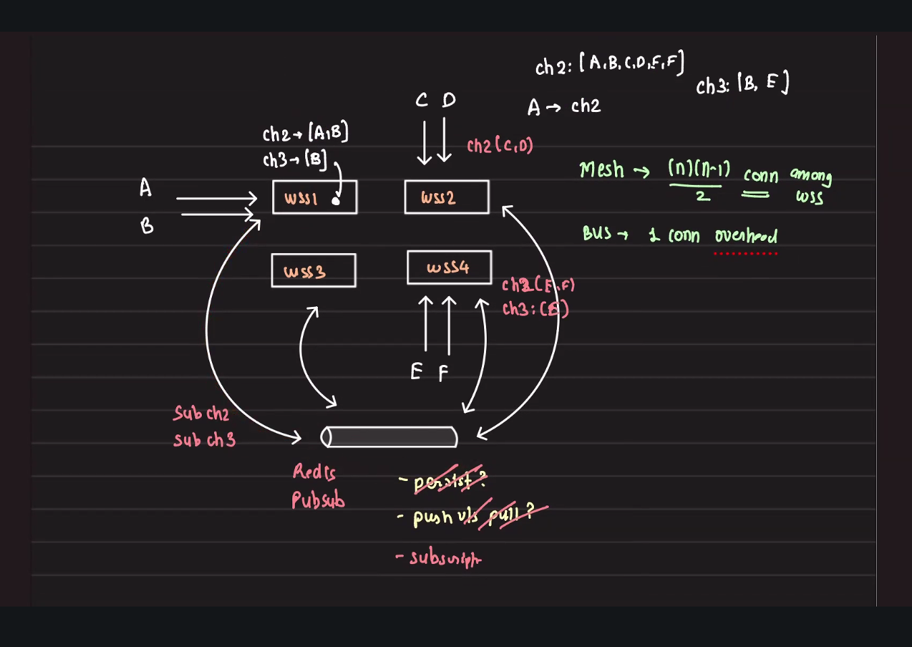

## Slack Messaging System

### Database Schema

#### Users Table
| Column | Type | Description |
|--------|------|-------------|
| id | INT/UUID | Unique identifier |
| name | VARCHAR | User's name |
| email | VARCHAR | User's email address |

#### Channels Table
| Column | Type | Description |
|--------|------|-------------|
| id | INT/UUID | Unique identifier |
| name | VARCHAR | Channel name |
| type | VARCHAR | Channel type (DM/GROUP) |

#### Messages Table
| Column | Type | Description |
|--------|------|-------------|
| id | INT/UUID | Unique identifier |
| channel_id | INT/UUID | Foreign key to channels table |
| sender_id | INT/UUID | Foreign key to users table |
| message | TEXT | Message content |
| created_at | TIMESTAMP | Timestamp of message creation |

#### Membership Table
| Column | Type | Description |
|--------|------|-------------|
| user_id | INT/UUID | Foreign key to users table |
| channel_id | INT/UUID | Foreign key to channels table |
| joined_at | TIMESTAMP | When user joined the channel |


---

### Query Patterns

#### Direct Messages Between Two Users

**Naive Approach**: When user(A) selects a user(B), to retrieve their conversation:

```sql
SELECT * FROM messages 
WHERE (sender_id = A AND receiver_id = B) OR (sender_id = B AND receiver_id = A)
ORDER BY created_at DESC
```

**Issue**: This query uses OR logic, which is expensive and requires checking multiple conditions. It also requires a `receiver_id` field on every message.

**Solution**: Create a dedicated channel for every conversation between two people. Every direct message between two people can be considered as a channel (DM is a Channel with two users).

Optimized query
```sql
select * from messages where channel_id=? order by created_at DESC
```


---

### Optimization Strategies

#### Database Optimization
- **Partitioning**: Messages table can be partitioned by `channel_id` to keep all messages related to a channel closer together for faster retrieval

#### API Design

**Initial Message Loading**:
```
User → REST GET /messages?channel_id=X&limit=20 → MessageService → DB
```
- Load initial messages (last 20 messages) via REST API

#### Real-time Message Delivery

**Option 1: REST-based Approach**
- **Send messages**: POST `/messages` endpoint
- **Receive messages**: Short polling to GET `/messages` periodically
- ❌ **Drawback**: High latency, increased server load from constant polling

**Option 2: WebSocket-based Approach** ✅ **(RECOMMENDED)**
- Client creates a WebSocket connection to push and pull real-time messages
- **Benefits**:
  - Bi-directional communication
  - Lower latency
  - Reduced server overhead
  - Real-time message delivery

#### Historical Messages (Infinite Scroll)

When users scroll up to view older messages, use **cursor-based pagination** via REST API:

**Pagination Query**:
```sql
SELECT * FROM messages 
WHERE channel_id = ? AND created_at < ?
ORDER BY created_at DESC 
LIMIT 50
```

**API Endpoint**:
```
GET /messages?channel_id=X&before=<timestamp>&limit=50
```

**Implementation Flow**:
```
1. User scrolls up
2. Client checks if more messages exist in local cache
3. If not, make REST GET request with last message timestamp
4. Append older messages to conversation view
5. Repeat as user continues scrolling
```


#### A sends message to a channel
**Real-time Message Send & Broadcast Flow**:

communication models
- is persistance impotant
- is realime important


#### Scaling websocket services
Assuming there are 4 Websocket server
- Some users are connect to WSS1, other are WSS2 and so on.

The next issue that you will have to address is, how would messages comming to WSS1 be relayed to other WSS
- Mesh based archi. All WSS needs to have a persistant connection between each other
    - Issue becomes when you add new WSS
    - When the number of WSS becomes high, all WSS would need to have (n)(n-1)/2 connections.
        - As number increases to become 100 or more it starts to become a problem

- Alternatively, use somekind of bus
    - Redis PubSub


    - Each WSS is subscribed to the channels that it is intrested in (based on user)
        - channel2: [A, B, C, D, E, F]
        - channel3: [B, E]
    - WSS1 which have A, E
        - It means that it is interested in channel2 and channel3, and would subscribed to required channels in redis PUBSUB
    - WSS2 which has C, D
        - It means it is interested in channel2


-----
#### Scaling WSS
Maximum number of TCP connections between the same source and destination IP is 65,536 (limited by 16-bit source port range).

TCP connections are uniquely identified by a 5-tuple:
- source IP
- source port number (16 bits. Math.pow(2, 16) = 65536)
- destination IP
- destination port number
- protocol

If WSS are behind reverse proxy or loadbalancers, MAX connections between loadbalancer and WSS would a bottleneck.
So, WSS are exposed naked to internet by taking care of security. 

Final design


- Users
- Message service
    - Talking to message DB
- REDIS PubSub
    - All WSS servers use Redis PUBSUB as a bus to push messages to WSS
- Web socket servers
    - Cluster of websocket servers. 
- Connection balancers
    - A service that clients used to identify which websocket servers to connect to.
    - This service can be used to route a workspace/company to a same web socket server
- Membership service
    - Membership DB

---
**Reading:**
1. Redis PubSub
    - How channels are created
    - How to subscribe to channels