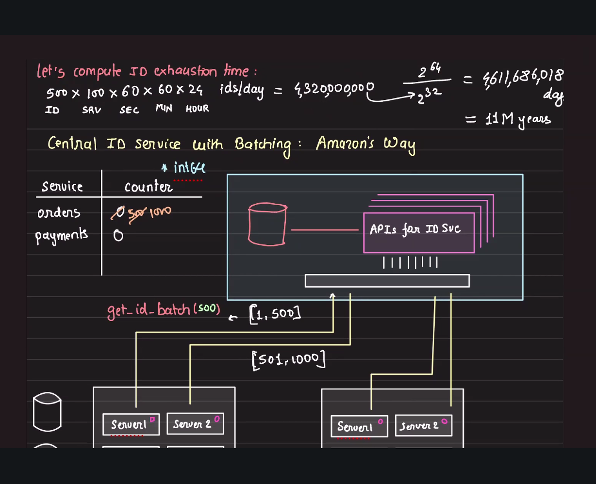

## Foundation of IDs

Something unique that is generate 

### Basic 
getEpocMilliseconds

**Across to computers**
```
M1 => M1-${getEpocMilliseconds}
M2 => M2-${getEpocMilliseconds}
```

**include threads**
```
M1 => T1 => M1-T1=${getEpocMilliseconds}
M1 => T1 => M1-T2-${getEpocMilliseconds}
M2 => T1 => M2-T1-${getEpocMilliseconds}
M2 => T1 => M2-T2-${getEpocMilliseconds}
```

### Concating static counter

**M1**
```
c=0
M1 => M1-c1
M1 => M1-c2
M1 => M1-c3
```

**M2**
```
c=0
M2 => M2-c1
M2 => M2-c2
M2 => M2-c3
```

If either of machine is down, counter is back to 0

Persistance would help getting back.
Writing to file instead of DB to reduce a network io

```javascript
counter = loadFromFile();
getId() {
    // mutex
    counter++; //atomic increment
    saveCounterToFile();
    // mutex
    return concat(
        machine_id,
        counter
    )
}
```

**Optimization**

Buffer and flush to the disk;

```javascript
counter = loadFromFile();
getId() {
    // mutex
    counter++; //atomic increment
    if(counter%1000==0) {
        saveCounterToFile();
    }
    // mutex
    return concat(
        machine_id,
        counter
    )
}
```
### Why Are Monotonic Increasing IDs Needed? 

Earlier in this document, we discussed incrementing counters per machine to generate unique IDs. While this works for basic ID uniqueness, it can cause issues in distributed systems, especially when multiple machines are involved, and when data must be efficiently queried and indexed at scale.

**Key Differences:**

- **Counter-only approach:**  
  - IDs like `M1-c1`, `M2-c1034`, etc. only guarantee local (per-machine) increment but may not be globally ordered by creation time (since `M1-c3` and `M2-c2` could be generated in any order).
  - With just counters and machine IDs, insertion order isn't reflected globally.

- **Monotonic Increasing IDs (with timestamp + counter):**  
  - Guarantee that each newer ID is *always* greater than any previous one, across all machines.
  - Enable time-based ordering without a separate timestamp column.
  - Make queries like "get newest records" or paginating with `WHERE id < last_id ORDER BY id DESC` extremely fast and consistent using a single B+ tree index.
  - Ensure that even after restarts and counter resets, IDs keep increasing (since timestamp dominates).

**Summary Table:**

| Approach         | Globally Ordered? | Fast Database Paging? | Resilience to Restarts? |
|------------------|------------------|----------------------|-----------------------|
| Counter+Machine  | ❌               | ❌                   | ⚠️ (manual handling)  |
| Monotonic ID     | ✅               | ✅                   | ✅ (timestamp primary)|

**In short:**  
Monotonic increasing IDs are **needed** for distributed systems because they provide both uniqueness *and* a global, time-sortable order, unlocking major performance and consistency advantages over local counter IDs.

---

## Monotonic increasing IDs
- **What?**
  - IDs that always increase in value over time (never decrease)
  - Each new ID > previous ID (e.g., 1001, 1002, 1003...)
  - Provides natural ordering without additional timestamp column

- **How?**
  - Use timestamp as base (milliseconds since epoch)
  - Add auto-increment counter
  - Combine: `timestamp + machine_id + counter`
  - Ensure sequential generation (use locks/atomic operations)

- **Example**
  ```javascript
  // Simple monotonic ID generator
  class MonotonicIdGenerator {
      constructor(machineId) {
          this.machineId = machineId;
          this.counter = 0;
          this.lastTimestamp = 0;
      }
      
      generateId() {
          let timestamp = Date.now();
          
          // If same millisecond, increment counter
          if (timestamp === this.lastTimestamp) {
              this.counter++;
          } else {
              this.counter = 0;
              this.lastTimestamp = timestamp;
          }
          
          // Format: timestamp (41 bits) + machine (10 bits) + counter (12 bits)
          return (timestamp << 22) | (this.machineId << 12) | this.counter;
      }
  }
  
  // Usage
  const idGen = new MonotonicIdGenerator(1);
  console.log(idGen.generateId()); // e.g., 7234567890123
  console.log(idGen.generateId()); // e.g., 7234567890124
  ```

- **Why Needed in Distributed Systems?**
  1. **Database Performance (B+ Tree)**
     - Sequential inserts are 2-10x faster
     - Reduces page splits and fragmentation
     - Better cache locality
  
  2. **Natural Ordering**
     - Easy to sort events chronologically
     - Pagination: `WHERE id > last_seen_id LIMIT 20`
     - No need for separate timestamp column
  
  3. **Efficient Time-Range Queries**
     - Query by ID range ≈ query by time range
     - `SELECT * FROM events WHERE id >= start_id AND id < end_id`
  
  4. **Debugging & Observability**
     - Human-readable (can estimate when event occurred)
     - Easy to trace event sequences
  
  5. **Sharding by Range**
     - IDs 0-1M → Shard 1
     - IDs 1M-2M → Shard 2
     - Easier rebalancing

- **Issues**
  - **Hot Shard Problem**: All new writes go to latest shard (uneven load)
  - **Reveals Business Metrics**: Competitors can estimate growth rate by ID sequence
  - **Clock Skew**: If system clock goes backward, can break monotonicity
  - **Single Point of Failure**: If using centralized generator
  - **Solution**: Twitter Snowflake (distributed + monotonic)

---

## Central ID generation service
- **What?**
  - Dedicated service/server that generates unique IDs for entire system
  - Single source of truth for ID generation
  - Eliminates collisions across all services

- **How?**
  1. **Batch Allocation**
     - Central service allocates ID blocks/ranges (e.g., 1000 IDs at a time)
     - Services cache their allocated range locally
     - Request new block when exhausted
  
  2. **Persistence**
     - Store last allocated ID in database
     - On restart, resume from last saved ID
  
  3. **High Availability**
     - Multiple replicas of ID service
     - Each replica gets different ID ranges
     - Load balancer distributes requests

- **Example**
  ```javascript
  // Central ID Service
  class CentralIdService {
      constructor() {
          this.currentId = this.loadFromDB(); // e.g., 1000000
          this.blockSize = 1000;
      }
      
      allocateBlock() {
          const start = this.currentId + 1;
          const end = this.currentId + this.blockSize;
          this.currentId = end;
          this.saveToDb(this.currentId);
          
          return { start, end }; // Client owns IDs 1000001-1001000
      }
  }
  
  // Client Service (Orders, Payments, etc.)
  class IdClient {
      constructor() {
          this.currentId = 0;
          this.maxId = 0;
      }
      
      async getId() {
          // Need new block?
          if (this.currentId >= this.maxId) {
              const block = await centralIdService.allocateBlock();
              this.currentId = block.start;
              this.maxId = block.end;
          }
          
          return this.currentId++;
      }
  }
  
  // Usage in order service
  const orderId = await idClient.getId(); // Fast local operation
  ```

- **Issues**
  - **Single Point of Failure**: If central service down, no IDs generated
    - *Mitigation*: Multiple replicas with different ranges
  
  - **Network Latency**: Need to call service over network
    - *Mitigation*: Batch allocation (request 1000 IDs at once)
  
  - **Bottleneck**: High request volume can overwhelm service
    - *Mitigation*: Large block sizes, geo-distributed replicas
  
  - **ID Gaps**: If service crashes, allocated but unused IDs are lost
    - *Acceptable* in most cases (uniqueness > sequential)
  
  - **Complexity**: Extra service to maintain and monitor

---

## Amazon's Centralized ID Generation (Order/Payment IDs)

Amazon and other large-scale systems often employ **centralized ID generation services** to eliminate collisions and ensure global uniqueness and ordering guarantees across data centers and services.




**Key characteristics:**
- **Central service ("ID authority")**: A highly available, replicated microservice solely responsible for issuing blocks of unique IDs.
- **Batch allocation:** Instead of every service calling the central authority for each ID, the service allocates *ranges* or *blocks* (e.g., 500 IDs at a time) to local nodes/services, reducing traffic and improving performance.
- **ID format:** Typically uses a *composite ID* that encodes multiple relevant attributes, such as:
    - Timestamp (for ordering)
    - Data center & machine identifier
    - Sequence number (counter)
    - Partition, region, or environment bits

---

### Example: How a Centralized ID Generation Service Works

```python
# Pseudocode for central "ID Authority" microservice
# - Allocates ID blocks to clients on request
# - Persists the latest issued ID in a database (to avoid collisions)
class IdAuthority:
    def __init__(self):
        self.current_id = self.load_from_db()

    def allocate_block(self, block_size):
        start = self.current_id + 1
        end = self.current_id + block_size
        self.current_id = end
        self.save_to_db(self.current_id)
        return (start, end)  # Client now owns this block of IDs

# Client-side pattern (e.g., payment/orders service)
class IdClient:
    def __init__(self, authority):
        self.authority = authority
        self.current, self.max = 0, -1

    def get_id(self):
        if self.current >= self.max:
            self.current, self.max = self.authority.allocate_block(1000)
        id = self.current
        self.current += 1
        return id  # can be formatted as composite if needed
```

**ID Structure Example (64 bits):**

| Bits     | Purpose                  |
|----------|--------------------------|
| 42       | Timestamp (ms)           |
| 9        | Machine/Data center ID   |
| 13       | Sequence counter         |

- Similar concept as Twitter Snowflake, but may be customized for Amazon's business needs.

---

**Why centralized?**
- Guarantees monotonicity and uniqueness even across distributed systems.
- Helps with ordering, auditability, and can encode sharding/region logic.

**Drawback & Mitigation:**
- Central authority is a bottleneck? → **Batching/range allocation** and geo-replication for high availability.

---

**Summary:** Amazon's order/payment systems use a *highly available central authority* or ID block allocation system to issue distributed, collision-free, and often time-sortable identifiers at high scale.

---

## Why do databases prefer monotonic IDs?

- **Reduced Rebalancing & Splitting:**  
  Monotonic (increasing) IDs mean newly inserted rows are always appended at the "end" of the index or storage structure (e.g., B-tree leaves). This minimizes random insertions, so internal index pages rarely need to rebalance/split, keeping the write path efficient.

- **Improved Write Performance:**  
  With predictable insert patterns, database engines benefit from better cache locality, faster sequential disk writes, and fewer index maintenance operations.

- **Data Locality:**  
  Sequential IDs keep related records clustered together physically, boosting range scan and query efficiency.

- **Contrast: Non-monotonic or Random IDs:**  
  If IDs are randomly distributed (e.g., UUIDs), every insert could hit any point in the index, causing page splits, higher write amplification, and poor cache/disk utilization.

**In short:**  
Monotonic IDs let databases optimize for append-only patterns, **reducing internal rebalancing**, and making large-scale inserts faster and more resource-efficient.
