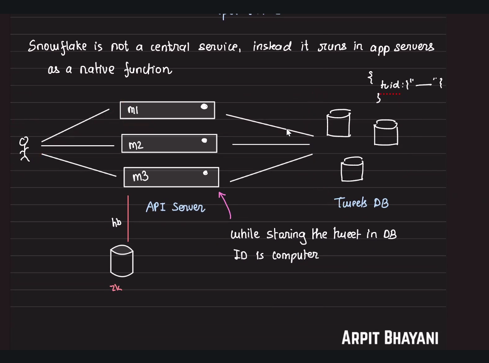

## Twitter's Snowflake (generated needs to be reviewed)

### Quick Summary
- **NOT a central service** - runs as a **native function** inside each app server
- Generates 64-bit unique, monotonic, time-sortable IDs for tweets
- **Distributed & decentralized** - each machine generates IDs independently
- No coordination needed between servers, eliminating bottlenecks

### Architecture Overview

```
User Request → Load Balancer → [M1, M2, M3...] API Servers
                                      ↓
                                Each server computes ID locally
                                      ↓
                                   TweetDB (with Zookeeper)
```

**Key Insight:** Snowflake runs **IN the application servers**, not as a separate service!



---

### Core Concepts: 64-bit ID Structure

```
┌─────────────────────────────────────────────────┐
│ 1 bit │ 41 bits    │ 10 bits      │ 12 bits    │
│ Sign  │ Timestamp  │ Machine ID   │ Sequence   │
│  0    │ Millis     │ (0-1023)     │ (0-4095)   │
└─────────────────────────────────────────────────┘

Total: 64 bits = Long integer
```

| Bits | Component | Purpose | Range |
|------|-----------|---------|-------|
| 1 | Sign bit | Always 0 (positive number) | 0 |
| 41 | Timestamp | Milliseconds since custom epoch | ~69 years |
| 10 | Machine/Datacenter ID | Identifies which server generated ID | 0-1023 (1024 machines) |
| 12 | Sequence | Counter per machine per millisecond | 0-4095 (4096 IDs/ms) |

**Format:** `epochMillis | machine_id | counter`

---

### How It Works

```javascript
class SnowflakeIdGenerator {
    constructor(machineId, dataCenterId) {
        this.machineId = machineId;          // 10 bits total
        this.dataCenterId = dataCenterId;    // (5 bits datacenter + 5 bits machine)
        this.sequence = 0;
        this.lastTimestamp = -1;
        this.customEpoch = 1288834974657;    // Twitter's custom epoch (Nov 04, 2010)
    }
    
    generateId() {
        let timestamp = Date.now();
        
        // Clock moved backwards - wait
        if (timestamp < this.lastTimestamp) {
            throw new Error("Clock moved backwards!");
        }
        
        // Same millisecond - increment sequence
        if (timestamp === this.lastTimestamp) {
            this.sequence = (this.sequence + 1) & 4095;  // Mask to 12 bits
            
            // Sequence overflow - wait for next millisecond
            if (this.sequence === 0) {
                timestamp = this.waitNextMillis(this.lastTimestamp);
            }
        } else {
            this.sequence = 0;  // Reset for new millisecond
        }
        
        this.lastTimestamp = timestamp;
        
        // Construct 64-bit ID
        const timePart = (timestamp - this.customEpoch) << 22;  // 41 bits, shift left 22
        const machinePart = this.machineId << 12;               // 10 bits, shift left 12
        const sequencePart = this.sequence;                     // 12 bits
        
        return timePart | machinePart | sequencePart;
    }
    
    waitNextMillis(lastTimestamp) {
        let timestamp = Date.now();
        while (timestamp <= lastTimestamp) {
            timestamp = Date.now();
        }
        return timestamp;
    }
}

// Usage
const generator = new SnowflakeIdGenerator(1, 1);
const tweetId = generator.generateId();
// Output: 1234567890123456 (64-bit integer)
```

---

### Key Advantages

1. **No Central Service Required**
   - Each server generates IDs independently
   - No network calls or coordination needed
   - No single point of failure

2. **High Performance**
   - **4,096 IDs per millisecond per machine**
   - Total capacity: 4,096 × 1,024 machines = **4.19 million IDs/ms**
   - Sub-microsecond generation time

3. **Monotonic & Time-Sortable**
   - IDs increase over time (timestamp is most significant bits)
   - Can extract timestamp from ID: `timestamp = (id >> 22) + customEpoch`
   - Natural ordering for timelines

4. **Database Friendly**
   - 64-bit integer (fits in BIGINT)
   - Sequential inserts → better B+ tree performance
   - Indexable and sortable

5. **URL Safe**
   - Base64 encode for compact URLs
   - Example: `twitter.com/user/status/1234567890123456`

---

### Usage Examples

**Example 1: Generate Tweet ID**
```javascript
// On Server M1 (machineId = 1)
const snowflake = new SnowflakeIdGenerator(1, 1);

// User creates tweet
const tweet = {
    id: snowflake.generateId(),      // 1152945683951325184
    text: "Hello World!",
    userId: 12345,
    createdAt: new Date()
};

// Store in database
db.tweets.insert(tweet);
```

**Example 2: Extract Timestamp from ID**
```javascript
function extractTimestamp(snowflakeId) {
    const customEpoch = 1288834974657;
    const timestamp = (snowflakeId >> 22) + customEpoch;
    return new Date(timestamp);
}

const tweetId = 1152945683951325184;
const createdAt = extractTimestamp(tweetId);
console.log(createdAt);  // 2019-07-21T...
```

**Example 3: Range Query (get tweets from last hour)**
```javascript
function generateSnowflakeForTime(timestamp, machineId = 0, sequence = 0) {
    const customEpoch = 1288834974657;
    return ((timestamp - customEpoch) << 22) | (machineId << 12) | sequence;
}

const oneHourAgo = Date.now() - 3600000;
const minId = generateSnowflakeForTime(oneHourAgo);

// Efficient query using ID range instead of timestamp column
db.tweets.find({ id: { $gte: minId } });
```

---

### Key Points to Remember

**Important Gotchas:**
- ⚠️ **Clock Synchronization Critical:** All servers must have synchronized clocks (use NTP)
- ⚠️ **Clock Skew:** If clock moves backward, generation fails or waits
- ⚠️ **Machine ID Management:** Must ensure unique machine IDs (use Zookeeper for coordination)
- ⚠️ **Sequence Overflow:** Can only generate 4,096 IDs per millisecond per machine

**Performance Considerations:**
- **Write-heavy workloads:** Excellent (local generation, no coordination)
- **Hot partitions:** Possible if sharding by ID (newest tweets on same shard)
- **Solution:** Shard by user_id or use consistent hashing, not by tweet_id

**Common Mistakes:**
- ❌ Don't use Snowflake IDs for sharding directly (creates hot shards)
- ❌ Don't forget to handle clock drift/backward movement
- ❌ Don't generate IDs on client side (machine ID collisions)
- ✅ Use Zookeeper or config service for machine ID allocation

---

### Machine ID Coordination (Zookeeper)

Since each server needs a **unique machine ID**, Twitter uses **Zookeeper** for coordination:

```javascript
// Simplified machine ID allocation
class MachineIdAllocator {
    async getMachineId() {
        // Connect to Zookeeper ensemble
        const zk = await ZooKeeper.connect("zk1:2181,zk2:2181,zk3:2181");
        
        // Try to claim an ID by creating ephemeral sequential node
        const path = await zk.create(
            "/snowflake/machines/worker-",
            { hostname: os.hostname() },
            { ephemeral: true, sequential: true }
        );
        
        // Extract sequence number as machine ID
        const machineId = parseInt(path.split("-").pop());
        
        // Keep connection alive to maintain ephemeral node
        // If server dies, node auto-deletes and ID becomes available
        
        return machineId;
    }
}

// On server startup
const machineId = await machineIdAllocator.getMachineId();
const snowflake = new SnowflakeIdGenerator(machineId, dataCenterId);
```

**Why Zookeeper?**
- Ensures unique machine IDs across cluster
- Ephemeral nodes → auto-cleanup when server crashes
- ID becomes available for reuse automatically

---

### Capacity & Limits

| Metric | Value | Calculation |
|--------|-------|-------------|
| IDs per ms per machine | 4,096 | 2^12 |
| Total machines | 1,024 | 2^10 |
| Max IDs per ms (cluster) | 4,194,304 | 4,096 × 1,024 |
| Max IDs per second (cluster) | 4.19 billion | 4,194,304 × 1,000 |
| Timestamp range | ~69 years | 2^41 milliseconds |
| Epoch expires | ~2079 | Started Nov 2010 |

**Twitter's Scale (estimate):**
- ~500M tweets/day = ~5,787 tweets/second
- Snowflake capacity = 4.19 billion/second
- **Utilization: < 0.0001%** (massive headroom)

---

### Quick Reference

**Generate ID:**
```javascript
const id = snowflake.generateId();
```

**Extract Components:**
```javascript
const timestamp = (id >> 22) + customEpoch;
const machineId = (id >> 12) & 1023;  // Mask 10 bits
const sequence = id & 4095;            // Mask 12 bits
```

**Bit Shifts:**
- Timestamp: shift left 22 bits → `<< 22`
- Machine ID: shift left 12 bits → `<< 12`
- Sequence: no shift (rightmost 12 bits)

---

### Comparison: Snowflake vs Central Service vs UUID

| Feature | Snowflake | Central Service | UUID v4 |
|---------|-----------|-----------------|---------|
| Network call | ❌ No | ✅ Yes | ❌ No |
| Single point of failure | ❌ No | ✅ Yes (unless replicated) | ❌ No |
| Monotonic | ✅ Yes | ✅ Yes | ❌ No |
| Time-sortable | ✅ Yes | ⚠️ Maybe | ❌ No |
| Size | 64 bits | 64 bits | 128 bits |
| DB performance | ✅ Excellent | ✅ Excellent | ⚠️ Poor (random) |
| Generation speed | ✅ Very fast | ⚠️ Network latency | ✅ Very fast |
| Coordination needed | ⚠️ Machine ID only | ✅ Continuous | ❌ None |

**Winner:** Snowflake (distributed + monotonic + fast)

---

### Related Topics
- Zookeeper for distributed coordination
- B+ Tree indexing and performance
- Clock synchronization (NTP)
- Consistent hashing for sharding
- Hot shard problem and mitigation
- Instagram's ID generation (similar but 41-bit timestamp + 13-bit shard + 10-bit sequence)
