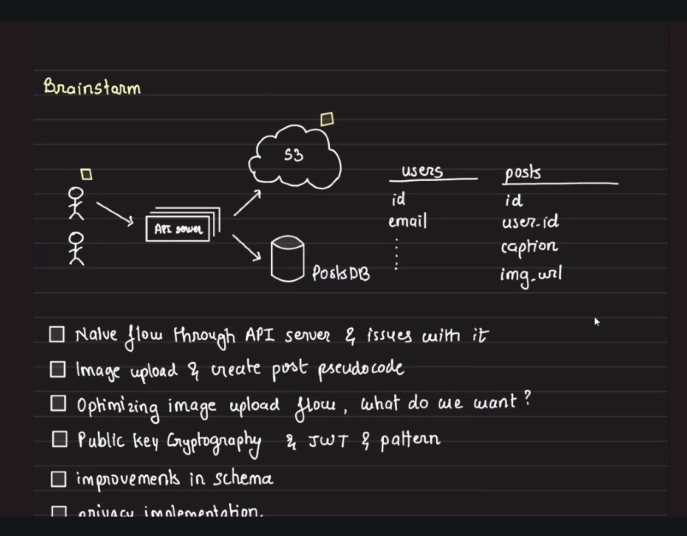

## Image Upload Service

### Quick Summary

**What it does:** Enables users to upload images directly to S3 using pre-signed URLs, bypassing the API server to reduce computational load and bandwidth usage.

**Primary use case:** Social media platforms, content management systems, and any application requiring efficient image uploads at scale.

**Key features:**
- Client uploads directly to S3 (offloading from API server)
- Secure, time-limited pre-signed URLs
- Reduces API server bandwidth and computation
- Maintains security through temporary credentials

---

### Architecture Overview



```
Client → API Server (request pre-signed URL)
       ← API Server (returns pre-signed URL)
Client → S3 (upload image directly)
       ← S3 (returns success)
Client → API Server (save metadata with S3 URL)
```

---

### Database Schema

**users**
```
id          (Primary Key)
email       (String)
```

**posts**
```
id          (Primary Key)
user_id     (Foreign Key → users.id)
caption     (Text)
img_path    (String - S3 Key/Path)
created_at  (Timestamp)
```

---

### Core Concepts

#### 1. Pre-signed URLs
- **What:** Temporary URLs generated by API server with AWS credentials
- **Purpose:** Allow clients to upload directly to S3 without exposing AWS credentials
- **Lifetime:** Typically 5-15 minutes (configurable)
- **Security:** URL contains signature that validates request

#### 2. Upload Flow Components

**API Server responsibilities:**
- Authenticate user
- Generate pre-signed URL with proper permissions
- Validate file type/size constraints
- Store final image metadata in database

**Client responsibilities:**
- Request pre-signed URL from API server
- Upload image directly to S3 using the URL
- Notify API server of successful upload with metadata

**S3 responsibilities:**
- Validate pre-signed URL signature
- Accept file upload
- Store image with specified key/path

---

### Usage Examples

#### Example 1: Generate Pre-signed URL (Java - Spring Boot)

```java
@Service
public class ImageUploadService {
    
    @Autowired
    private AmazonS3 s3Client;
    
    private static final String BUCKET_NAME = "my-app-images";
    private static final int URL_EXPIRATION_MINUTES = 15;
    
    public PreSignedUrlResponse generateUploadUrl(String userId, String fileName) {
        // Validate file extension
        if (!isValidImageFile(fileName)) {
            throw new InvalidFileTypeException("Only jpg, png, gif allowed");
        }
        
        // Generate unique file key
        String fileKey = String.format("users/%s/%s_%s", 
            userId, 
            System.currentTimeMillis(), 
            fileName
        );
        
        // Set expiration time
        Date expiration = new Date();
        long expTimeMillis = expiration.getTime();
        expTimeMillis += 1000 * 60 * URL_EXPIRATION_MINUTES;
        expiration.setTime(expTimeMillis);
        
        // Generate pre-signed URL
        GeneratePresignedUrlRequest generatePresignedUrlRequest =
            new GeneratePresignedUrlRequest(BUCKET_NAME, fileKey)
                .withMethod(HttpMethod.PUT)
                .withExpiration(expiration);
        
        // Add metadata constraints
        generatePresignedUrlRequest.addRequestParameter(
            "x-amz-acl", "public-read"
        );
        
        URL url = s3Client.generatePresignedUrl(generatePresignedUrlRequest);
        
        return new PreSignedUrlResponse(
            url.toString(),
            fileKey,
            expiration
        );
    }
    
    private boolean isValidImageFile(String fileName) {
        String[] allowedExtensions = {".jpg", ".jpeg", ".png", ".gif", ".webp"};
        return Arrays.stream(allowedExtensions)
            .anyMatch(ext -> fileName.toLowerCase().endsWith(ext));
    }
}
```

#### Example 2: API Endpoint to Request Pre-signed URL

```java
@RestController
@RequestMapping("/api/v1/uploads")
public class UploadController {
    
    @Autowired
    private ImageUploadService uploadService;
    
    @PostMapping("/presigned-url")
    public ResponseEntity<PreSignedUrlResponse> getUploadUrl(
        @RequestHeader("Authorization") String token,
        @RequestBody UploadRequestDto request
    ) {
        // Authenticate user
        String userId = authService.validateTokenAndGetUserId(token);
        
        // Validate request
        if (request.getFileSize() > 10 * 1024 * 1024) { // 10MB limit
            return ResponseEntity.badRequest()
                .body(new ErrorResponse("File size exceeds 10MB"));
        }
        
        // Generate pre-signed URL
        PreSignedUrlResponse response = uploadService.generateUploadUrl(
            userId, 
            request.getFileName()
        );
        
        return ResponseEntity.ok(response);
    }
    
    @PostMapping("/complete")
    public ResponseEntity<Post> completeUpload(
        @RequestHeader("Authorization") String token,
        @RequestBody CompleteUploadDto request
    ) {
        String userId = authService.validateTokenAndGetUserId(token);
        
        // Save post metadata to database
        Post post = new Post();
        post.setUserId(userId);
        post.setCaption(request.getCaption());
        post.setImgUrl(request.getS3Url());
        post.setCreatedAt(Instant.now());
        
        Post savedPost = postRepository.save(post);
        
        return ResponseEntity.ok(savedPost);
    }
}
```

#### Example 3: Client-Side Upload (JavaScript/TypeScript)

```typescript
// Step 1: Request pre-signed URL from API server
async function uploadImage(file: File, caption: string, token: string) {
    try {
        // Get pre-signed URL
        const preSignedResponse = await fetch('/api/v1/uploads/presigned-url', {
            method: 'POST',
            headers: {
                'Authorization': `Bearer ${token}`,
                'Content-Type': 'application/json'
            },
            body: JSON.stringify({
                fileName: file.name,
                fileSize: file.size,
                contentType: file.type
            })
        });
        
        const { url, fileKey, expiration } = await preSignedResponse.json();
        
        // Step 2: Upload directly to S3
        const uploadResponse = await fetch(url, {
            method: 'PUT',
            headers: {
                'Content-Type': file.type,
                'x-amz-acl': 'public-read'
            },
            body: file
        });
        
        if (!uploadResponse.ok) {
            throw new Error('S3 upload failed');
        }
        
        // Step 3: Notify API server of successful upload
        const completeResponse = await fetch('/api/v1/uploads/complete', {
            method: 'POST',
            headers: {
                'Authorization': `Bearer ${token}`,
                'Content-Type': 'application/json'
            },
            body: JSON.stringify({
                caption: caption,
                s3Url: `https://my-app-images.s3.amazonaws.com/${fileKey}`,
                fileKey: fileKey
            })
        });
        
        const post = await completeResponse.json();
        console.log('Upload complete:', post);
        
        return post;
    } catch (error) {
        console.error('Upload failed:', error);
        throw error;
    }
}
```

---

### Key Points to Remember

#### Security Considerations
- **Never expose AWS credentials to client** - Always generate pre-signed URLs server-side
- **Set short expiration times** - 5-15 minutes is typical; prevents URL reuse
- **Validate file types** - Check extensions and MIME types before generating URL
- **Set file size limits** - Configure both on API server and S3 bucket policy
- **Use HTTPS only** - Ensure all pre-signed URLs use HTTPS protocol
- **Implement rate limiting** - Prevent abuse of pre-signed URL generation endpoint

#### Performance Benefits
- **Reduces API server load** - Direct S3 upload bypasses application server
- **Scales better** - S3 handles upload bandwidth, not your infrastructure
- **Faster uploads** - Direct path to S3, no intermediate hops
- **Concurrent uploads** - Multiple users can upload simultaneously without bottlenecking API

#### Common Mistakes to Avoid
- ❌ **Uploading through API server** - Don't proxy the entire file through your backend
- ❌ **Long-lived pre-signed URLs** - Don't set expiration > 1 hour
- ❌ **Not validating upload completion** - Always confirm file exists in S3 before saving metadata
- ❌ **Storing credentials in client code** - Never put AWS keys in frontend code
- ❌ **Missing Content-Type headers** - Always specify correct MIME type during upload
- ❌ **No file size validation** - Validate size before generating pre-signed URL

#### Edge Cases
- **URL expiration during upload** - Large files may take time; adjust expiration accordingly
- **Network failures** - Implement retry logic with exponential backoff
- **Duplicate filenames** - Use UUID or timestamp to ensure unique file keys
- **Orphaned files** - If client fails to complete flow, S3 may have file but no DB record
  - Solution: Implement S3 lifecycle policy to delete unconfirmed uploads after 24 hours

---

### Quick Reference

#### Pre-signed URL Generation (AWS SDK v2)
```java
// Essential parameters
GeneratePresignedUrlRequest request = new GeneratePresignedUrlRequest(bucket, key)
    .withMethod(HttpMethod.PUT)           // or GET for downloads
    .withExpiration(expirationDate)       // Required
    .withContentType("image/jpeg");       // Match upload content type
```

#### Common AWS S3 Client Configuration
```java
@Configuration
public class S3Config {
    @Bean
    public AmazonS3 s3Client() {
        return AmazonS3ClientBuilder
            .standard()
            .withRegion(Regions.US_EAST_1)
            .withCredentials(new DefaultAWSCredentialsProviderChain())
            .build();
    }
}
```

#### File Size Limits
- **API validation**: 10-50 MB typical
- **S3 single PUT**: Max 5 GB
- **For larger files**: Use multipart upload

#### Typical Expiration Times
- **Image uploads**: 10-15 minutes
- **Large video uploads**: 1-2 hours
- **Downloads**: 5-30 minutes

---

### Request/Response Examples

#### Request Pre-signed URL
```json
POST /api/v1/uploads/presigned-url
Headers: {
    "Authorization": "Bearer eyJhbGc...",
    "Content-Type": "application/json"
}
Body: {
    "fileName": "profile-pic.jpg",
    "fileSize": 2458672,
    "contentType": "image/jpeg"
}
```

#### Response with Pre-signed URL
```json
{
    "url": "https://my-app-images.s3.amazonaws.com/users/123/1698765432_profile-pic.jpg?AWSAccessKeyId=...&Signature=...&Expires=1698766332",
    "fileKey": "users/123/1698765432_profile-pic.jpg",
    "expiration": "2024-10-31T15:45:32Z"
}
```

#### Complete Upload Request
```json
POST /api/v1/uploads/complete
Headers: {
    "Authorization": "Bearer eyJhbGc...",
    "Content-Type": "application/json"
}
Body: {
    "caption": "Beautiful sunset today!",
    "s3Url": "https://my-app-images.s3.amazonaws.com/users/123/1698765432_profile-pic.jpg",
    "fileKey": "users/123/1698765432_profile-pic.jpg"
}
```

---

### Why This Approach?

#### Traditional Approach (Bad ❌)
```
Client → API Server (upload 10MB image)
API Server → S3 (forward 10MB image)
API Server → Client (confirm)
```
**Problems:**
- API server handles full file bandwidth (10MB in, 10MB out)
- Blocks API server thread during upload
- Scales poorly with concurrent uploads
- Increases infrastructure costs

#### Pre-signed URL Approach (Good ✅)
```
Client → API Server (request URL, tiny payload)
API Server → Client (return URL, tiny payload)
Client → S3 (upload 10MB directly)
Client → API Server (save metadata, tiny payload)
```
**Benefits:**
- API server only handles small metadata requests
- S3 handles all upload bandwidth
- Non-blocking, highly concurrent
- Cost-effective scaling

---

### Related Topics

- **S3 Multipart Upload** - For files > 100MB
- **CloudFront CDN** - For serving uploaded images efficiently
- **Image Optimization** - Resize/compress before upload (client-side or Lambda)
- **S3 Lifecycle Policies** - Auto-delete old/unconfirmed uploads
- **S3 Bucket Policies** - Fine-grained access control
- **Lambda Triggers** - Post-processing images after upload (thumbnails, validation)
- **Content Delivery Networks (CDN)** - Distribute uploaded content globally
- **Database Indexing** - Index `user_id` and `created_at` for efficient queries

---

### Additional Considerations

#### Monitoring & Observability
- Track pre-signed URL generation rate
- Monitor S3 upload success/failure rates
- Alert on expired URL usage attempts
- Log completion rate (URLs generated vs uploads completed)

#### Cost Optimization
- Use S3 Intelligent-Tiering for infrequently accessed images
- Implement CloudFront for reduced S3 GET requests
- Set lifecycle rules to archive old content to Glacier

#### Security Best Practices
- Enable S3 bucket versioning for recovery
- Use VPC endpoints for private API-S3 communication
- Implement CloudTrail for audit logging
- Enable S3 server-side encryption (SSE)
