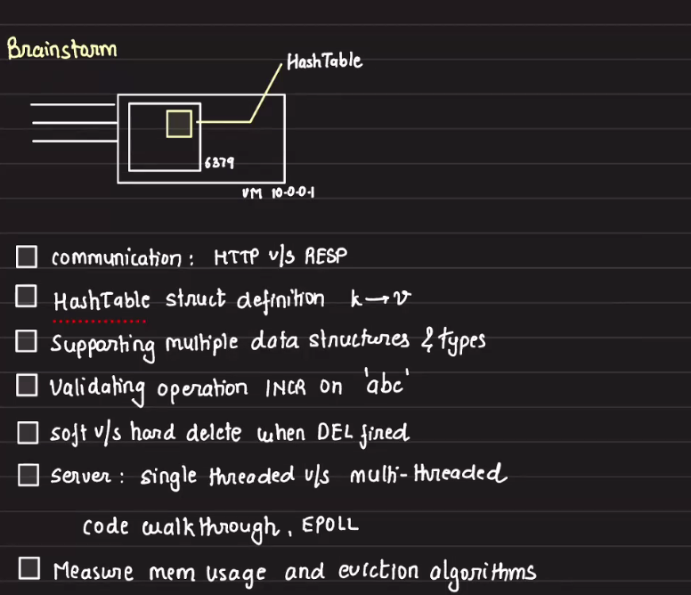
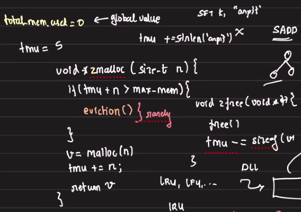

## Desiging a distributed Cache (single)

### Single node

Requirements


Brainstorming


#### Communication
HTTP
- Can be used to support communicate with cache
- But HTTP is verbose
```
GET /hello.html HTTP/1.1
User-Agent: Mozilla/4.0 (compatible; MSIE5.01; Windows NT)
Host: www.sample-server.com
Accept-Language: en-us
Accept-Encoding: gzip, deflate
Connection: Keep-Alive
```

Redis uses Redis Realization protocol
- Wire protocol
- `GET K` translated to `*2$3GET$1K`

#### Storage
Hashmaps
- string -> abstract Datatype

value is object is `robj`(redis obj)
```
    class robj {
        T val // pointer for value
        int dataType
    }
```
> Read more about redis redisObject internal structure encoding types memory optimization

#### Single threaded vs Multithreaded
- Redis uses Single thread with Event loop.
- Only uses single core
- Supports 300K ops/seconds


#### Measure memory usage and memory eviction
- Have a global variable to store memory used
- Add wrappers on top of malloc() and free() that not only add/frees memory but also updates total memory used (TMU)
- If the malloc() is called to allocate memory(n bytes), and when `TMU + n > (total available memory)`, evict data



#### TTL
