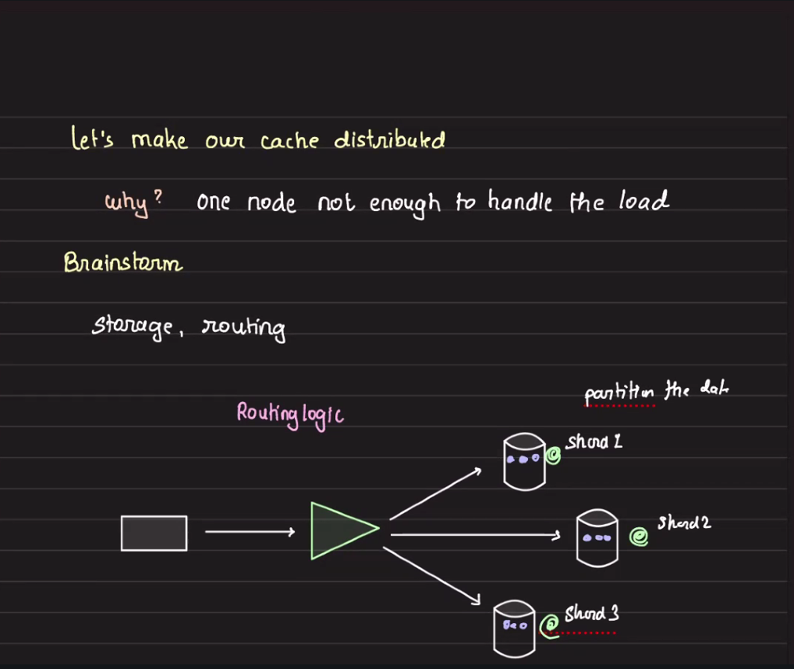

## Desiging a distributed Cache (distributed)

Ways to implement a distributed cache:

1. **Proxy/Middleware-based Routing**  
   - A central proxy or middleware sits in front of the cache cluster and knows the topology.
   - All client requests go through this middleware, which routes them to the correct cache node.
   - Hashbased routing
        - Issues with hash based routing is when the number of nodes in cluster is elastic
        - When nodes are added, rehash all the data, 
   - Range based routing

2. **Client-side Sharding**  
   - Clients are aware of the cluster topology and use algorithms (like consistent hashing) to determine which cache node to contact directly for each key.

3. **Redis Cluster Auto-Redirection**  
   - Clients send requests to any node in the cluster; if the node does not store the requested key, it redirects the client to the correct node.
   - The cluster handles routing internally and gives clients the necessary information to find the correct node.

4. **Peer-to-Peer Decentralized Cache (e.g., IPFS, DHT-based systems)**
   - Nodes themselves manage data distribution, and clients can query any node to fetch data, which may be retrieved via a distributed lookup protocol.

- Consistent hashing
- Operational complexity
