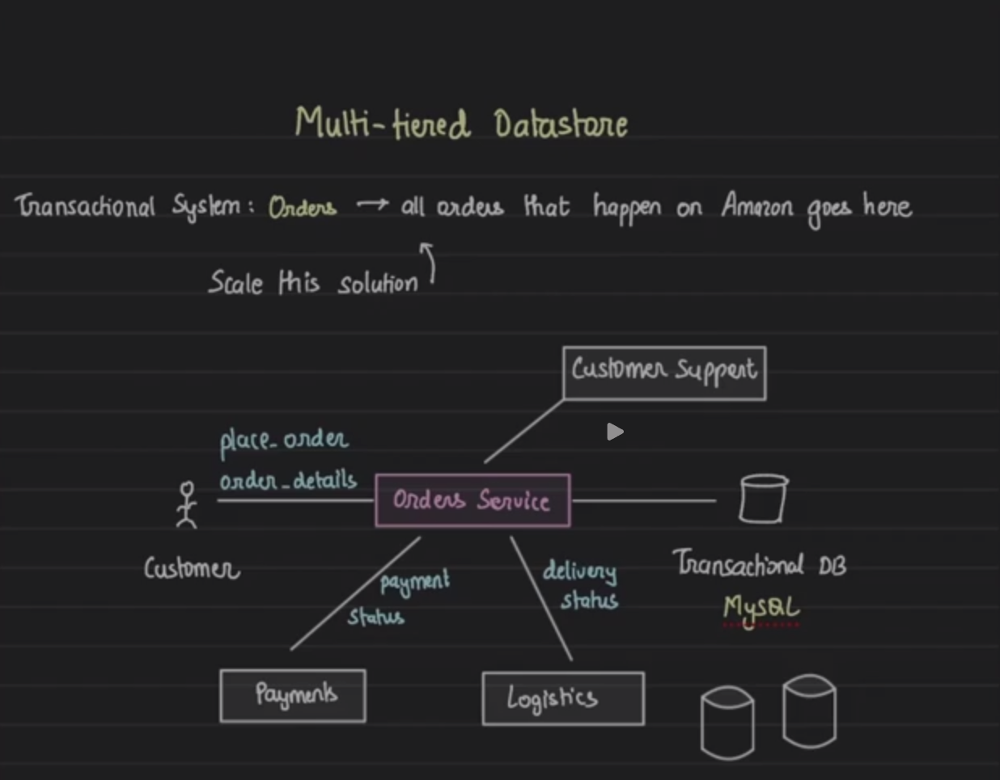
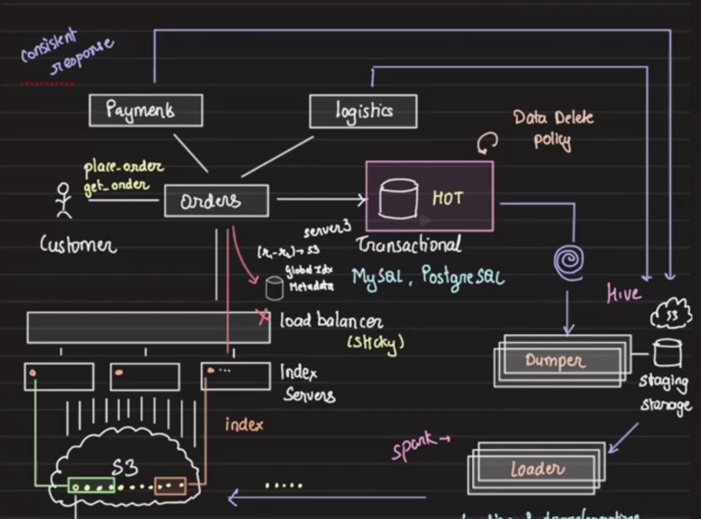

## Multi tier Datastore

#### Scaling

In transactional systems for example: 
In amazon, all orders are stored in a transactional DB



Access patterns
- Mostly access latest orders
- Orders older than 6 months are rarely accessed

> Does it makes sense to keep all the data in the db if you are not going to query it?
> Does it makes sense to move it some where else? And build a multi tiered datastore? (NOT ARCHIVAL)
> HOT storage vs COLD Storage. Cold storage is cheaper.

#### Move older orders to cold storage 


##### Access Patterns for Hot vs Cold Storage Decision

Orders exhibit predictable access patterns based on their age:

**Hot Storage (Transactional DB) - Recent Orders:**
- **0-7 days old**: Very high access frequency (80%+ of queries)
  - Customers checking order status multiple times daily
  - Payment processing and verification
  - Logistics updates and tracking
  - Customer service inquiries
  - Order modifications/cancellations
- **1-4 weeks old**: Moderate access frequency
  - Delivery confirmations
  - Returns/refunds processing
  - Invoice generation
- **1-6 months old**: Low but still operational access
  - Warranty claims
  - Financial reconciliation
  - Occasional customer queries

**Cold Storage (S3/Hive) - Older Orders:**
- **6+ months old**: Rare access patterns
  - Compliance and audit requirements
  - Historical analytics
  - Customer purchase history
  - Tax reporting
  - Legal disputes

##### Data Movement Process

The data movement from hot to cold storage follows a scheduled ETL pipeline:

**1. Dumper Component:**
- Runs scheduled batch jobs (typically daily/weekly)
- Queries HOT storage for orders meeting age criteria (e.g., > 6 months)
- Extracts data in chunks to avoid impacting transactional performance
- Creates database snapshots or uses read replicas to minimize load
- Exports data in a consistent format (CSV, JSON, or Parquet)

**2. Staging Storage:**
- **Purpose**: Temporary intermediate storage for data transformation
- **Characteristics**:
  - High-performance storage (often SSD-backed)
  - Acts as a buffer between hot and cold storage
  - Enables retry mechanisms if downstream processing fails
  - Allows for data validation before final storage
- **Benefits**:
  - Decouples extraction from transformation/loading
  - Provides checkpoint for recovery
  - Enables parallel processing of multiple data batches

**3. Loader Component:**
- **Data Transformation**:
  - Converts data formats (e.g., relational to columnar)
  - Applies compression algorithms
  - Partitions data by date/customer/region for efficient querying
  - Removes sensitive data based on retention policies
  - Aggregates related data (orders + order_items + shipping)
- **Data Validation**:
  - Ensures data integrity and completeness
  - Validates against schema definitions
  - Checks for duplicate entries
- **Loading Process**:
  - Writes transformed data to Spark for processing
  - Creates appropriate partitions in Hive/S3
  - Updates metadata catalogs
  - Maintains data lineage information

**4. Spark Processing:**
- Performs large-scale data transformations
- Creates optimized file formats (Parquet, ORC)
- Builds aggregated views for analytics
- Generates indexes for efficient querying

**5. Final Storage in S3:**
- Data organized in hierarchical structure (year/month/day)
- Compressed and optimized for storage costs
- Lifecycle policies for eventual archival or deletion
- Integrated with Hive metastore for SQL queries

##### Data Delete Policy Integration

The architecture includes a data deletion policy that works across both tiers:
- Automated deletion based on legal retention requirements
- GDPR compliance for customer data removal requests
- Cascading deletes across hot and cold storage
- Audit trails for all deletions

##### Index Servers for Cold Storage Access

To enable efficient querying of cold storage:
- Maintain indexes of order IDs to S3 locations
- Cache frequently accessed historical data
- Route queries to appropriate storage tier
- Provide unified query interface across hot and cold data

### Read Path Decision Logic: Hot vs Cold

When an analytics query (or API call) requests data, the multi-tier datastore must determine whether to serve the request from **hot storage** (e.g., the transactional database or an in-memory store like Redis/HBase) or **cold storage** (e.g., S3-based data lake with Parquet files).

#### Who Decides: The Query Coordinator

- The query entry point is typically a **Query Router** or **API Gateway** built into the analytics stack or service layer.
- This router/dispatcher determines data residency based on **query parameters** (e.g., date ranges, customer, SKU, etc.), metadata tables, or storage tiering policies.
- Frequent design: 
  - **Metadata Catalog** (such as Hive Metastore or a custom partition registry) keeps track of the partitioning scheme and which partitions/dates/customers are present in hot storage vs moved/archived to S3.

#### Decision Mechanism

1. **Check Metadata**: 
   - When a read is initiated, the Query Router first queries the metadata catalog/index to determine if the requested data partition/range/key is resident in hot storage.
2. **Route the Request**: 
   - If in hot storage: Route to DB or fast cache node (sub-millisecond to millisecond response).
   - If only in cold storage: 
     - Query the **Index Server** for S3 location(s) corresponding to the requested keys/ranges.
     - Construct an S3 key/prefix (e.g., `s3://bucket/orders/YYYY/MM/DD/customer_id=.../order_id=...`)
     - Use query engines (like Spark, Presto/Trino, Athena, or custom S3 readers) to selectively read only the necessary Parquet or ORC files.
3. **Merge Results and Respond**:
   - If the query spans both hot and cold: 
     - Retrieve partial results from both, merge, sort/filter as needed, and serve a unified result to the user.

#### How to Access Correct S3 Object(s) When Reading Cold

- **Global Index**: 
  - The Index Server maintains mapping from high-level query keys (e.g., order_id, customer_id, or date) to precise S3 locations of the relevant files. 
  - Could be implemented as a key-value store, or as part of the data lake's metadata service.
- **Efficient Retrieval**:
  - The read workload is pushed down to only scan and load the relevant Parquet blocks (using predicate pushdown and column projection techniques).
  - Serverless query engines (Athena, BigQuery, Trino) read data directly from S3, using indexes and partitioning to scan only necessary files.
- **Example Flow**:
  1. Query for order ID `O12345` for January 2021.
  2. Index Server looks up: `order_id=O12345` → `s3://.../orders/2021/01/02/customer_id=789/order_id=O12345.parquet`
  3. The engine reads the Parquet file (or relevant row group if file is large), returns results upstream.

#### Unified Abstraction

- The user/application sees a **unified API** regardless of whether the data lives hot or cold.
- The system abstracts away tiering, fetching optimally from both as needed.

##### Summary Table

| Step                | Who Decides/Acts               | Description                                 |
|---------------------|-------------------------------|---------------------------------------------|
| Query received      | Query Router / API Layer       | Inspect parameters/range                    |
| Metadata checked    | Metadata Catalog               | Is data "hot" or "cold"?                    |
| Hot?                | DB/Cache/Real-time store       | Serve from hot storage                      |
| Cold?               | Index Server + S3 + Data Lake  | Find file location, read from S3            |
| Both?               | Results Merger/Aggregator      | Fetch from both, merge/filter for user       |

This architecture ensures transparent, efficient, and scalable reads regardless of data age or storage tier.

### Read Access Flow Diagram

```
┌─────────────────┐
│   Client/App    │
│  (Analytics/    │
│     API)        │
└────────┬────────┘
         │
         ▼
┌─────────────────────────────────────────────┐
│           Query Router/API Gateway           │
│  • Parses query parameters (date, order ID) │
│  • Determines data location strategy        │
└─────────────┬───────────────────────────────┘
              │
              ▼
        ┌─────────────┐
        │  Metadata   │
        │  Catalog    │
        │ (Partition  │
        │  Registry)  │
        └──────┬──────┘
               │
        ┌──────┴───────┐
        │ Data Age?    │
        └──────┬───────┘
               │
    ┌──────────┴──────────┐
    │                     │
    ▼                     ▼
┌─────────────┐    ┌──────────────┐
│ HOT Storage │    │ COLD Storage │
│  Decision   │    │   Decision   │
└──────┬──────┘    └──────┬───────┘
       │                   │
       ▼                   ▼
┌─────────────┐    ┌──────────────┐
│ Direct DB   │    │Index Server  │
│   Query     │    │   Lookup     │
│ (MySQL/     │    │ (order_id →  │
│ PostgreSQL) │    │ S3 location) │
└──────┬──────┘    └──────┬───────┘
       │                   │
       │                   ▼
       │           ┌──────────────┐
       │           │ Query Engine │
       │           │(Spark/Presto)│
       │           └──────┬───────┘
       │                   │
       │                   ▼
       │           ┌──────────────┐
       │           │ S3 Storage   │
       │           │ (Parquet/ORC │
       │           │   files)     │
       │           └──────┬───────┘
       │                   │
       └─────────┬─────────┘
                 │
                 ▼
         ┌───────────────┐
         │ Result Merger │
         │ & Aggregator  │
         └───────┬───────┘
                 │
                 ▼
         ┌───────────────┐
         │ Unified Result│
         │  to Client    │
         └───────────────┘
```

**Key Decision Points:**
1. **Query Router**: Entry point that analyzes the request
2. **Metadata Catalog**: Determines data location (hot/cold)
3. **Parallel Paths**: Simultaneous queries to both storage tiers if needed
4. **Result Merger**: Combines data from multiple sources transparently

### Data Movement Process Flow

```
┌─────────────────────────────────────────────────────────────────┐
│                     HOT Storage (Transactional DB)               │
│                                                                  │
│  ┌─────────┐  ┌─────────┐  ┌─────────┐  ┌─────────┐           │
│  │Orders   │  │Payments │  │Logistics│  │Customer │           │
│  │Table    │  │Table    │  │Table    │  │Table    │           │
│  └─────────┘  └─────────┘  └─────────┘  └─────────┘           │
└─────────────────────────────┬───────────────────────────────────┘
                              │
                              ▼
                    ┌─────────────────┐
                    │    Dumper       │
                    │ (Scheduled Job) │
                    │                 │
                    │ • Daily/Weekly  │
                    │ • Age > 6 months│
                    │ • Chunked reads │
                    └────────┬────────┘
                             │
                             ▼
                ┌────────────────────────┐
                │   Staging Storage      │
                │  (High-perf Buffer)    │
                │                        │
                │ • Checkpoint/Recovery  │
                │ • Format: CSV/JSON     │
                │ • Temp storage         │
                └───────────┬────────────┘
                            │
                            ▼
                   ┌────────────────┐
                   │    Loader      │
                   │                │
                   │ • Transform    │──────┐
                   │ • Validate     │      │
                   │ • Compress     │      │
                   │ • Partition    │      │
                   └────────┬───────┘      │
                            │              │
                            ▼              ▼
                   ┌─────────────────────────┐
                   │   Spark Cluster         │
                   │                         │
                   │ • Columnar conversion   │
                   │ • Create Parquet/ORC    │
                   │ • Build aggregations    │
                   │ • Generate indexes      │
                   └──────────┬──────────────┘
                              │
                              ▼
              ┌───────────────────────────────────┐
              │         S3 (Cold Storage)          │
              │                                    │
              │  /orders/2021/01/01/              │
              │  /orders/2021/01/02/              │
              │  └── customer_id=123/             │
              │      └── order_O12345.parquet     │
              │                                    │
              │  • Partitioned by date/customer   │
              │  • Compressed Parquet files       │
              │  • Lifecycle policies             │
              └───────────────┬───────────────────┘
                              │
                              ▼
                     ┌─────────────────┐
                     │ Hive Metastore  │
                     │ (Update catalog)│
                     └─────────────────┘
```

**Data Movement Pipeline Steps:**

1. **Extraction Phase**:
   - Dumper queries hot storage for orders meeting age criteria
   - Uses read replicas to minimize impact
   - Exports in batches (e.g., 10K orders at a time)

2. **Staging Phase**:
   - Temporary storage acts as buffer
   - Enables parallel processing
   - Provides failure recovery points

3. **Transformation Phase**:
   - Convert relational → columnar format
   - Apply compression (Snappy/Gzip)
   - Create date/customer partitions
   - Remove sensitive data per retention policy

4. **Loading Phase**:
   - Spark processes and optimizes data
   - Writes to S3 with proper partitioning
   - Updates Hive metastore with new partition info

5. **Verification Phase**:
   - Validate data completeness
   - Update indexes and metadata
   - Mark hot storage records for deletion


