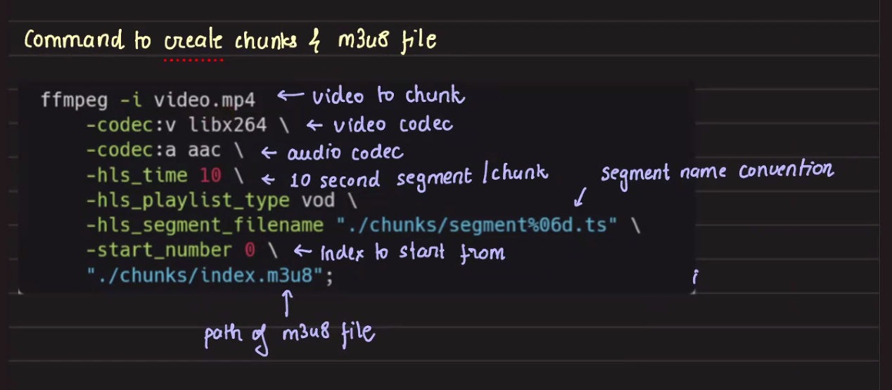
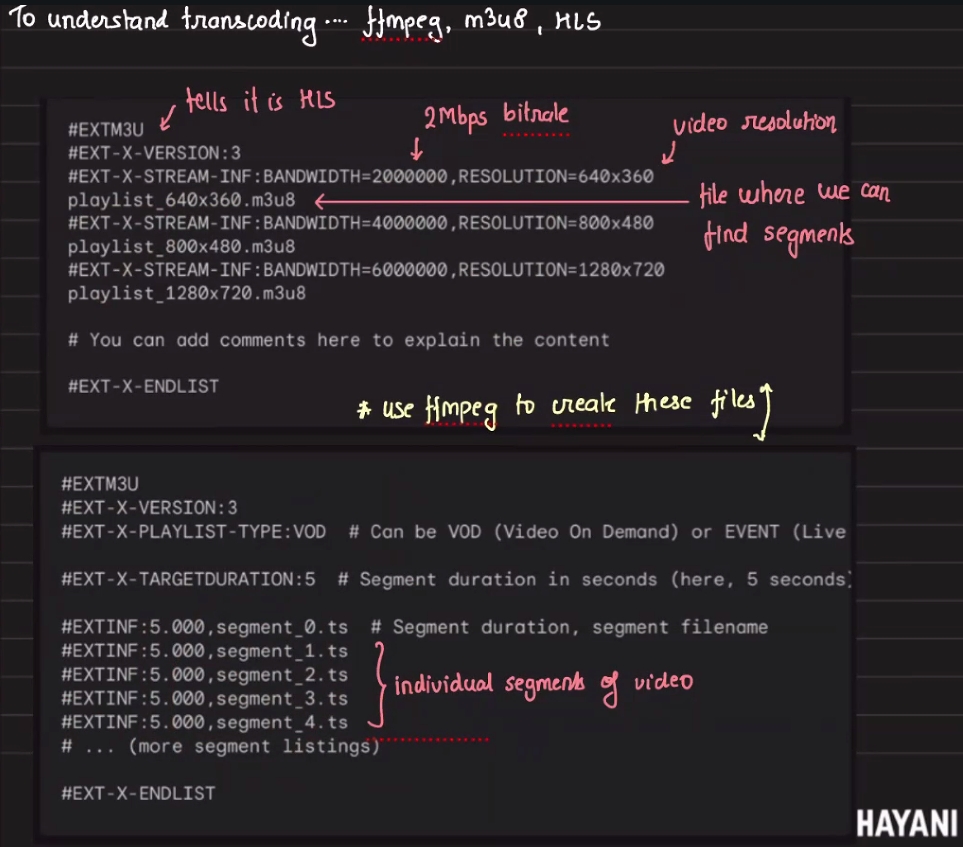

# Live Streaming

## Prerequisites
- How video works
- Understanding of HLS (HTTP Live Streaming) protocol
- Basic knowledge of video encoding/transcoding

## Overview

ffmpeg -> takes video --> breaks into chunks -> player plays each continuous chunk

## How FFmpeg Creates Chunks

FFmpeg uses the HLS (HTTP Live Streaming) protocol to segment video into small chunks that can be progressively downloaded and played. The process involves:

1. **Input Processing**: FFmpeg reads the source video file
2. **Transcoding**: Converts video to desired codec, resolution, and bitrate
3. **Segmentation**: Splits video into fixed-duration chunks (typically 2-10 seconds)
4. **Manifest Generation**: Creates .m3u8 playlist file listing all chunks

### Create chunks


### Common FFmpeg Command for HLS Chunking

```bash
ffmpeg -i input.mp4 \
  -c:v h264 \              # Video codec: H.264
  -c:a aac \               # Audio codec: AAC
  -b:v 1M \                # Video bitrate: 1 Mbps
  -b:a 128k \              # Audio bitrate: 128 kbps
  -vf scale=1280:720 \     # Scale to 720p resolution
  -f hls \                 # Output format: HLS
  -hls_time 10 \           # Segment duration: 10 seconds
  -hls_list_size 0 \       # Keep all segments in playlist
  -hls_segment_filename 'segment_%03d.ts' \  # Segment naming pattern
  output.m3u8              # Output playlist file
```

### Transcoding Parameters Explained

#### Video Codec (`-c:v`)
- **h264**: Most compatible codec, supported by virtually all devices
- **h265/HEVC**: Better compression (50% smaller files), but limited device support
- **VP9**: Open-source alternative, good for web streaming

#### Audio Codec (`-c:a`)
- **aac**: Standard for HLS, widely supported
- **mp3**: Alternative for compatibility, larger file size
- **opus**: Better quality at low bitrates, limited support

#### Bitrate Settings
- **Video Bitrate (`-b:v`)**: Determines video quality and file size
  - 500k-1M: Low quality (480p)
  - 1M-3M: Medium quality (720p)
  - 3M-8M: High quality (1080p)
  - 8M+: Ultra high quality (4K)

- **Audio Bitrate (`-b:a`)**: 
  - 64k: Low quality (voice)
  - 128k: Standard quality (music)
  - 192k-320k: High quality

#### Resolution Scaling (`-vf scale=`)
- Common resolutions for adaptive streaming:
  - 426x240 (240p) - Mobile on slow connections
  - 640x360 (360p) - Mobile standard
  - 854x480 (480p) - SD quality
  - 1280x720 (720p) - HD quality
  - 1920x1080 (1080p) - Full HD
  - 3840x2160 (4K) - Ultra HD

#### HLS-Specific Parameters
- **`-hls_time`**: Duration of each segment in seconds
  - Shorter segments (2-4s): Lower latency, more overhead
  - Longer segments (6-10s): Higher latency, better efficiency

- **`-hls_list_size`**: Number of segments to keep in playlist
  - 0: Keep all segments (VOD)
  - N: Keep only last N segments (live streaming)

- **`-hls_segment_filename`**: Pattern for naming segments
  - Use %d for sequential numbering
  - Use %03d for zero-padded numbers (001, 002, etc.)

### Video chunks


## Adaptive Bitrate Streaming

For better user experience, create multiple quality variants:

```bash
# Create multiple quality streams
ffmpeg -i input.mp4 \
  -map 0:v:0 -map 0:a:0 \
  -c:v h264 -c:a aac \
  -b:v:0 400k -s:v:0 640x360 -profile:v:0 baseline \
  -b:v:1 800k -s:v:1 854x480 -profile:v:1 main \
  -b:v:2 1500k -s:v:2 1280x720 -profile:v:2 main \
  -b:v:3 3000k -s:v:3 1920x1080 -profile:v:3 high \
  -b:a 128k \
  -f hls \
  -hls_time 10 \
  -hls_playlist_type vod \
  -master_pl_name master.m3u8 \
  -var_stream_map "v:0,a:0 v:1,a:0 v:2,a:0 v:3,a:0" \
  stream_%v/playlist.m3u8
```

This creates a master playlist with multiple quality options that players can switch between based on network conditions.

### What is an m3u8 file?

An `.m3u8` file is a playlist file used for HTTP Live Streaming (HLS), a media streaming protocol developed by Apple. The m3u8 file contains a list of media segment files (usually `.ts` files), metadata, and instructions for the streaming client. The ".m3u8" extension indicates that the playlist is in UTF-8 encoding.

There are two main types of m3u8 files in HLS:

1. **Master Playlist (`master.m3u8`)**: Lists multiple "variant streams," each typically representing a different quality or bitrate.
2. **Media Playlist (`playlist.m3u8`)**: Lists the actual media segment files for a specific quality.

#### Example: Master Playlist with Multiple Bitrates

```m3u8
#EXTM3U
#EXT-X-VERSION:3

# 360p stream (low bitrate)
#EXT-X-STREAM-INF:BANDWIDTH=500000,RESOLUTION=640x360
stream_0/playlist.m3u8

# 480p stream (medium bitrate)
#EXT-X-STREAM-INF:BANDWIDTH=900000,RESOLUTION=854x480
stream_1/playlist.m3u8

# 720p stream (higher bitrate)
#EXT-X-STREAM-INF:BANDWIDTH=1600000,RESOLUTION=1280x720
stream_2/playlist.m3u8

# 1080p stream (highest bitrate)
#EXT-X-STREAM-INF:BANDWIDTH=3200000,RESOLUTION=1920x1080
stream_3/playlist.m3u8
```

- `BANDWIDTH`: The average bitrate in bits per second.
- `RESOLUTION`: Video resolution for each stream.
- Each entry points to a media playlist for that quality.

#### Example: Single Media Playlist (`stream_2/playlist.m3u8`)

```m3u8
#EXTM3U
#EXT-X-VERSION:3
#EXT-X-TARGETDURATION:10
#EXT-X-MEDIA-SEQUENCE:0

# 10-second segments for 720p stream
#EXTINF:10.000,
segment0.ts
#EXTINF:10.000,
segment1.ts
#EXTINF:10.000,
segment2.ts
#EXTINF:10.000,
segment3.ts

#EXT-X-ENDLIST
```

- `#EXTINF:10.000,` specifies duration (seconds) of each segment.
- Each segment (e.g., `segment0.ts`) contains part of the media.
- In live streaming, segments are generated on-the-fly; in VOD, the playlist is static and ends with `#EXT-X-ENDLIST`.

#### How Adaptive Bitrate Streaming Works
The player first loads the master playlist (`master.m3u8`). Depending on current bandwidth and device capabilities, it selects a stream (`playlist.m3u8` at a particular bitrate). If network conditions change, the player can switch to a different bitrate by fetching segments from another variant playlist, ensuring smooth playback.

**In summary:**  
- `.m3u8` files are the backbone of HLS streaming.
- The master playlist enables adaptive bitrate switching by referencing different quality streams.
- Each quality stream's playlist lists the actual media segments to play.

## Inserting Advertisements Between Videos

Advertisement insertion in video streaming is a critical monetization strategy. There are two main approaches for inserting ads into HLS streams:

### 1. Client-Side Ad Insertion (CSAI)

In CSAI, the video player handles ad insertion by making separate requests for ads and content.

**How it works:**
1. Player loads the main content playlist
2. At designated ad break points, player pauses main content
3. Player requests ads from ad server
4. Player plays ads, then resumes main content

**Pros:**
- Personalized ads per viewer
- Real-time ad decisioning
- Simple server infrastructure

**Cons:**
- Ad blockers can easily detect and block
- Buffering between content and ads
- Poor user experience with multiple requests

### 2. Server-Side Ad Insertion (SSAI) / Dynamic Ad Insertion (DAI)

SSAI stitches ads directly into the video stream on the server side, creating a seamless viewing experience.

**How it works:**
1. Ad decision server determines which ads to insert
2. Transcoding service prepares ad segments
3. Manifest manipulation service updates m3u8 playlist
4. Single continuous stream delivered to player

### Technical Implementation of SSAI

#### Step 1: Mark Ad Insertion Points

Use SCTE-35 markers in your video stream to indicate where ads can be inserted:

```bash
# FFmpeg command to insert SCTE-35 markers
ffmpeg -i input.mp4 \
  -c copy \
  -f mpegts \
  -mpegts_flags +initial_discontinuity \
  -metadata:s:v:0 'scte35=/DAhAAAAAAAAAP/wEAUAAAABf+9/fgAg9YDAAAAAAAA=' \
  output.ts
```

#### Step 2: Create Ad Segments

Prepare ad videos in the same format as main content:

```bash
# Ensure ads match main content specs
ffmpeg -i ad.mp4 \
  -c:v h264 -c:a aac \
  -b:v 1500k -b:a 128k \
  -vf scale=1280:720 \
  -f hls \
  -hls_time 10 \
  -hls_segment_filename 'ad_%03d.ts' \
  ad.m3u8
```

#### Step 3: Manifest Manipulation

Example of a playlist with ad insertion:

```m3u8
#EXTM3U
#EXT-X-VERSION:3
#EXT-X-TARGETDURATION:10
#EXT-X-MEDIA-SEQUENCE:0

# Main content segments
#EXTINF:10.0,
content_000.ts
#EXTINF:10.0,
content_001.ts

# Ad break marker
#EXT-X-DISCONTINUITY
#EXT-X-CUE-OUT:DURATION=30

# Pre-roll ad segments (30 seconds total)
#EXTINF:10.0,
ad_preroll_000.ts
#EXTINF:10.0,
ad_preroll_001.ts
#EXTINF:10.0,
ad_preroll_002.ts

# Resume main content
#EXT-X-CUE-IN
#EXT-X-DISCONTINUITY

#EXTINF:10.0,
content_002.ts
#EXTINF:10.0,
content_003.ts

# Mid-roll ad break
#EXT-X-DISCONTINUITY
#EXT-X-CUE-OUT:DURATION=15

#EXTINF:10.0,
ad_midroll_000.ts
#EXTINF:5.0,
ad_midroll_001.ts

#EXT-X-CUE-IN
#EXT-X-DISCONTINUITY

# Continue main content
#EXTINF:10.0,
content_004.ts
```

### Key HLS Tags for Ad Insertion

- **`#EXT-X-DISCONTINUITY`**: Indicates a discontinuity between segments (codec, timestamp, etc. may change)
- **`#EXT-X-CUE-OUT:DURATION=X`**: Start of ad break, X seconds long
- **`#EXT-X-CUE-IN`**: End of ad break, return to main content
- **`#EXT-X-DATERANGE`**: For timed metadata and SCTE-35 signals

### Best Practices for Ad Insertion

1. **Match Video Specifications**
   - Same resolution, codec, and bitrate as main content
   - Prevents jarring transitions

2. **Use Consistent Segment Duration**
   - Keep ad segments same length as content segments
   - Ensures smooth playback

3. **Pre-transcode Ad Inventory**
   - Have ads ready in multiple bitrates
   - Reduces latency during ad insertion

4. **Implement Ad Tracking**
   ```javascript
   // Client-side tracking for VAST compliance
   player.on('adstart', () => {
     trackEvent('impression', adId);
   });
   
   player.on('adquartile', (quartile) => {
     trackEvent(`${quartile}Quartile`, adId);
   });
   ```

5. **Handle Ad Failures Gracefully**
   - Have fallback ads ready
   - Skip to content if ad fails to load

### Advanced Ad Insertion Strategies

#### Personalized Ad Insertion
Each viewer gets a unique manifest with targeted ads:

```python
def generate_personalized_manifest(user_id, content_id):
    user_profile = get_user_profile(user_id)
    selected_ads = ad_decision_service.select_ads(user_profile)
    
    manifest = create_base_manifest(content_id)
    for ad_break in manifest.ad_breaks:
        ad = selected_ads.pop(0)
        manifest.insert_ad(ad_break.timestamp, ad)
    
    return manifest.to_m3u8()
```

#### Live Stream Ad Replacement
For live streams, dynamically update the playlist:

```python
def update_live_playlist(stream_id, ad_opportunity):
    playlist = get_current_playlist(stream_id)
    
    # Insert ad markers
    playlist.add_tag('#EXT-X-CUE-OUT:DURATION=30')
    
    # Add ad segments
    for ad_segment in ad_opportunity.segments:
        playlist.add_segment(ad_segment)
    
    # Resume stream
    playlist.add_tag('#EXT-X-CUE-IN')
    
    return playlist
```

### Monitoring and Analytics

Track ad performance metrics:
- **Fill Rate**: Percentage of ad opportunities filled
- **Completion Rate**: Percentage of ads watched to completion  
- **Revenue per Thousand Impressions (RPM)**
- **Quality of Experience (QoE)**: Buffering, errors during ads

By implementing proper ad insertion strategies, you can monetize content while maintaining a good user experience. Server-side ad insertion provides the best viewing experience but requires more complex infrastructure compared to client-side solutions.

## Server-Side Ad Insertion - Java Pseudocode

### Step-by-Step Implementation

```java
// Main components for SSAI system

public class ServerSideAdInsertion {
    
    // Step 1: Generate video chunks from source content
    public List<VideoChunk> generateChunks(String inputVideo, ChunkConfig config) {
        List<VideoChunk> chunks = new ArrayList<>();
        
        // Initialize FFmpeg wrapper
        FFmpegWrapper ffmpeg = new FFmpegWrapper();
        
        // Set transcoding parameters
        TranscodingParams params = new TranscodingParams();
        params.setVideoCodec("h264");
        params.setAudioCodec("aac");
        params.setVideoBitrate(config.getVideoBitrate());
        params.setAudioBitrate(config.getAudioBitrate());
        params.setResolution(config.getResolution());
        params.setSegmentDuration(config.getSegmentDuration()); // e.g., 10 seconds
        
        // Execute chunking process
        ffmpeg.execute(inputVideo, params);
        
        // Read generated chunks
        for (int i = 0; i < ffmpeg.getChunkCount(); i++) {
            VideoChunk chunk = new VideoChunk();
            chunk.setId("content_" + String.format("%03d", i));
            chunk.setDuration(config.getSegmentDuration());
            chunk.setPath("segments/content_" + String.format("%03d", i) + ".ts");
            chunk.setType(ChunkType.CONTENT);
            chunks.add(chunk);
        }
        
        return chunks;
    }
    
    // Step 2: Prepare advertisement chunks
    public List<VideoChunk> prepareAdChunks(List<Advertisement> ads, ChunkConfig config) {
        List<VideoChunk> adChunks = new ArrayList<>();
        
        for (Advertisement ad : ads) {
            // Ensure ad matches content specifications
            List<VideoChunk> chunks = generateChunks(ad.getVideoPath(), config);
            
            // Tag chunks as advertisements
            for (VideoChunk chunk : chunks) {
                chunk.setType(ChunkType.ADVERTISEMENT);
                chunk.setAdId(ad.getId());
                chunk.setTrackingUrl(ad.getTrackingUrl());
                adChunks.add(chunk);
            }
        }
        
        return adChunks;
    }
    
    // Step 3: Identify ad insertion points
    public List<AdInsertionPoint> identifyAdBreaks(List<VideoChunk> contentChunks, AdPolicy policy) {
        List<AdInsertionPoint> adBreaks = new ArrayList<>();
        
        // Pre-roll ad
        if (policy.hasPreRoll()) {
            AdInsertionPoint preRoll = new AdInsertionPoint();
            preRoll.setPosition(0);
            preRoll.setType(AdType.PRE_ROLL);
            preRoll.setDuration(policy.getPreRollDuration());
            adBreaks.add(preRoll);
        }
        
        // Mid-roll ads at specified intervals
        if (policy.hasMidRoll()) {
            int interval = policy.getMidRollInterval(); // e.g., every 10 minutes
            for (int i = interval; i < contentChunks.size(); i += interval) {
                AdInsertionPoint midRoll = new AdInsertionPoint();
                midRoll.setPosition(i);
                midRoll.setType(AdType.MID_ROLL);
                midRoll.setDuration(policy.getMidRollDuration());
                adBreaks.add(midRoll);
            }
        }
        
        // Post-roll ad
        if (policy.hasPostRoll()) {
            AdInsertionPoint postRoll = new AdInsertionPoint();
            postRoll.setPosition(contentChunks.size());
            postRoll.setType(AdType.POST_ROLL);
            postRoll.setDuration(policy.getPostRollDuration());
            adBreaks.add(postRoll);
        }
        
        return adBreaks;
    }
    
    // Step 4: Select personalized ads for user
    public List<Advertisement> selectAdsForUser(User user, List<AdInsertionPoint> adBreaks) {
        List<Advertisement> selectedAds = new ArrayList<>();
        AdDecisionService adService = new AdDecisionService();
        
        for (AdInsertionPoint adBreak : adBreaks) {
            // Get user profile and context
            UserProfile profile = getUserProfile(user);
            StreamingContext context = new StreamingContext();
            context.setDeviceType(user.getDeviceType());
            context.setLocation(user.getLocation());
            context.setTime(System.currentTimeMillis());
            
            // Request ads from ad server
            AdRequest request = new AdRequest();
            request.setProfile(profile);
            request.setContext(context);
            request.setDuration(adBreak.getDuration());
            request.setAdType(adBreak.getType());
            
            Advertisement ad = adService.selectAd(request);
            selectedAds.add(ad);
        }
        
        return selectedAds;
    }
    
    // Step 5: Create personalized manifest with ads
    public M3U8Manifest createManifestWithAds(List<VideoChunk> contentChunks, 
                                               List<Advertisement> ads,
                                               List<AdInsertionPoint> adBreaks) {
        M3U8Manifest manifest = new M3U8Manifest();
        manifest.addHeader("#EXTM3U");
        manifest.addHeader("#EXT-X-VERSION:3");
        manifest.addHeader("#EXT-X-TARGETDURATION:10");
        
        int contentIndex = 0;
        
        for (AdInsertionPoint adBreak : adBreaks) {
            // Add content chunks before ad break
            while (contentIndex < adBreak.getPosition() && contentIndex < contentChunks.size()) {
                VideoChunk chunk = contentChunks.get(contentIndex);
                manifest.addSegment(chunk);
                contentIndex++;
            }
            
            // Insert ad at break point
            if (!ads.isEmpty()) {
                Advertisement ad = ads.remove(0);
                List<VideoChunk> adChunks = prepareAdChunks(Arrays.asList(ad), new ChunkConfig());
                
                // Add discontinuity marker
                manifest.addTag("#EXT-X-DISCONTINUITY");
                manifest.addTag("#EXT-X-CUE-OUT:DURATION=" + ad.getDuration());
                
                // Add ad chunks
                for (VideoChunk adChunk : adChunks) {
                    manifest.addSegment(adChunk);
                }
                
                // End of ad marker
                manifest.addTag("#EXT-X-CUE-IN");
                manifest.addTag("#EXT-X-DISCONTINUITY");
            }
        }
        
        // Add remaining content chunks
        while (contentIndex < contentChunks.size()) {
            manifest.addSegment(contentChunks.get(contentIndex));
            contentIndex++;
        }
        
        manifest.addTag("#EXT-X-ENDLIST");
        return manifest;
    }
    
    // Step 6: Play chunks (client-side simulation)
    public void playChunk(VideoChunk chunk, Player player) {
        try {
            // Check chunk type for analytics
            if (chunk.getType() == ChunkType.ADVERTISEMENT) {
                // Track ad impression
                trackAdEvent("impression", chunk.getAdId());
                
                // Set up quartile tracking
                player.setProgressListener(new ProgressListener() {
                    public void onProgress(float progress) {
                        if (progress >= 0.25 && !firstQuartileTracked) {
                            trackAdEvent("firstQuartile", chunk.getAdId());
                            firstQuartileTracked = true;
                        }
                        if (progress >= 0.50 && !midpointTracked) {
                            trackAdEvent("midpoint", chunk.getAdId());
                            midpointTracked = true;
                        }
                        if (progress >= 0.75 && !thirdQuartileTracked) {
                            trackAdEvent("thirdQuartile", chunk.getAdId());
                            thirdQuartileTracked = true;
                        }
                    }
                });
            }
            
            // Download chunk if not cached
            if (!player.isChunkCached(chunk)) {
                byte[] chunkData = downloadChunk(chunk.getPath());
                player.cacheChunk(chunk, chunkData);
            }
            
            // Decode and play chunk
            player.decodeAndPlay(chunk);
            
            // Track completion
            if (chunk.getType() == ChunkType.ADVERTISEMENT) {
                trackAdEvent("complete", chunk.getAdId());
            }
            
        } catch (Exception e) {
            handlePlaybackError(chunk, e);
        }
    }
    
    // Main orchestration method
    public void streamWithAds(String videoPath, User user) {
        // Step 1: Generate content chunks
        ChunkConfig config = new ChunkConfig();
        config.setSegmentDuration(10);
        config.setVideoBitrate("1500k");
        config.setResolution("1280x720");
        List<VideoChunk> contentChunks = generateChunks(videoPath, config);
        
        // Step 2: Identify ad breaks based on policy
        AdPolicy policy = getAdPolicy();
        List<AdInsertionPoint> adBreaks = identifyAdBreaks(contentChunks, policy);
        
        // Step 3: Select personalized ads
        List<Advertisement> selectedAds = selectAdsForUser(user, adBreaks);
        
        // Step 4: Create personalized manifest
        M3U8Manifest manifest = createManifestWithAds(contentChunks, selectedAds, adBreaks);
        
        // Step 5: Save manifest for user
        String manifestPath = saveManifest(manifest, user.getId());
        
        // Step 6: Return manifest URL to player
        String manifestUrl = CDN_BASE_URL + manifestPath;
        sendManifestToPlayer(manifestUrl, user);
    }
    
    // Helper classes
    class VideoChunk {
        private String id;
        private String path;
        private float duration;
        private ChunkType type;
        private String adId;
        private String trackingUrl;
        // getters and setters
    }
    
    class AdInsertionPoint {
        private int position;
        private AdType type;
        private float duration;
        // getters and setters
    }
    
    class M3U8Manifest {
        private List<String> lines = new ArrayList<>();
        
        public void addHeader(String header) {
            lines.add(header);
        }
        
        public void addTag(String tag) {
            lines.add(tag);
        }
        
        public void addSegment(VideoChunk chunk) {
            lines.add("#EXTINF:" + chunk.getDuration() + ",");
            lines.add(chunk.getPath());
        }
        
        public String toString() {
            return String.join("\n", lines);
        }
    }
    
    enum ChunkType {
        CONTENT, ADVERTISEMENT
    }
    
    enum AdType {
        PRE_ROLL, MID_ROLL, POST_ROLL
    }
}
```

### Simplified Flow Summary

```java
// Simplified pseudocode showing the main flow

// generateChunks() - Creates HLS chunks from video content using FFmpeg
// prepareAdChunks() - Prepares advertisement chunks matching content specifications
// identifyAdBreaks() - Determines pre-roll, mid-roll, and post-roll ad positions
// selectAdsForUser() - Personalizes ad selection based on user profile
// createManifestWithAds() - Stitches ads into the M3U8 manifest
// playChunk() - Handles chunk playback with comprehensive ad tracking
// streamWithAds() - Main orchestration method that ties everything together

// 1. Content Preparation
generateChunks(videoFile) {
    // Use FFmpeg to create HLS chunks
    // Return list of content chunks
}

// 2. Ad Preparation  
prepareAdChunks(advertisements) {
    // Transcode ads to match content specs
    // Return list of ad chunks
}

// 3. Manifest Creation
createPersonalizedManifest(user) {
    // Get content chunks
    // Identify ad insertion points
    // Select ads based on user profile
    // Stitch together content + ads
    // Return personalized M3U8 manifest
}

// 4. Streaming
streamToPlayer(manifestUrl) {
    // Player requests manifest
    // Player downloads chunks sequentially
    // For each chunk: playChunk()
}

// 5. Chunk Playback
playChunk(chunk) {
    // Download chunk if needed
    // Decode video/audio
    // Display frames
    // Track analytics (especially for ads)
    // Prefetch next chunk
}
```

This pseudocode demonstrates how server-side ad insertion works by:
1. Breaking video content into chunks
2. Preparing ad content in matching format
3. Creating personalized manifests with ads inserted at appropriate points
4. Delivering a seamless stream where ads and content are stitched together
5. Playing chunks while tracking ad metrics for monetization